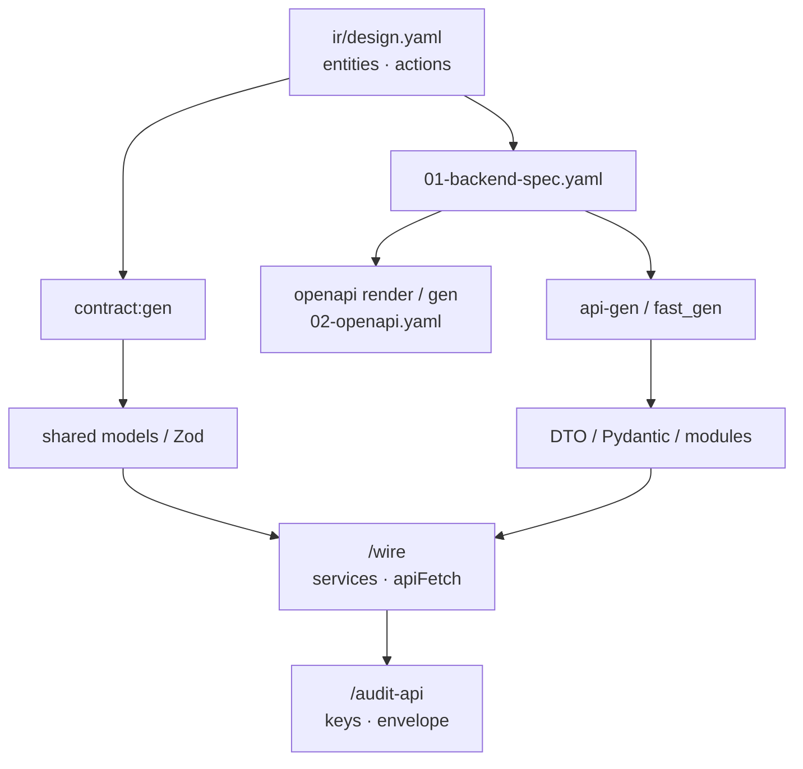
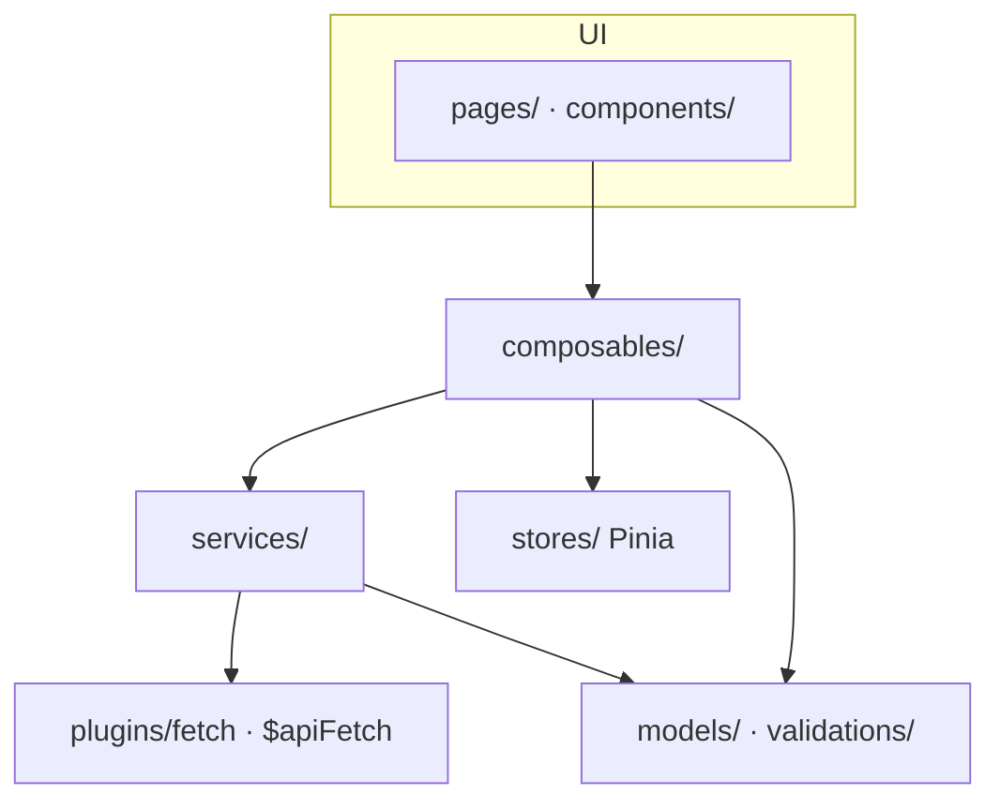

# Code (resource)

Vai trò **Code** trong bốn nhóm artifacts: [index.md](./index.md). Trang này mô tả **chuẩn triển khai và lane kỹ thuật** của nhóm **code**.

**Code (resource)** là **cụm repo (hoặc package) kỹ thuật** dùng để **dựng và chạy sản phẩm** — source FE/BE, lib dùng chung, script build/deploy runtime, và chỗ **chạy** test automation (unit, integration, Playwright). Có thể:

- **Monolith / một repo** — FE + BE (hoặc fullstack) gom một checkout;
- **Tách nhiều repo** — theo boundary kỹ thuật (portal admin, line client, API gateway, service domain…) thường **ánh xạ** kênh **Surfaces** trên docs, mỗi repo chọn **stack đã chốt** khi `flowgrid init` (adapter): vd. **Nuxt 4**, **Next.js** (FE); **NestJS**, **FastAPI**, **Laravel** (BE).

Docs mô tả **Surfaces / module / function**; code là **triển khai** — không nhân bản cây spec trong repo, nhưng có thể **nhiều repo code** cùng trỏ một **docs** và **tests-docs** hub.

SSOT **nghiệp vụ** và **plan kiểm thử** không sống trong cụm code (→ [docs.md](./docs.md), [tests-docs.md](./tests-docs.md)).

---

## Code chứa những gì?

| Lane | Nội dung điển hình | Đọc SSOT từ docs |
| --- | --- | --- |
| **FE** | Route, page, component, state, service client, `data-testid` | `ir/design.yaml` (sau `spec:split`), common `surfaces/common/yaml/` |
| **BE** | Controller, service, DTO, persistence | `api/<seq>/01-backend-spec.yaml` (+ openapi) |
| **Test chạy (trong repo code)** | Vitest/Jest unit; Playwright `*.spec.ts`, Page Object, mock helpers | Plan: tests-docs `TC-*.yaml`; locator: `ir/design.yaml` |
| **Harness agent (sau init)** | `.cursor/` hoặc `.agents/` — skills, MCP `flowgrid` | Pointer env tới docs/tests-docs |

**Không coi code là SSOT requirement:** đổi hành vi đã chốt → cập nhật **docs** (và **tests-docs** nếu ảnh hưởng kiểm thử) trước hoặc cùng PR với code — không “sửa code rồi quay lại đoán spec”.

---

## Ba lane artifact + code

| Resource | Code liên quan |
| --- | --- |
| **Docs** | Codegen prototype/portal, contract BE; audit `spec` / `api` / `fe-be` đối chiếu bundle ↔ implementation |
| **Tests-docs** | `testcase:gen` sinh skeleton Playwright; `audit e2e` so plan YAML ↔ spec chạy |
| **Code** | Source production + **e2e-root** (thư mục chạy E2E — thường trong repo FE) |

```text
docs (bundle, API spec, ir/design)
    → code FE/BE implement
tests-docs (TC-*.yaml)
    → testcase:gen → Playwright (e2e-root)
    → member hoàn thiện /wire → audit e2e
```

---

## Triển khai root

| Kiểu | Khi dùng |
| --- | --- |
| **Repo FE + repo BE** | Scale team; mỗi repo có `.flowgrid/config.json` (hoặc chỉ repo “primary” init đầy đủ). |
| **Fullstack monorepo** | `apps/web`, `apps/api`, `packages/*` — một init, nhiều adapter. |
| **FE / BE in-repo docs/tests** | `docs/`, `tests/` cùng repo code (FE portal hoặc **BE service** + spec API trên docs-hub) — vẫn **ba resource** về nghĩa; `flowgrid init` wizard **This repository** scaffold hub. |

Project type **Frontend** / **Backend** / **Fullstack** (wizard `flowgrid init`) scaffold code + **bắt buộc khai báo** docs-hub và tests-docs (in-repo hoặc pointer). **Backend** không “chỉ code API”: SSOT nghiệp vụ/API vẫn trên **docs** (`01-backend-spec`, OpenAPI, surfaces). Type **Document** / **Test** không thay code resource — chỉ hub tương ứng.

### VitePress trên repo Backend (`flowgrid dev` · `flowgrid build`)

Giống FE: `backend.docsRoot` / `backend.testsRoot` trong `.flowgrid/config.json` → `flowgrid dev` (docs **5173**, tests **5174**) và `flowgrid build` (hai `.vitepress/dist` tách). Init inject `flowgrid:split`, `flowgrid:render`, `flowgrid:openapi`, `flowgrid:dev`, `flowgrid:build` khi docs in-repo; `api-gen` / `api-unit-gen` bám spec trên docs-hub qua `FLOWGRID_DOCS_ROOT`.

---

## FlowGrid trên repo code

### `.flowgrid/config.json`

Sau `init`, file này (cùng thư mục `.flowgrid/`) ghi **loại dự án**, **adapter stack**, **đường dẫn tới docs/tests-docs** (tương đối repo hoặc repo khác). MCP và skills đọc config khi sync harness.

| Trường (ý nghĩa) | Ghi chú |
| --- | --- |
| `type` | `Frontend` · `Backend` · `Fullstack` · … |
| `frontend.adapter` / `backend.adapter` | vd. `nuxt4`, `nextjs`, `nestjs`, `fastapi` — chọn engine codegen |
| `frontend.docsRoot` / `backend.docsRoot` | Path tới **docs resource** (hub spec); `*HubInRepo` khi scaffold in-repo |
| `frontend.testsRoot` / `backend.testsRoot` | Path tới **tests-docs** hub (API hook TC trên repo BE) |
| `frontend.e2eRoot` | Thư mục **code Playwright UI** (`tests/e2e/**/*.spec.ts`, PO) — init mặc định **`tests/e2e`**. MCP: `FLOWGRID_E2E_ROOT`. |
| `backend.e2eRoot` | **Automation root** trên repo BE (partner/webhook) — init mặc định **`tests`** để `audit e2e` quét `tests/api-e2e/**` (`testcase:gen:api`) và Newman tùy chọn. Khác `testsRoot` (hub YAML). Cùng env `FLOWGRID_E2E_ROOT` khi sync harness. |
| `stack`, `commands`, `registries` | Merge từ `stacks/*.json` khi init — ArtifactGraph MCP allowlist (xem [dsl.md](./dsl.md)) |
| `baseProfile` | `standard` → cuối init **`registry:sync`** quét shadcn/Mo*/shell FE + BE helpers; `custom` → `build-template-code` thay cho quét FE |

Sau khi thêm component shell hoặc đổi middleware BE: **`flowgrid registry:sync`** (hoặc `npm run flowgrid:registry-sync`) rồi `artifactgraph_rebuild` nếu MCP báo stale.

Chạy `flowgrid doctor` trên repo code để kiểm config, MCP (`FLOWGRID_DOCS_ROOT`, `FLOWGRID_TESTS_DOC`), harness.

### Biến môi trường (thường gặp)

| Biến / flag | Vai trò |
| --- | --- |
| `FLOWGRID_DOCS_ROOT` | Resolve bundle, IR, API spec khi codegen/audit (ưu tiên hơn DNA ngầm). |
| `FLOWGRID_TESTS_DOC` | Hub testcase plan — audit e2e, `/testcase` trên hub. |
| `FLOWGRID_ADAPTER` / `FLOWGRID_BE_ADAPTER` | Adapter FE/BE đang dùng (MCP, script). |
| `FLOWGRID_PROJECT_ROOT` | Root repo code khi adapter chạy từ subfolder. |
| `--e2e-root` | Override automation root; mặc định `frontend.e2eRoot` / `backend.e2eRoot` hoặc `FLOWGRID_E2E_ROOT`. |
| `--docs-root` / `--tests-docs` | Override path một lần cho CLI audit/codegen. |

Chi tiết env & doctor: [references/cli-and-commands.md](../references/cli-and-commands.md).

---

## Đọc gì từ docs khi code (phân lane)

| Nhu cầu | File trên docs hub | Không dùng |
| --- | --- | --- |
| UI layout, testId, state matrix codegen | `ir/design.yaml` | Chỉ đọc `*.md` generated |
| Business rule / AC khi grill code | `*.bundle.yaml` (authoring) | Đoán từ component đã viết |
| Contract HTTP BE | `01-backend-spec.yaml` | `bundle.spec` cho API entity |
| OpenAPI client/mock | `02-openapi.yaml` | IR FE cho contract BE |
| Shared Zod / DTO (`entities`) | `ir/design.yaml` sau split — [§ Contract field registry](#contract-field-registry) | Chỉ suy từ `ui.columns` khi thiếu `entities` |

Sau khi BA/dev sửa bundle: `flowgrid split` (hoặc `pnpm spec:split`) rồi codegen — **không** sửa tay `ir/design.yaml` làm SSOT.

---

## Contract field registry {#contract-field-registry}

SSOT cho `contract:gen` (adapter Nest/portal: Zod trong `@portal/models` hoặc package models tương đương) + file ORM-agnostic `*.relationships.meta.ts`. Registry JSON trên repo FE: `registries/contract-field.registry.json`.

Author trong `ir/design.yaml` (sau `/grill-dev` + `flowgrid split`):

```yaml
entities:
  - name: Hotel
    table: hotels
    fields:
      - key: id
        kind: scalar
        type: integer
        scopes: [response, persistence]
        readOnly: true
      - key: chain_id
        kind: fk
        type: integer
        target: Chain
        scopes: [persistence, be]
        readOnly: true
        persistence:
          type: belongsTo
          fkField: chain_id
          orm: typeorm
      - key: name
        kind: scalar
        type: string
        scopes: [form, response, persistence]
      - key: managers
        kind: relation
        cardinality: many
        target: User
        scopes: [response]
        persistence:
          type: hasMany
          orm: typeorm
        contract:
          read:
            includeOn: [list, detail]
            embed: [id, full_name]
          write:
            mode: syncIds
            includeOn: [create, update]
```

`relationships: []` ở root bundle — **derived** khi split/grill; không author song song.

| `kind` | Zod / contract | ORM meta |
| --- | --- | --- |
| `scalar` | read/write schema | column |
| `fk` | thường ẩn FE (`scopes: be`) | belongsTo FK |
| `relation` | nested read + optional write payload | hasMany / belongsToMany / hasOne |

| `scope` | Sinh vào |
| --- | --- |
| `form` | `*WriteSchema` |
| `response` | `*ReadSchema` |
| `persistence` | `relationships.meta` + nest ORM gen |
| `be` | hidden fields (audit, FK nội bộ) |

**Fallback:** `contract:gen` có thể infer từ `ui.columns` (cột `type: relation` → `kind: relation`); `/grill-dev` nên materialize `entities[].fields` trước gate.

| Output (ví dụ monorepo portal) | Consumer |
| --- | --- |
| `packages/models/src/{entity}/*.read.schema.ts` | FE parse, BE Query response |
| `packages/models/src/{entity}/*.write.schema.ts` | FE form, BE Command + validation pipe |
| `packages/models/src/{entity}/*.relationships.meta.ts` | ORM gen + relation sync handler |

`portal:gen` **không** sinh `models/` — chạy `contract:gen` (hoặc `pnpm contract:gen`) trước `portal:gen`. Lane: [workflows/backend.md](../workflows/backend.md).

**Contract keys:** cùng tên field trên portal `entities` ↔ BE `requests/responses` ↔ line/integration presenter khi multi-repo — [cli-and-commands](../references/cli-and-commands.md) (repo split).

---

## Portal ↔ API (FE và BE) {#portal-api}

Luồng contract chuẩn (adapter portal + API riêng — Nest, FastAPI, Laravel…):



### Envelope HTTP

Response JSON thường dùng shape:

```json
{
  "success": true,
  "code": 200,
  "message": "Success",
  "data": {},
  "meta": null
}
```

FE: helper `assertApiSuccess` (`success === true`) + `parseApiData(schema, data)` (Zod). BE adapter map lỗi vào cùng envelope. Global API prefix (vd. `/api`) + `NEXT_PUBLIC_API_URL` / base URL trong client.

### List và pagination

| Shape | BE | FE schema |
| --- | --- | --- |
| Inline list | `data: { items, total }` | `*ListResponseSchema` |
| Meta pagination | `meta.pagination` (helper `to_envelope_meta()` trên adapter Python, tương đương trên stack khác) | `ApiSuccess.meta` (optional) |

### Auth (wire)

Pilot thường dùng cookie/header stub → `Authorization: Bearer` + middleware redirect; BE `get_current_user` stub. Production JWT/refresh — triển khai trong repo BE/FE, không SSOT trên docs hub.

### OpenAPI artifact

Sau `01-backend-spec.yaml`: `flowgrid openapi_render` / `openapi_gen` (tên script theo adapter) → `02-openapi.yaml` cạnh spec trên docs tree. Dùng cho client gen, audit contract, NSwag — không bắt buộc cho prototype mock.

### Gọi dịch vụ bên thứ ba

OT / partner / LLM **không** gọi trực tiếp từ portal UI — qua **BE** (`#call-external` trên spec, client module trên repo API). Tag và SSOT prose: [dsl.md](./dsl.md) · skill `/call-external`.

Wire và audit: [workflows/wire.md](../workflows/wire.md).

---

## Portal FE — bốn tầng (adapter Nuxt) {#portal-fe-layers}

Chuẩn thư mục trên **repo FE portal** (Nuxt 4 / adapter tương đương): tách orchestration UI, HTTP, state client và contract dữ liệu. Presentation (`pages/`, `components/`, shadcn) **không** gọi `$apiFetch` trực tiếp — đi qua composable → service.



| Tầng | Trách nhiệm | Không làm |
| --- | --- | --- |
| **Composables** | Form submit, loading/error, navigation, guard | Gọi HTTP thô từ page |
| **Services** | Endpoint, method, `parseApiData` / Zod response | Giữ cookie/token UI lâu dài (trừ factory nhận `api`) |
| **Stores** | Token, user, toast, dialog — state client | Logic HTTP chi tiết |
| **Models + validations** | Zod entity/API; form rules (`validations/` chặt hơn body API khi cần) | Render UI |

**Import:** `pages` / `components` → `composables` → `stores` + `services` → `models`; `validations` → `models`. **Cấm ngược:** `models/` không import `stores/`, `services/`, `composables/`.

**Login (mẫu luồng):** `login.vue` + `validations/auth/schemas` + `useAuthLoginForm` → store orchestration hoặc composable → `createAuthService($apiFetch).login` → `LoginResponseSchema` parse.

**Feature mới (thứ tự gợi ý):** `models/{entity}/` (schema + types) → `services/{entity}.service.ts` → store (nếu cache UI) → `composables/{entity}/` → `validations/` khi có form.

```ts
export function createAuthService(api: typeof $apiFetch) {
  return {
    async login(payload: LoginRequest) {
      const res = await api('/api/auth/login', { method: 'POST', body: payload })
      return parseSchemaOrThrow(LoginResponseSchema, res.data)
    },
  }
}
```

Form lặp logic: base `useApiForm` (adapter). Shared models từ docs: `contract:gen` trước `portal:gen` — [§ Contract field registry](#contract-field-registry). E2E locator: [§ testId](#e2e-testids).

---

## Vòng đời trên code (tóm tắt)

| Phase | Mục tiêu | Skill / lệnh gợi ý |
| --- | --- | --- |
| **Prototype** | UI chạy được, mock API, feedback sớm | `/prototype`, portal/codegen adapters |
| **Backend** | Service khớp `01-backend-spec` | `/api`, `/api-spec`, `audit api` |
| **E2E skeleton** | Playwright bám tests-docs | `testcase:gen` trên **e2e-root** |
| **Wire** | Bỏ mock, API thật, gate testcase | `/wire`, `cases:gate --strict`, `audit e2e` |
| **Unit** | Logic nhỏ, nhanh | `/unit`, adapter unitgen — **không** thay E2E plan hub |

**Prototype vs production:** tag/handoff `#wire-only` trên spec — testcase và E2E có thể mock đến khi `/wire`; sau wire chạy `audit e2e` scoped theo `W-*`.

### Page lifecycle (registry) {#page-lifecycle}

Máy đọc: `registries/page-lifecycle.registry.json` trên repo FE. Cập nhật: `portal:gen` → `prototype`; `portal:remove` → `design-spec`; `pnpm portal:lifecycle sync` quét manifest + page trên disk. Chi tiết registry: [dsl.md § Registry](./dsl.md#registry--promote).

| Stage | Ý nghĩa | Auth trên dev (portal adapter) |
| --- | --- | --- |
| `design-spec` | Spec/testcase có; chưa prototype code | bypass |
| `prototype` | UI + mock API (`portal:gen`) | bypass |
| `test` | E2E/unit pass (vẫn mock API) | bypass |
| `wire` | Ghép API thật xong | **required** |

`stage` = bước **cao nhất** đã đạt. Sửa spec / re-grill **không** tự hạ stage. `portal:remove` hoặc `lifecycle sync` (page mất trên disk) → `design-spec`. Middleware auth global: bypass mọi stage **trừ** `wire`.

```bash
pnpm portal:lifecycle sync
pnpm portal:lifecycle set /hotels test
pnpm portal:remove --spec <docs-path>/feature.spec.yaml
```

Lane: prototype → [workflows/design.md](../workflows/design.md) · E2E `test` → [workflows/test.md](../workflows/test.md) · `wire` → [workflows/wire.md](../workflows/wire.md).

---

## E2E trên code (e2e-root) {#e2e-root}

E2E mô phỏng hành vi user trên browser (mở trang, session/login, form, API hoặc mock, assert toast/table/dialog/URL). **Kế hoạch** kiểm thử SSOT trên [tests-docs](./tests-docs.md); **chạy** automation trên **e2e-root** (thường repo FE). Lane workflow: [workflows/test.md](../workflows/test.md).

| Tầng | Công cụ | Vai trò |
| --- | --- | --- |
| Unit | Vitest/Jest/PHPUnit (adapter) | Logic nhỏ, edge case — chạy nhanh |
| E2E | Playwright | Flow nghiệp vụ chính, regression release/CI |
| Semantic + axe | Helpers + `@axe-core/playwright` | Console, scroll/overflow, layout table, WCAG — **sau** bước functional |

Playwright phù hợp portal stack: auto-wait, multi-browser, API mocking, trace/screenshot/HTML report; tích hợp axe cho scan scoped.

| Khái niệm | Ghi chú |
| --- | --- |
| **e2e-root** | Cwd hoặc package FE nơi cài Playwright, `playwright.config`, `tests/e2e/**/*.spec.ts` |
| **Input plan** | `FLOWGRID_TESTS_DOC` → `cases/**/TC-*.yaml` |
| **Output** | `.spec.ts`, Page Object, helpers — member chỉnh sau `testcase:gen` |
| **Registry** | `ui.testIds` / `registries/e2e-test.registry.json` — khớp `testIds.required` trên TC YAML; tag `#e2e:*` trên bundle → [dsl.md](./dsl.md) |

Tests-docs = **kế hoạch**; e2e-root = **chạy CI/local**. Không đặt SSOT `TC-*.yaml` chỉ trong repo FE nếu team đã chốt hub tests-docs riêng (file cạnh code có thể là bản sinh — trace về hub).

### Chạy Playwright (ví dụ adapter)

```bash
pnpm test:e2e              # dev server + headless (port theo adapter)
pnpm test:e2e:ui           # UI mode
pnpm test:e2e:report       # HTML report
PLAYWRIGHT_SKIP_WEBSERVER=1 PLAYWRIGHT_BASE_URL=http://127.0.0.1:3004 pnpm exec playwright test
```

---

## Chuẩn `data-testid` {#e2e-testids}

**Khai báo SSOT:** `spec.ui.testIds.required` (+ `patterns` khi id động) trên bundle docs → `flowgrid split` → `ir/design.yaml`. Grill trước lane `/test`; testcase hub mirror trong `testIds.required` ([tests-docs](./tests-docs.md)). `portal:gen` emit markup; Playwright **ưu tiên** `page.getByTestId()` — fallback `getByRole` khi semantic rõ (`alert`, `heading`).

### Nguyên tắc

1. Mọi control tương tác (input, select, button, nav, row action, dialog) có `data-testid`.
2. Shell logic: alert, dialog, toast, breadcrumb, page title, sidebar `nav-*`.
3. **Không** dùng `id` HTML làm selector chính.
4. Gắn id ở **shared UI** qua prop `testId` — page chỉ truyền giá trị.

**Đặt tên:** `{scope}-{entity}-{action|field}` — kebab-case, tiếng Anh. Module scope = mã feature (`auth`, `customer`, …); auth dùng `auth-{flow}-*`.

| Loại | Pattern | Ví dụ |
| --- | --- | --- |
| Page | `{module}-page` | `customers-page` |
| Title | `{module}-page-title` | `customers-page-title` |
| Field | `{module}-{field}-input` | `auth-login-email-input` |
| Label / error | `{module}-{field}-label`, `-error` | qua `FormField` |
| Action | `{module}-{action}-btn` | `customer-create-btn` |
| Table | `{module}-table`, row `{entity}-row` + `data-{entity}-id` | `customers-table` |
| Dialog | `{module}-{action}-dialog`, `-confirm-btn` | `customer-delete-dialog` |
| App shell | `app-toast`, `app-dialog-*` | toast/dialog global |

**Primitives hỗ trợ `testId` (portal adapter):** `Button`, `Input`, `Label`, `FormField` (`-wrapper`, `-label`, `-error`), `DialogContent`, `ConfirmDialog`, `BreadcrumbNav`, `DataPageHeader`, `AlertDismissible`, `OrGlobalToast`, `OrGlobalDialog`. Helper map prop → attribute: `utils/testId.ts`.

```vue
<DataPageHeader test-id="customers-page" />
<Button test-id="customers-create-btn" />
<FormField test-id="customer-name">
  <Input test-id="customer-name-input" />
</FormField>
```

| Khi thêm page | Cần có |
| --- | --- |
| Shell | `{module}-page`, title, breadcrumb (nếu có) |
| Form | input/select + label/error qua `FormField` |
| Actions | nút `-btn`; dialog confirm `-dialog` + confirm/cancel |
| Nav | `nav-{id}` sidebar |
| Spec | `getByTestId`, không `input#email` |

**Global toast/dialog trong test:** `app-toast`, `app-toast-message`, `app-dialog`, `app-dialog-title`, `app-dialog-message`, `app-dialog-confirm-btn`, `app-dialog-cancel-btn`.

### Layout integrity (smoke)

Helper quét DOM và fail khi overflow (scroll > client), shell co (`*-page` quá thấp), hoặc hai `[data-testid]` chồng nhau (ngưỡng diện tích). Gọi sau `goto` + mock API trong smoke spec — trước assert nghiệp vụ. Skip mặc định `app-toast*`, `app-dialog*`. Tương thích semantic helpers: [§ Semantic UI](#e2e-semantic-assertions).

```ts
import { assertLayoutIntegrity } from './helpers/assertLayoutIntegrity'
await page.goto('/customers')
await assertLayoutIntegrity(page, { skipOverlap: true })
```

---

## Semantic UI assertions {#e2e-semantic-assertions}

Lớp **smoke guard** sau functional steps — bắt UI “vẫn render nhưng đã hỏng” (console, asset, overflow, table lệch, axe). **Không** thay testcase steps hay unit test. Tag bundle `#e2e:semantic-*` và `registries/e2e-test.registry.json` (`pnpm portal:e2e-registry`) — [dsl.md](./dsl.md).

| Level | Nội dung |
| --- | --- |
| **1** | `waitForSemanticUiReady`, no console errors, no horizontal scroll, broken images, text overflow |
| **2** | Element overlap, grid alignment, table header/body |
| **3** | Design token (shadcn/Tailwind CSS vars) — chỉ màn/component đại diện |

Cấu trúc điển hình trên e2e-root:

```text
tests/e2e/
├── fixtures/semantic-ui.ts
├── helpers/semantic-ui/     # accessibility, layout, table, grid, …
├── helpers/assertLayoutIntegrity.ts
└── semantic-ui/*.spec.ts  # spike + examples
```

Spec mới import fixture khi dùng matchers tùy chỉnh:

```ts
import { expect, test } from '../fixtures/semantic-ui'

test('customer list', async ({ page, consoleErrors }) => {
  await page.goto('/customers')
  await expect(page).toHaveNoConsoleErrors(consoleErrors)
  await expect(page).toHaveNoHorizontalScroll()
  await expect(page.getByTestId('customers-page')).toHaveNoTextOverflow()
})
```

**`waitForSemanticUiReady`:** root `{module}-page` visible, test id quan trọng attached, fonts/images nếu bật — **thay** `waitForTimeout()` rời. Không mặc định `networkidle` trên SPA có polling.

**Matcher Level 1 (global):** `toHaveNoConsoleErrors`, `toHaveNoHorizontalScroll`, `toHaveNoBrokenImages`, `toHaveNoTextOverflow`.

**Level 1b (axe):** `toHaveNoA11yViolations` với `AxeBuilder` — `.withTags(['wcag2a','wcag2aa','wcag21a','wcag21aa'])`, `.include()` scope page, attach JSON khi debug. Automated scan **không** phủ hết WCAG; flow critical vẫn cần keyboard/semantic bổ sung.

**Level 2 (layout):** `toHaveNoElementOverlap` (scan `[data-testid]`, bỏ overlay/dialog), `toHaveAlignedGrid`, `toHaveValidTableLayout` — table nên có `{module}-table`, row `{entity}-row`.

**Level 3:** `toMatchDesignToken` / preset shadcn (button, control, surface, table) — resolve computed `rgb` so với CSS variables; ưu tiên Storybook cho primitive, E2E guard màn quan trọng.

**Preset smoke page:**

```ts
await waitForSemanticUiReady(page, {
  rootTestId: 'customers-page',
  waitForTestIds: ['customers-table'],
  waitForFonts: true,
  waitForImages: 'visible',
})
await expect(page).toHaveNoConsoleErrors(consoleErrors)
await expect(page).toHaveNoHorizontalScroll()
await expect(page.getByTestId('customers-page')).toHaveNoTextOverflow()
```

`assertLayoutIntegrity(page)` giữ **wrapper** gọi matcher Level 1/2 — spec cũ không đổi import ngay.

**Quy ước spec:** có testId trước khi viết E2E; không CSS class / XPath / `nth-child`; semantic chạy sau mock/loading xong; message fail có testId + metric; known noise chỉ `ignorePatterns` / `excludeTestIds` có lý do; screenshot không làm assertion layout chính.

**YAML testcase (hub):** block `assertions.semantic` (ready, level1, layout, accessibility) — AI/dev map sang helper khi hoàn thiện spec sau `testcase:gen`:

```yaml
assertions:
  semantic:
    ready:
      rootTestId: customers-page
      waitForTestIds: [customers-table]
    level1:
      - toHaveNoConsoleErrors
      - toHaveNoHorizontalScroll
    accessibility:
      - toHaveNoA11yViolations
```

Tham khảo: [axe-core](https://github.com/dequelabs/axe-core) · [Playwright accessibility](https://playwright.dev/docs/accessibility-testing).

---

## Lệnh & audit (tham chiếu)

| Việc | Gợi ý lệnh |
| --- | --- |
| Gap spec UI/UX | `flowgrid audit spec <bundle.yaml>` |
| API YAML | `flowgrid audit api …` |
| Bundle `apiRef` ↔ BE spec | `flowgrid audit fe-be …` |
| Playwright ↔ plan testcase | `flowgrid audit e2e --id TC-*` hoặc `--tests-docs` (e2eRoot từ config/MCP) |
| Sinh E2E từ plan | `flowgrid testcase:gen --id TC-*` / `testcase:gen:api --id TC-*` (ghi theo `e2eRoot`) |
| Codegen FE từ IR | `contract:gen` rồi `portal:gen` / lệnh stack trong `package.json` |
| Shared Zod từ `entities` | `contract:gen` / `pnpm contract:gen --spec …` |
| Đồng bộ skills | `flowgrid harness sync` |

Tham số đầy đủ & audit: [references/cli-and-commands.md](../references/cli-and-commands.md).

---

## Skill & vai trò (T-shaped)

| Skill | Lane |
| --- | --- |
| `/prototype`, `/css` | FE codegen (`/gen-common` deprecated — UI in base; see [custom-base](../workflows/custom-base.md)) |
| `/api`, `/wire` | BE + tích hợp FE |
| `/test`, `/grill-test` | Playwright, audit matrix |
| `/unit` | Unit test trong repo code |

Harness sync vào repo làm việc (`.cursor/skills`, MCP) — agent gọi slash command; member **review** patch. Index skill: [references/skills/](../references/skills/spec.md) (`skills/*.md`).

---

## Quan hệ với nhóm resource khác

- **Docs:** SSOT hành vi — code implement và audit ngược lại docs, không ngược chiều khi đã chốt.
- **Tests-docs:** SSOT plan — automation bám YAML hub; MD user case chỉ để người đọc.
- **DSL & platform:** markers, registry, ArtifactGraph — [dsl.md](./dsl.md) ([`/docs-mark`](./dsl.md#docs-mark), [Registry & promote](./dsl.md#registry--promote)); quy ước tag trên bundle/IR, không thay nội dung nghiệp vụ.

Thứ tự phase: [workflows/](../workflows/).
