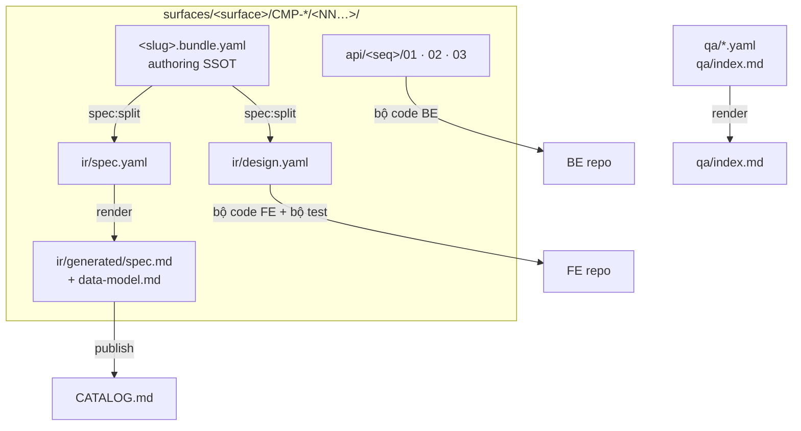
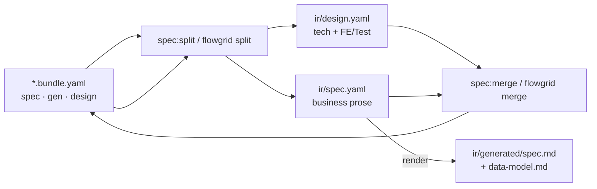

# Docs (resource)

Vai trò **Docs** trong dự án (SSOT nghiệp vụ, cập nhật docs trước khi sửa nhóm resource khác): [index.md](./index.md). Trang này mô tả **chuẩn nội dung và cấu trúc** của nhóm **docs** trên disk.

**Docs** là artifacts resource chứa **tài liệu đặc tả và kiến trúc** — phạm vi, actor, module, chức năng, hợp đồng API trên tài liệu, user-flow, deployment, open question, technical debt / derived / external call, … Trong README hoặc wizard init, root kiểu **docs-hub** chỉ là tên thường gặp khi repo **chuyên document**; SSOT mới gọi thống nhất **docs resource**, dù root nằm repo riêng hay thư mục trong repo FE.

---

## Docs chứa những gì?

Trên **cùng một cây docs** (không phải hai repo):

- **Overview:** operating model — actor, operational area, phạm vi.
- **Surfaces:** **SSOT cả team tham chiếu** — nghiệp vụ, module, chức năng, bundle, API spec trên docs, `FLOW-*` product; ngôn ngữ product, kỹ thuật chỉ mức team hiểu chung (lưu đâu, bucket nào…).
- **Architecture:** **kiến giải kỹ thuật** — phải **detail** cách hệ thống triển khai (service, gateway, CDN, data, integration, `DEP-*`).

**Web / Client / API** là kênh trong cây Surfaces, không đồng nghĩa operational area.

PM/Leader **không bắt buộc** lấp đầy toàn bộ cây một lần — hoàn thiện cuốn chiếu theo giai đoạn.

### Cây layer (điều hướng nội dung)

Root = **docs resource** (`FLOWGRID_DOCS_ROOT` / `.flowgrid/config.json`). Path vật lý dưới root (không dùng `modules/`, `docs/features/`, `shared/` ad-hoc):

```text
<CATALOG.md>                         # publish — mục lục GitHub / site
index.md

overview/
├─ index.md                          # purpose, scope, actor, assumptions
└─ operational-areas/
   └─ <area>.md                      # Admin ops, shop-floor, …

surfaces/                            # SSOT product + spec — cả team đọc/sửa đây
├─ common/                           # scope system — folder chỉ khi có artifact
│  ├─ processes/                     # FLOW-* cross-flow (product, Markdown)
│  ├─ patterns/                      # quy tắc UX/nghiệp vụ dùng chung (`/common`) — Markdown
│  ├─ data-model/                    # model / ERD mức product (nếu cần)
│  └─ integrations/                  # luồng đối tác mức product (nếu cần)
│
│  # Không SSOT: common/yaml, bundle CMN, gen-common — UI pattern đã trong FE base + rule AI
│
├─ <surface>/                        # vd. admin-web · line-client · integration-gateway
│  ├─ common/                        # scope surface — cùng pattern common (khi có)
│  └─ CMP-*/                         # module — một owner surface giữ SSOT
│     ├─ README.md                   # ownership, boundary, dependency
│     ├─ common/                     # scope module (processes/FLOW-*, data-model, …)
│     └─ <NN>/<NN>/…/                # function leaf — cluster số (nav: Functions)
│        ├─ <slug>.bundle.yaml       # authoring SSOT
│        ├─ ir/
│        │  ├─ design.yaml
│        │  ├─ spec.yaml
│        │  └─ generated/spec.md · data-model.md
│        ├─ api/<seq>/
│        │  ├─ 01-backend-spec.yaml
│        │  ├─ 02-openapi.yaml
│        │  └─ 03-mock.yaml          # tùy stack
│        └─ qa/
│           ├─ open/QA-*.yaml
│           └─ index.md
│
└─ <surface-khác>/                   # không owner: link/map sang CMP-* owner, không copy

architecture/                        # kiến giải kỹ thuật — detail how (Markdown + Mermaid)
├─ 03-user-flows · FLOW-*     # catalog `architecture/03-user-flows/`
├─ data model / database             # overview kỹ thuật (chapter tương ứng khi có)
├─ cross-service · integrations
├─ deployment · DEP-*                # → thường architecture/07-deployment/
├─ decisions · ADR-*                 # → thường architecture/09-decisions/
└─ …                                 # folder chapter khác từ init skeleton — stub đến khi cần
```

**Nav vs disk:** site/VitePress dùng nhãn nghiệp vụ (Overview, Surfaces, Modules, Functions); `flowgrid init` có thể tạo leaf dưới tên slug — **contract path** vẫn là `surfaces/<owner>/CMP-*/…` + bundle/IR/API như trên.

**`Common?` (system / surface / module):** node **động** — có folder khi scope thật sự có artifact; rỗng thì ẩn trên nav.

**Module (`CMP-*`):** một **owner surface**; surface khác chỉ **link/map**.

**Function:** không có folder tên `functions/`; leaf = `CMP-*/<NN…>/` (+ file trong leaf, xem [Function leaf](#function-leaf--layout-chuẩn)).

## Architecture và Surfaces — khác nhau thế nào?

**Tóm lại:** **Surfaces** = tài liệu **SSOT** mà cả team (BA, PO, dev, QA) tham chiếu khi làm feature; **Architecture** = **kiến giải kỹ thuật** — phải mô tả **chi tiết** hệ thống sẽ/build như thế nào (không thay spec product trong Surfaces).

### Surfaces — ngôn ngữ product / business

- **Surface** là góc nhìn **sản phẩm** theo kênh (Admin Web, Line Client, …): module (`CMP-*`), function, bundle — nơi mô tả **hành vi nghiệp vụ**, actor, rule, acceptance cho stakeholder.
- Viết để BA / PO / dev hiểu **làm gì, vì sao, ai dùng** — không phải sơ đồ hạ tầng.
- Khi cần nhắc kỹ thuật trong Surfaces, chỉ ở mức **product hiểu được**, ví dụ: “file đính kèm **lưu trên S3** bucket `reports-prod`”, “gọi dịch vụ thanh toán bên thứ ba” — **không** mô tả gateway, CDN, subnet, IAM policy, sequence diagram service nội bộ.
- Cấu trúc: **Common?** → **Modules** → **Functions**; `FLOW-*` và user-flow **chi tiết nghiệp vụ** (actor, bước, outcome, exception) nằm ở **Common theo scope** (`surfaces/common/…`, `surfaces/<surface>/common/…`, `…/CMP-*/common/user-flows/FLOW-*.md`) — vẫn là **ngôn ngữ product**, kể cả khi có một dòng “lưu S3”.

### Architecture — thuần kỹ thuật

- Nhánh **Architecture** mô tả **hệ thống chạy thế nào**: service nào gọi service nào, data model kỹ thuật, integration contract, **deployment** (`DEP-*`), topology.
- Cùng ví dụ S3: Architecture ghi **đường đi kỹ thuật** — upload qua **API gateway** nào, **CDN** có hay không, presigned URL, queue, worker, region, backup — không viết lại user story product.
- `architecture/03-user-flows/FLOW-*.md` là **`FLOW-*` ở góc kỹ thuật** — luồng xử lý qua component/hệ thống (curated, xuyên sản phẩm), **không** thay bản kể nghiệp vụ trong Surfaces.
- Các chương Architecture khác (data, integration, deployment) cùng nguyên tắc: **how**, không **what** product.

### So sánh nhanh (cùng chủ đề, hai layer)

| Chủ đề | Surfaces (product) | Architecture (kỹ thuật) |
| --- | --- | --- |
| Lưu file | “User upload báo cáo; file lưu S3 bucket X” | Client → API → auth → S3 qua gateway Y; virus scan; lifecycle policy |
| Luồng nghiệp vụ | `FLOW-*` trong Common: bước business, actor, rule | `FLOW-*` trong `03-user-flows`: bước system, service, queue, API |
| API / data | Contract trên bundle + `01-backend-spec` (spec chức năng) | Data model, cross-service flow, integration diagram |
| Triển khai | (thường không chi tiết) | `DEP-*`, môi trường, network |

### `FLOW-*` — hai home, một mã, không trùng vai trò

| Home | Path | Ngôn ngữ & nội dung |
| --- | --- | --- |
| **Surfaces / Common** | `surfaces/.../common/…`, `…/CMP-*/common/user-flows/FLOW-*.md` | **Product:** luồng nghiệp vụ chi tiết; tech chỉ **mức chung** (có S3, có gọi đối tác) |
| **Architecture §03** | `architecture/03-user-flows/FLOW-*.md` | **Kỹ thuật:** luồng qua hệ thống; gateway, service, integration — curated toàn sản phẩm |

**Write rule:**

- Cùng mã `FLOW-*` được **link** giữa product (Surfaces) và technical (Architecture) — **không** copy hai bản mô tả khác nghĩa rồi gọi là SSOT.
- Sửa **nghiệp vụ** (bước user, rule) → Surfaces / bundle trước; sửa **triển khai** (service, gateway) → Architecture.
- Function **bundle** là spec màn/API (product + design kỹ thuật UI/field); không thay file `FLOW-*` Surfaces hay Architecture.

### Loại artifact thường gặp trong docs

- **Overview:** purpose, operational areas, actor.
- **Surfaces (SSOT):** module, bundle, IR, API spec, QA, `FLOW-*` product, common registry.
- **Architecture (kỹ thuật):** `FLOW-*` system view, data/integration/deployment detail, `DEP-*`, ADR.
- **Đặc tả chức năng:** user story, acceptance, rule nghiệp vụ; **bundle** + IR cho từng màn/API.
- **Thiết kế hành vi UI:** `bundle.design`, state/action, matrix — input cho prototype và codegen FE.
- **Hợp đồng API (trên docs):** `api/<seq>/01-backend-spec.yaml` (+ `02` gen, `03-mock` tùy stack) — SSOT BE; hướng dẫn đọc/ghi: [tpl-api-contract.md](../../templates/shared/tpl-api-contract.md).
- **QA:** `qa/<SHORT>_NNNN.yaml`, `qa/index.md` (catalog render) — template `qa-item.yaml` + [qa-authoring.md](https://github.com/ShanYuCoder/flowgrid/blob/main/templates/shared/qa-authoring.md) · [workflows/qa-team.md](../workflows/qa-team.md).
- **Chất lượng & phụ thuộc:** technical debt, derived requirement, call external service — markers/section trên bundle hoặc common theo scope.
- **Xuất bản đọc cho người:** `ir/generated/spec.md` + `data-model.md` + `api.md` (khi có `01`), site VitePress (`flowgrid build`), `CATALOG.md` — **sinh từ** SSOT authoring, không thay bundle.

### ID chuẩn (resolve codegen / test / audit)

SSOT shape: [`product-id-convention.md`](../../harness/docs/extracts/product-id-convention.md) — `surfaceCode` trên mỗi surface; `CMP-{SURF}-{DOMAIN}-{NN}`, `W-{SURF}-{DOMAIN}-{NN}`, `API-{SURF}-{DOMAIN}-{NN}` (global unique; cùng chức năng hai surface ⇒ hai ID).

`CMP-*` · `W-*` · `API-*` · `FLOW-*` · `DEP-*` · `SC-*` · `TC-*` (trace) · `UI-CMN-*` / `API-CMN-*` (common registry).

Công cụ FE/BE/Test ưu tiên resolve theo ID và path chuẩn; `DEP-*` chỉ cho deployment, không thay target màn hình. **Không** dùng `CTR-*` / ID Context-Containers cũ trên public contract; `W-*` / `API-*` / bundle **chỉ** dưới `surfaces/`.

---

## Triển khai root

| Kiểu | Khi dùng |
| --- | --- |
| **Repo document riêng** | Team tách hub spec; `flowgrid init` type **Document**, hoặc FE/BE/Fullstack trỏ docs root sang repo/path khác. |
| **Docs in-repo** | Dự án nhỏ: `docs/`, `documentation/` trong repo FE — vẫn là **docs resource** về nghĩa, chỉ gom vật lý. |

### FlowGrid

| | |
| --- | --- |
| `FLOWGRID_DOCS_ROOT` | Root docs resource (CLI, engine, MCP). |
| `.flowgrid/config.json` | Ghi path docs sau `init`. |
| Type **Document** | cwd thường = docs root; wizard hỏi **đa ngôn ngữ global** của dự án (locale/i18n áp cho toàn hệ thống — UI, label trong bundle, app; **không** phải “tài liệu tiếng Anh / tiếng Pháp” riêng từng file). Khai báo vd. `vi,en,ja` + locale mặc định; chỉ một ngôn ngữ thì nhập một. |

Chi tiết flag CLI & init: [references/cli-and-commands.md](../references/cli-and-commands.md).

### VitePress (`flowgrid dev` · `flowgrid build`)

Khi **docs in-repo**, `init` copy engine `engines/docs/vitepress` → `<docsRoot>/.vitepress`. CLI đọc `docsRoot` từ `frontend.docsRoot` hoặc **`backend.docsRoot`** (repo **Backend** / NestJS / FastAPI — wizard vẫn hỏi docs-hub; path ghi dưới `backend` trong config) và chạy `vitepress dev|build <docsRoot>` (port mặc định **5173**).

Nếu cùng repo có **tests-docs in-repo** (`testsRoot` trên `frontend` hoặc `backend`), một lệnh `flowgrid dev` / `flowgrid build` xử lý **cả hai hub**: docs trước (dev: spawn song song), tests trên port **5174**; build ra `<hub>/.vitepress/dist` riêng. Script `pnpm flowgrid:dev` / `flowgrid:build` khi có `docsRoot` hoặc `testsRoot` (kể cả repo **Backend**). `split` / `render` / `publish` chỉ inject khi **docs-hub in-repo** (hoặc type Document).

#### Team reading — một mặt SSOT (review / UAT / sign-off)

| Ai | Đọc trên VitePress (sau `split` + `render` + `build`) | Chỉ khi implement |
| --- | --- | --- |
| BA / PO / QA | `ir/generated/spec.md` (stories, list columns/filters, validation, actions) + [qa/index.md](../../qa/index.md) | — |
| BA / lead / data | `ir/generated/data-model.md` | — |
| Dev FE / BE (review) | `ir/generated/api.md` (endpoint table từ `01`) | Sửa contract: `01` + `/api-update` |
| Implement codegen | Đọc site trước; **sửa** qua bundle → split | `ir/design.yaml`, `01` đầy đủ |

Sidebar function leaf: **Spec · `W-*`** + **Data model** + **API summary** (khi có `01`) — runtime: `engines/docs/vitepress/surfaces-nav.mjs`, `attachGeneratedDocs`.

---

## Function leaf — layout chuẩn

Một chức năng (màn / API primary entity) nằm dưới `surfaces/<owner-surface>/CMP-*/<NN…>/`:

```text
<slug>.bundle.yaml          # authoring SSOT (sửa tay tại đây)
ir/
  design.yaml               # tech IR — FE codegen + bộ test đọc lane design
  spec.yaml                 # business prose (split từ bundle)
  generated/spec.md       # BA / QA face (render)
  generated/data-model.md # DB tables review (render)
  generated/api.md        # 01 summary (render, khi có 01)
api/<seq>/
  01-backend-spec.yaml      # API SSOT
  02-openapi.yaml
  03-mock.yaml              # tùy stack
qa/<SHORT>_NNNN.yaml        # optional inbox (append updates[])
```

**Không** dùng path `modules/` trên disk, **không** `code/W-*` / `code/API-*` sát leaf (nav “Functions” ≠ folder `functions/`). Cluster số: `CMP-*/<NN>/<NN>/…/` (vd. `01/01/01/`).

### Leaf → split, render, repo code, publish



| Path (docs hub) | Vai trò |
| --- | --- |
| `*.bundle.yaml` | Authoring SSOT (business + tech trên cùng file) |
| `ir/design.yaml` | Tech IR — input **FE** codegen + lane design trên tests |
| `ir/spec.yaml` | Business inventory — publish qua `ir/generated` |
| `ir/generated/spec.md` | Markdown site — nghiệp vụ + list columns + validation |
| `ir/generated/data-model.md` | Markdown site — bảng/cột DB (multi-table) |
| `ir/generated/api.md` | Markdown site — endpoint summary từ `01` |
| `api/<seq>/01-backend-spec.yaml` | API SSOT (một API / một primary entity) |
| `api/<seq>/02-openapi.yaml` | `flowgrid openapi_render` / gen OpenAPI |
| `api/<seq>/03-mock.yaml` | Mock contract (tùy stack) |
| `surfaces/…/common/user-flows/FLOW-*.md` | Cross-flow product (link `SC-*` tests-docs) |
| `surfaces/…/common/patterns/*.md` | Quy tắc dùng chung — skill `/common` (không IR/bundle) |
| `architecture/03-user-flows/FLOW-*.md` | Catalog FLOW kỹ thuật; module-internal: `…/CMP-*/common/user-flows/FLOW-*.md` |
| `qa/*.yaml` · `qa/index.md` | Inbox + list (`render` luôn ghi list, kể cả rỗng) |
| `CATALOG.md` (repo root docs) | Mục lục — `flowgrid publish` |

Pattern CRUD mẫu (sau `flowgrid init`): `templates/shared/patterns/admin-crud.pattern.yaml`.

### Bundle ↔ IR (split & render)



- **Không** còn `ir/legacy.yaml`. Stub `legacy:` rỗng trên bundle bị bỏ lúc split.
- **Không** author `bundle.spec.api` — API SSOT là `api/<seq>/01-backend-spec.yaml`.

### Bundle — authoring SSOT (`spec` · `gen` · `design`)

| Section | Chứa | Ai sửa (skill) |
| --- | --- | --- |
| `bundle.spec` | Actors, requirements, `ui.list\|form\|detail`, acceptance — **không** `spec.api` | `/spec`, `/legacy /spec`, `/grill-bqa` |
| `bundle.gen` | `codegen.profile` / entity / module, `#gen:*`, `ui.filters` / columns | `/grill-dev` |
| `bundle.design` | nav, sections/items (label, meaning, purpose, 5-tier validation, widget specs), `stateMatrix`, actions (6 blocks + 4-tier outcomes) | `/spec` + `/grill-dev` |
| `bundle.review` | Prose BA — **không** split sang `ir/*` | `/grill-bqa` |
| `qa/<SHORT>_NNNN.yaml` | Câu hỏi treo (AskQuestion / Other chưa chốt) | `/qa-resolve` append answer + đóng |

**Quy tắc edit:** sửa **`*.bundle.yaml`** (và/hoặc `01-backend-spec.yaml`), rồi **`flowgrid split`** / `pnpm spec:split`. **Không** sửa tay `ir/design.yaml` / `ir/spec.yaml` — split **ghi đè** IR. Grill ghi bundle (hoặc `01`) rồi split; merge đẩy `gen` / layout về bundle khi cần.

**Hướng dẫn author bundle (toolkit):** quy ước `userStories` ↔ UX, ma trận action, checklist `/update-spec` — [`templates/shared/bundle-authoring.md`](https://github.com/ShanYuCoder/flowgrid/blob/main/templates/shared/bundle-authoring.md) trong repo FlowGrid (sau `init`, template tương đương thường nằm `.flowgrid/templates/`). Đọc trên GitHub repo toolkit; trang VitePress không mirror file này.

### Split output — ai đọc file nào

| File | Độc giả / mục đích |
| --- | --- |
| `*.bundle.yaml` | **Authoring SSOT** (agent grill); **tests-docs** `/testcase` đọc **cả bundle**. |
| `ir/design.yaml` | **Implement** FE/codegen — không dùng thay site review nghiệp vụ. |
| `ir/spec.yaml` | Input render; member **review trên VitePress** (`spec.md`), không bắt buộc mở YAML. |
| `ir/generated/spec.md` | **Team reading SSOT** — stories, list columns, validation, actions. |
| `ir/generated/data-model.md` | **Team reading SSOT** — DB tables (sidebar cạnh spec). |
| `api/<seq>/01-backend-spec.yaml` | BE contract — dev BE; tóm tắt link từ spec trên site. |

### Common (path hợp lệ)

| Scope | Path |
| --- | --- |
| System | `surfaces/common/` |
| Surface | `surfaces/<surface>/common/` |
| Module | `surfaces/<owner-surface>/CMP-*/common/` |

**Cấm** path ad-hoc: `shared/`, `common/` (root lẫn), `docs/common/`, `docs/features/`, `modules/` trên disk.

### Write rules (SSOT) — tóm từ contract docs

| Chủ đề | Rule |
| --- | --- |
| `FLOW-*` product | SSOT nghiệp vụ: `surfaces/…/common/…` / `…/CMP-*/common/user-flows/` — link sang `architecture/03-user-flows/FLOW-*` (kỹ thuật), không hai bản mâu thuẫn |
| `FLOW-*` kỹ thuật | `architecture/03-user-flows/` (+ dynamic view trong `model/`) — sequence service/infra, không thay user journey trong Surfaces |
| Module | Một `CMP-*` → một owner `surfaces/<owner>/CMP-*`; surface khác **link/map** |
| Function | Leaf `CMP-*/<NN…>/`; nav “Functions” ≠ folder `functions/` |
| API contract | `api/<seq>/01-backend-spec.yaml` — không gộp vào `bundle.spec.api`; Architecture **không** chứa endpoint spec (thuộc `/spec`) |
| UI pattern / Mo* | `registries/design.registry.json` trên **FE base** (`flowgrid registry:sync` sau init) · custom template → [custom-base](../workflows/custom-base.md) |
| `DEP-*` | Chỉ `architecture/07-deployment/` — không thay target màn `W-*` |
| Diagram | Architecture: Mermaid `flowchart` / `sequenceDiagram` (luồng service/infra); Surfaces: sequence **màn hình** (skill `/user-flow`), không HTTP verb chi tiết trong FLOW product |

---

## YAML và Markdown trong docs

- **YAML (bundle, IR, API spec, QA):** lớp **máy** — schema, audit, codegen, agent; diff field rõ.
- **Markdown (generated, overview, FLOW, module README):** lớp **người** — review PR, stakeholder, site docs.

Excel/Docx vẫn có thể là deliverable khách hàng; **SSOT kỹ thuật** trong docs resource nên là YAML/Markdown có cấu trúc để export ngược chính xác.

---

## Lệnh docs hub (split · merge · render · publish)

| Lệnh (alias npm) | Mục đích |
| --- | --- |
| `flowgrid split` · `pnpm spec:split -- <bundle.yaml>` | bundle → `ir/design.yaml` + `ir/spec.yaml` (+ chuỗi render MD khi chạy pipeline đầy đủ) |
| `flowgrid merge` · `pnpm spec:merge -- <bundle.yaml>` | `ir/*` → bundle |
| `flowgrid check` · `pnpm spec:split:check` | CI: IR sync bundle; common yaml **bắt buộc** có `ir/design.yaml` |
| `flowgrid render` · `pnpm flowgrid:render` | `ir/spec.yaml` → `ir/generated/*.md`; luôn ghi `qa/index.md` |
| `flowgrid publish` · `pnpm flowgrid:publish` | `CATALOG.md` + link đầu README (**không** render lại spec) |

Audit spec trên bundle: `flowgrid audit spec` — [references/cli-and-commands.md](../references/cli-and-commands.md#audit--harness-pr-workflow).

---

## Quan hệ với nhóm resource khác

- **Tests-docs:** định nghĩa **kiểm gì**; trace về bundle/spec trong docs. Sai **yêu cầu** → sửa docs (và testcase) trước code.
- **Code:** implement FE/BE; đối chiếu `ir/design.yaml`, `01-backend-spec.yaml`, không “đoán” từ code khi đã có SSOT docs.
- **DSL & platform:** markers (`#needs-component`, debt…), DNA, registry — **định dạng và quy ước**, không thay nội dung nghiệp vụ trong bundle.

Thứ tự làm việc (skill, gate): [workflows](../workflows/).
