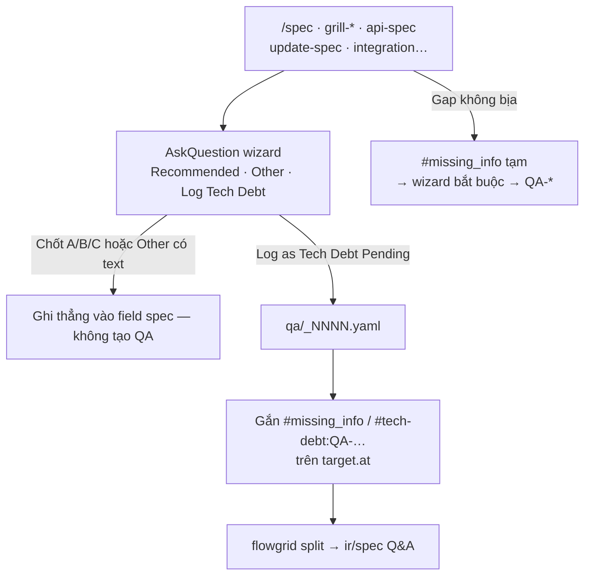
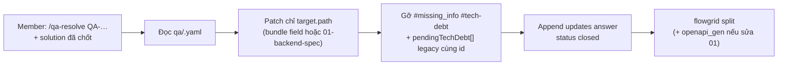
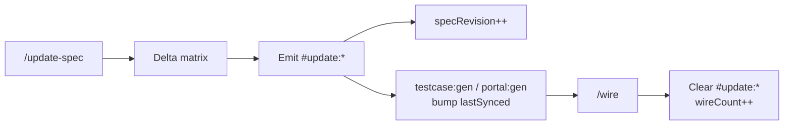
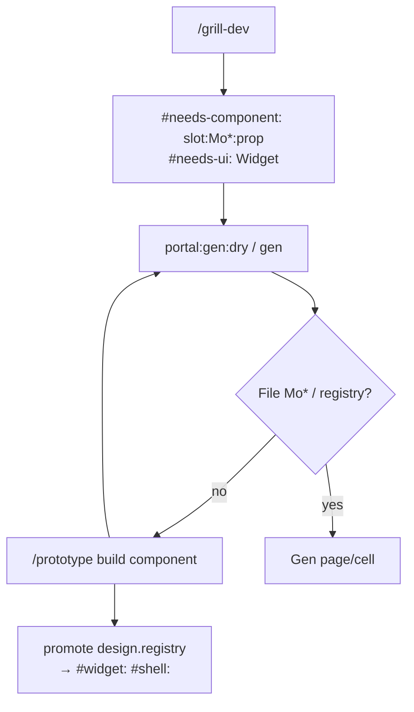
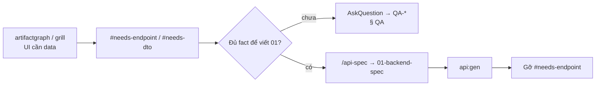
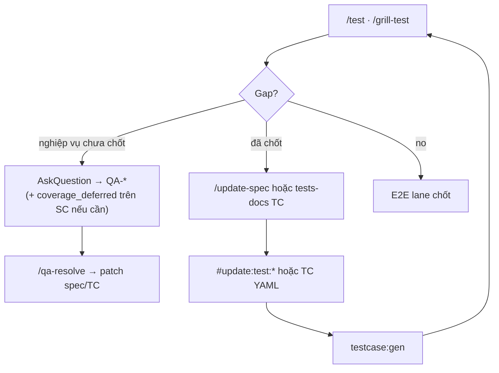
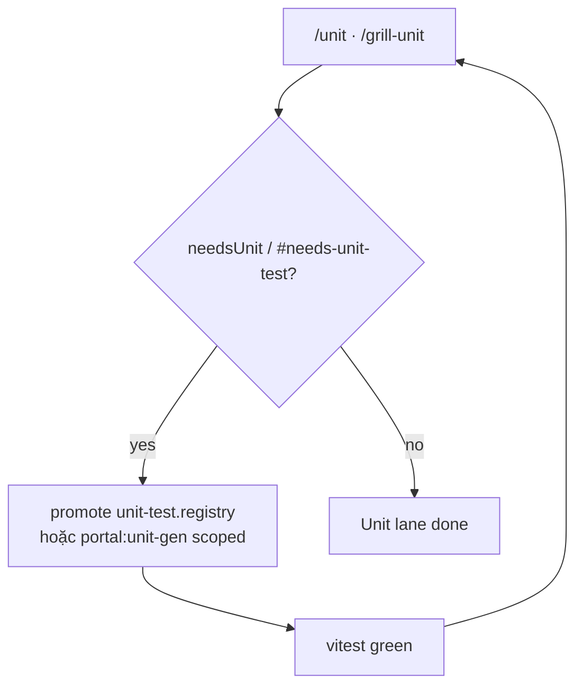
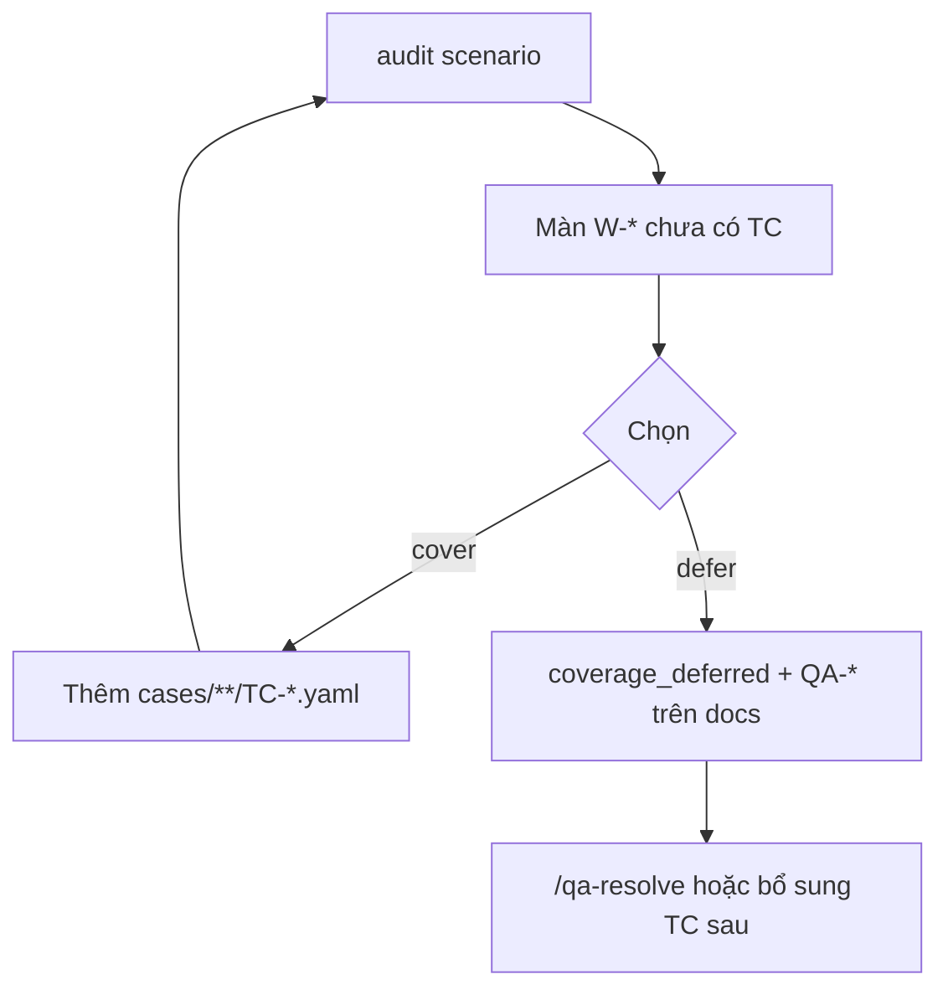
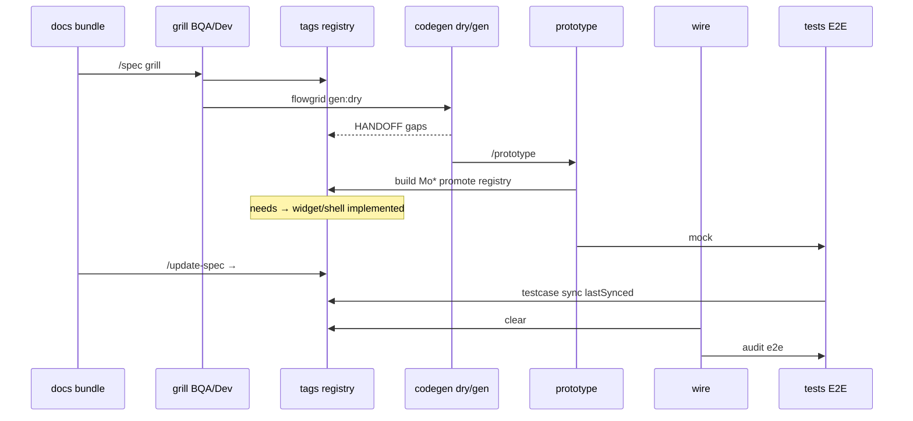
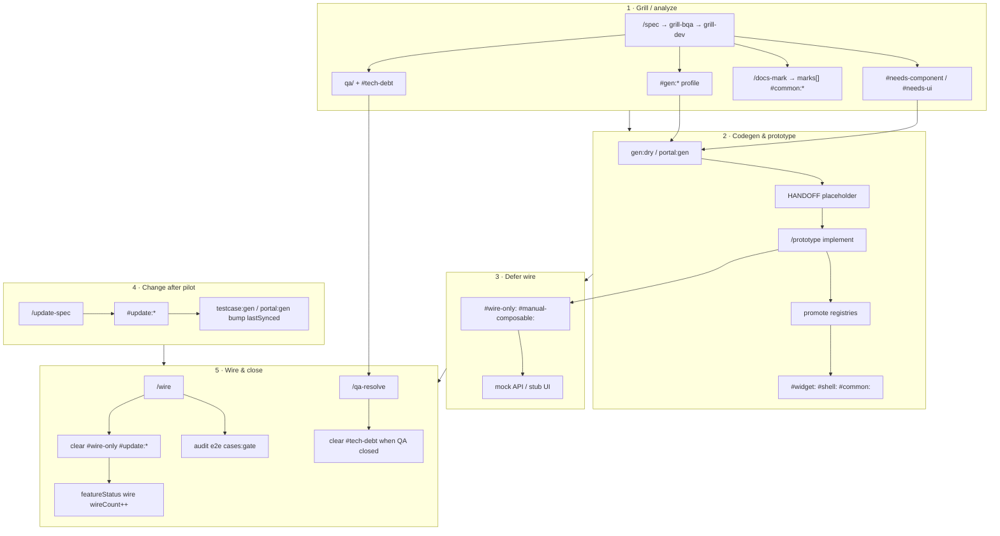

# DSL & platform (resource)

Vai trò **DSL & platform** trong bốn nhóm artifacts: [index.md](./index.md). Trang này mô tả **quy ước kỹ thuật dùng chung** — không thay SSOT nghiệp vụ ([docs.md](./docs.md)) hay plan kiểm thử ([tests-docs.md](./tests-docs.md)).

**DSL resource** gồm **DNA** (bản đồ stack & repo), **tag/marker** trên bundle/IR/code, **registry** (design, common logic, unit, E2E), **ArtifactGraph** local — để toolkit, codegen và agent **đọc/ghi cùng một ngôn ngữ**. Member vẫn **chốt** nội dung qua grill; tag chỉ **máy hiểu** trạng thái và việc còn lại.

---

## DSL chứa những gì?

| Nhóm | Ví dụ trên disk | Mục đích |
| --- | --- | --- |
| **Platform DNA** | `.flowgrid/config.json`, `core-dna` / `platform-dna`, `core-repos.local.json` · `platform-repos.local.json` | Adapter (Nuxt4, NestJS, Laravel…), map repo FE/BE/docs, fallback resolve path |
| **Tags & markers** | `bundle.design` / `bundle.gen`, `ir/design.yaml` `tags:`, `marks[]` | Grill, codegen, wire, debt, E2E semantic |
| **Registry** | `registries/design.registry.json`, `common.registry.json`, `unit-test.registry.json`, `e2e-test.registry.json` | Component/widget/pattern **đã có** vs **planned**; promote sau prototype |
| **ArtifactGraph index** | `.flowgrid/index.db` (SQLite cache, rebuild MCP) | Gợi ý gap, allowlist codegen — **không** thay bundle SSOT |
| **DSL backup / lexicon** | `artifactgraph/lexicon/`, `artifactgraph/registries/` (seed init) | Lexicon tags, mirror tùy team — SSOT registry vẫn `registries/*.json` trên repo code |
| **QA markers (docs)** | `qa/<SHORT>_*.yaml`, `#tech-debt:QA-…` / `#missing_info <id>` | Câu hỏi treo / nợ gắn ID — resolve trên docs, tag DSL tham chiếu |

**Không dùng DSL để “vá” spec sai:** nếu nghiệp vụ lệch → sửa **docs** trước; tag chỉ phản ánh **trạng thái triển khai** và **việc kỹ thuật còn lại**.

Author **`*.bundle.yaml`** (tag, `userStories`, `successMetrics`, `nonGoals`, action matrix): [docs.md § Bundle](./docs.md#bundle--authoring-ssot-spec--gen--design) · [`bundle-authoring.md`](https://github.com/ShanYuCoder/flowgrid/blob/main/templates/shared/bundle-authoring.md). **`design-spec.yaml`** deprecated — không author leaf mới.

---

## Root & pointer

- **Không** có `FLOWGRID_DSL_ROOT` — DNA và adapter trong **`.flowgrid/config.json`** (thường repo code hoặc repo init primary).
- **Registry** thường ở **repo FE/BE** (`registries/`), đôi khi sync từ adapter khi `flowgrid init`.
- **Repo map** (multi-repo): `core-repos.local.json` hoặc `platform-repos.local.json` — key → path checkout (FE, BE, docs, tests…); skill `/configure-repo-maps`.
- **ArtifactGraph MCP:** đọc **cùng** `.flowgrid/config.json` với init — sau `flowgrid init`, field `stack`, `commands`, `registries` merge từ `stacks/<adapter>.json` (preset allowlist `artifactgraph_recommend_command`). Index SQLite: **`.flowgrid/index.db`** (không commit; rebuild `artifactgraph_rebuild`).
- **Thư mục `artifactgraph/`** ở root repo: backup lexicon/registries khi init — **không** thay `registries/design.registry.json` trên repo FE/BE.
- Evidence docs/tests: `FLOWGRID_DOCS_ROOT`, `FLOWGRID_TESTS_DOC` (MCP env sau harness sync).

Grill narrative (AskQuestion, member chốt): [workflows/grill-and-human-review.md](../workflows/grill-and-human-review.md).

### Registry & script sau `init` (repo code)

**Luồng chuẩn (standard base):** cuối `flowgrid init` chạy **`flowgrid registry:sync`** — quét repo **đích** (FE: `components/ui`, molecules/organisms, shells, **`composables/` / `hooks/` / `utils`/`lib`** → `design.registry.json` → `composables` + `helpers`; BE: exception handler, middleware) → rebuild `.flowgrid/index.db`. Chạy lại sau khi đổi base: `npm run flowgrid:registry-sync`.

| Mục đích | Trên disk (SSOT) | CLI / npm |
| --- | --- | --- |
| Design / UI registry | `registries/design.registry.json` | **`flowgrid registry:sync`** (ghi) · `flowgrid registry` (validate FE) |
| BE capabilities (auth, exception, middleware) | `registries/be-capabilities.registry.json` | **`flowgrid registry:sync --be`** |
| Contract / shared Zod (Next) | `registries/common.registry.json` | `flowgrid contract-registry` |
| Unit test registry | `registries/unit-test.registry.json` | `flowgrid unit-registry` |
| E2E registry | `registries/e2e-test.registry.json` | `flowgrid e2e-registry` |
| BE codegen tags | `registries/codegen.registry.json` / `nest-codegen.registry.json` | `flowgrid api-registry` (static adapter + sync bổ sung paths) |

**Custom base** (`baseProfile: custom`): init **không** quét FE (dùng `build-template-code` + Golden Sample). `registry:sync --force` nếu cần refresh sau khi đã có code.

Docs hub `/spec` đọc `design.registry.json` qua pointer FE (`platform-repos` / checkout) — không quét từ hub.

Init **inject** `flowgrid:registry-sync` vào `package.json` consumer; map `portal:*` legacy trong [code.md](./code.md#contract-field-registry).

---

## Platform DNA

| Khái niệm | Ý nghĩa |
| --- | --- |
| **`core-dna` / platform profile** | Mã nhận diện kiến trúc cốt lõi dự án sau init — stack, convention codegen |
| **`.flowgrid/config.json`** | `type`, `frontend.*` / `backend.*` (`adapter`, `docsRoot`, `testsRoot`, `e2eRoot`, `*HubInRepo`) — xem [code.md](./code.md) |
| **`FLOWGRID_*` env** | MCP/harness sau sync; CLI resolve: flag → env → config ([cli-and-commands.md](../references/cli-and-commands.md)) |
| **`platform-repos.local.json`** | Checkout multi-repo; init seed từ config — lệch thì `flowgrid repo-maps align` |
| **Repo map JSON** | Liệt kê repo trong workspace; Codegraph / adopt / brownfield trace |

DNA **không** chứa user story — chỉ **đường dẫn và công cụ** để lane docs → code → test nối đúng repo.

---

## Hai chỗ ghi tag

| Nơi | Dùng khi |
| --- | --- |
| **`tags:`** (hashtag string) | Grill-dev, gen profile, wire defer, E2E semantic — vd. `#needs-component:…`, `#wire-only:`, `#gen:test-service` |
| **`marks[]`** (structured) | `/docs-mark` — `kind`, `registryId`, `reason`; audit ArtifactGraph |

Open question **không** field `openQuestions` trên bundle — dùng `qa/<SHORT>_NNNN.yaml` + `/qa-resolve` (docs resource, tag DSL tham chiếu id).

---

## Bảng tag theo nhóm (tóm tắt)

| Nhóm | Tag / marker | Sinh ra (thường) | Hết nợ khi |
| --- | --- | --- | --- |
| **UI thiếu** | `#needs-component:`, `#needs-ui:`, `#custom-slot:` | `/grill-dev`, `artifactgraph_analyze` | Build `Mo*` + promote design registry → `#widget:` / `#shell:` |
| **Logic common** | `#common:`, `#needs-common:` | `/docs-mark`, grill common candidates | Implement + `common.registry.json` |
| **Integration / data** | `#call-external`, `#cross-entity-service`, `#derived-data` | Grill / architecture lane | Doc SSOT `surfaces/common/…` + implement |
| **Codegen** | `#gen:*` (test, layout, column…) | `/grill-dev` profile | `portal:gen` / `api:gen` chạy xong scope |
| **Prototype defer** | `#wire-only:`, `#manual-composable:` | Prototype/mock phase | `/wire` — xóa tag, API thật |
| **Maintenance** | `#update:*` | `/update-spec` delta (đã **Confirm**) | `/wire` clear + `wireCount++` |
| **Tech debt / open question** | `QA-*`, `#tech-debt:QA-…`, `#missing_info QA-…` | AskQuestion → **Log as Tech Debt** | `/qa-resolve` — [§ QA](#vòng-đời-tech-debt--open-question-qa) |
| **Fact thiếu (tạm)** | `#missing_info` (chưa gắn ID) | Agent/grill — **không** invent | **Phải** → wizard → `QA-*` (cùng § QA) |
| **Unit (FE)** | `#needs-unit-test:*`, `#gen:test-*` | `portal:unit-gen` HANDOFF | Vitest green + promote; nghiệp vụ mơ hồ → **QA-*** trước |
| **Unit (BE)** | `#gen:test-module`, `needsUnit[]` manifest | `api:gen` / `api:unit-gen` | PHPUnit green; contract chưa chốt → **QA-*** |
| **E2E** | `#e2e:semantic-*`, `testIds` | `/grill-dev`, `/test` | Playwright; gap grill-test không chốt ngay → **QA-*** hoặc `#update:test:*` sau Confirm |
| **API / route thiếu** | `#needs-endpoint:`, `#needs-dto` (gap URL/contract) | artifactgraph, grill-dev | `/api-spec` khi đủ fact; **chưa chốt** → **QA-*** (không bịa `01`) |
| **Coverage defer** | `coverage_deferred` + **`QA-*`** bắt buộc | `audit scenario` thiếu TC | `/qa-resolve` hoặc thêm `TC-*.yaml` sau chốt |
| **Lỗi hợp đồng** | `#err:*` (+ UI error matrix) | `/grill-api-spec`, `/api-spec` | **Giữ** qua `/update-spec` & `/qa-resolve` — không “clear” như wire tag |

### Mục lục vòng đời tag

| Tag / cơ chế | Mục dưới |
| --- | --- |
| Tech debt / `QA-*` / `missing_info` | [§ QA](#vòng-đời-tech-debt--open-question-qa) |
| `#update:*` | [§ update](#vòng-đời-update) |
| `#needs-component` / `#needs-ui` | [§ UI needs](#vòng-đời-needs-component--needs-ui) · [§ docs-mark](#docs-mark) |
| `#needs-endpoint` / route gap | [§ endpoint](#vòng-đời-needs-endpoint) + **QA** nếu chưa chốt |
| Gap E2E (`needs-test`) | [§ needs-test](#vòng-đời-gap-e2e-needs-test) |
| `#needs-unit-test` / `#gen:test-*` | [§ unit](#vòng-đời-unit-fe--be) · [unit registry promote](#unit-registry-promote) |
| `#wire-only`, `#manual-composable` | [§ wire defer](#vòng-đời-wire-defer) |
| `#err:*` | [§ err](#vòng-đời-err-spec-annotation) |
| `coverage_deferred` | [§ scenario coverage](#vòng-đời-coverage_deferred) |
| `#widget:` / `#shell:` / `#common:` | [Registry & promote](#registry--promote) |

---

## `/docs-mark` — annotation member (tags & registry) {#docs-mark}

Skill: **`/docs-mark`** (ArtifactGraph). Alias deprecated một cycle: `/platform-mark`.

Member đánh dấu spec (hoặc sau grill chọn **B**) cho:

1. **UI common** — `#needs-component:`, `#needs-ui:` → promote [design registry](#registry--promote)
2. **Logic common** — `#common:*`, `#needs-common:*` → `common.registry.json`
3. **Technical** — `#call-external`, `#cross-entity-service`, `#derived-data` (SSOT prose thường dưới `surfaces/common/…`)

**Không** trong round-1 `/spec` — lane riêng `/docs-mark`, hoặc ngay sau grill khi member chọn promote common.

### Lệnh registry (repo FE / code)

```bash
pnpm portal:registry              # design.registry.json (Mo*, shells)
pnpm platform-common:registry     # common.registry.json (logic)
pnpm platform-common:registry show
```

| Layer | File | Tags |
| --- | --- | --- |
| UI | `registries/design.registry.json` | `#needs-component:`, `#needs-ui:`, `#shell:`, `#widget:` |
| Logic | `registries/common.registry.json` | `#common:*`, `#needs-common:*` |

Common UI bundles trên docs hub: `surfaces/common/` (list-page, status-chip, …).

### Mark kinds (tóm tắt)

| kind | Hashtag | Khi nào |
| --- | --- | --- |
| needs-component | `#needs-component: cell-x:MoXxx:prop` | Column/slot custom — `/prototype` implement |
| needs-ui | `#needs-ui: Widget` | Widget `planned` trong design registry |
| common | `#common:{id}` | Hook/service/helper lặp |
| needs-common | `#needs-common:{id}` | Logic chưa implement — HANDOFF codegen |
| call-external | `#call-external` | HTTP ngoài / BFF / third-party |
| cross-entity-service | `#cross-entity-service` | Orchestration multi-aggregate |
| derived-data | `#derived-data` | Field spec-only hoặc BE-only refresh |

### `marks[]` trên `ir/spec.yaml` (structured)

Bổ sung `tags:` hashtag — dùng khi cần audit ArtifactGraph (`id`, `registryId`, `reason`):

```yaml
tags:
  - "#shell: DataListPage"
  - "#needs-component: cell-status:MoStatusChip:label"

marks:
  - id: MK-EXPORT-001
    kind: common
    tag: "#common:export-csv"
    registryId: export.csv
    reason: "Toolbar export lặp ở 2 list"
    source: docs-mark
```

### Grill — common candidates

`/grill-dev` in bảng **Common candidates** (column/widget/composable lặp). Member chọn:

```text
[GRILL-MARK] Phát hiện: …
A) local only  B) mark + registry  C) defer
```

Chọn **B** → agent chạy `/docs-mark` trong cùng session. Skill: [references/skills/docs-mark](../references/skills/docs-mark.md).

### Thứ tự lane (sau grill)

```text
/spec → grill-bqa → grill-dev (+ common candidates)
     → gen:dry → /prototype (Mo*, composables)
     → /docs-mark (promote common logic/UI registry)
     → grill-prototype
```

Codegen FE: `portal:gen` **không** emit `Mo*` — placeholder + HANDOFF; sau `/prototype` có file → `portal:gen --force` khi cần. Chi tiết triển khai repo: [code.md](./code.md).

---

## Vòng đời tech debt & open question (`QA-*`)

**Một lane SSOT** cho mọi câu hỏi treo, gap nghiệp vụ, integration/API chưa chốt — **không** `openQuestions` trên bundle; **không** track nợ riêng `pendingTechDebt[]` như hệ thống song song (chỉ còn **con trỏ legacy** cùng `id` `QA-*` trên `01` nếu file cũ còn — đóng bằng `/qa-resolve` như mọi QA).

### AskQuestion wizard (open question form)

Mọi skill grill/spec khi gặp gap (**`/spec`**, **`/grill-bqa`**, **`/grill-dev`**, **`/grill-docs`**, **`/grill-api-spec`**, **`/api-spec`**, **`/update-spec`**, **`/architecture-grill`**, …) dùng **cùng form**:

1. **(Recommended)** — ghi fact vào field spec/`01` ngay.  
2. **Alternative / Other** — member gõ quyết định → ghi field.  
3. **Log as Tech Debt (Pending)** — **tạo `qa/<SHORT>_NNNN.yaml`**; **không** invent.

Hết scope hỏi → **STOP** (Law 2). Scope lớn → plan mode, không nhân QA hàng loạt một lượt.

### Gap bắt buộc gắn `QA-*` (không để trôi tag lẻ)

| Tình huống | Tag / dấu hiệu tạm | Hành động chuẩn |
| --- | --- | --- |
| Field thiếu fact | `#missing_info` hoặc `#missing_info QA-…` | Wizard → **QA file**; bare `#missing_info` **không** coi là xong |
| Grill-test / E2E thiếu coverage | gap `/grill-test`, thiếu TC/`testIds` | Chốt ngay **hoặc** **QA-*** + (tuỳ) `coverage_deferred` trên `SC-*` |
| API/URL/route chưa biết | `#needs-endpoint:`, `#needs-dto`, gap integration | `/api-spec` sau khi chốt; **trước khi chốt** → **QA-*** |
| Portal/BE lệch, câu hỏi còn mở | (trước: `pendingTechDebt[]`) | Cùng **QA inbox**; `pendingTechDebt[].id` = `QA-*` nếu cần pointer trên `01` |
| Brownfield | `[LEGACY_GAP]` | `/legacy` / `/adopt` → vẫn **QA-*** khi defer |

Câu hỏi **chưa chốt** không dùng field `openQuestions` trên bundle — lane **inbox + tag** trên **docs** (function leaf).

### Hai mặt cùng một ID

| Mặt | Vị trí | Vai trò |
| --- | --- | --- |
| **Inbox (SSOT câu hỏi)** | `qa/<SHORT>_NNNN.yaml` (legacy: `qa/open/QA-…`) | `updates[]` timeline; `target.path`, `target.at`, `kind` |
| **Pointer trên spec** | Field tại `target.at` trên bundle hoặc `01-backend-spec.yaml` | `#missing_info QA-…` và/hoặc `#tech-debt:QA-…` (cùng nghĩa tech debt); legacy: `pendingTechDebt[].id` = cùng `QA-*` |
| **Sau split** | `ir/spec.yaml` mục Q&A | Liệt kê ID QA còn mở — render site/đọc member |

**Một mã QA = một file YAML + cùng ID trên field/tag** — đóng (`status: closed`) thì gỡ `#missing_info`, `#tech-debt`, và **mọi** `pendingTechDebt[]` row trùng id. **`/qa-resolve`** append `kind: answer` trên **cùng file**; **`/qa-review`** append `kind: review`; `needs-change` → `status: open` lại, **không** tạo file mới — [workflows/qa-team.md](../workflows/qa-team.md). **`qa/index.md`** chỉ catalog (render), không SSOT nội dung.

### Sinh ra (mở QA)



- **ID / tên file:** `<SHORT>_NNNN` (slug màn/module + index); legacy `QA-<page-id>-NNNN` vẫn hỗ trợ.
- **Grill có thể `done`** khi vẫn còn QA `status: open` — QA mở **không** thay `grillStatus` bằng “bịa đủ field”.
- **Tests-docs:** scenario audit thiếu TC cho một `W-*` có thể **`coverage_deferred`** + tham chiếu **`QA-*`** trên docs (defer coverage, không bịa testcase).

### Đóng QA (`/qa-resolve`)



| Rule | Ghi chú |
| --- | --- |
| **Một lần một ID** | Không đóng hàng loạt QA trong một prompt `/qa-resolve` |
| **Có solution** | Không AskQuestion lại — patch và xóa inbox |
| **Chưa có solution** | AskQuestion (Recommended / Other / Log Tech Debt) — **không** invent |
| **Không** | `openQuestions` trên YAML; đóng QA ≠ `/update-spec` full screen |

### QA vs `#update:*`

| | `QA-*` + `#tech-debt:QA-…` | `#update:*` |
| --- | --- | --- |
| **Nghĩa** | Chưa biết / chưa chốt — inbox | Delta **đã Confirm** sau pilot |
| **SSOT câu hỏi** | `qa/<SHORT>_*.yaml` | Không file inbox |
| **Clear** | `/qa-resolve` + xóa file | `/wire` (cùng clear `#update:*`) |
| **Sau chốt** | Fact vào field → thường **không** còn tag QA | Regen prototype/testcase (`lastSynced`) |

Chốt nghiệp vụ từ QA → có thể phát sinh **`#update:*`** nếu đổi lớn sau wire pilot — hai lane khác nhau.

### Grill lặp khi QA còn mở

`/grill-bqa`, `/grill-dev`, `/grill-docs`, `/grill-api-spec` **re-ask** hoặc nhắc QA còn `status: open` — không ghi đè field đã chốt; không invent thay member.

Skill: `/qa-resolve` · extract `harness/docs/extracts/qa-inbox.md` · grill: [grill-and-human-review](../workflows/grill-and-human-review.md).  
`/api-update` sync spec **đã chốt** — **không** thay QA inbox; câu hỏi mở vẫn qua wizard → `QA-*`.

---

### Vòng đời `#update:*`

Delta **đã Confirm** sau pilot/prototype — khác QA (chưa chốt).



| Tag | Khi emit |
| --- | --- |
| `#update:add-block:{id}` | Thêm `ui.blocks[]` |
| `#update:modify-block:{id}` | Sửa block |
| `#update:remove-block:{id}` | Xóa block |
| `#update:api:{id}` | Đổi contract API |
| `#update:test:{id}` | Đổi kịch bản kiểm thử |

**Rule:** tag **tồn tại** qua sync testcase/prototype; **chỉ clear tại `/wire`** — không xóa sớm như QA.

---

### Vòng đời `#needs-component` / `#needs-ui`



`portal:gen` **không** tự implement Mo* — placeholder + HANDOFF; loop đến khi không còn `#needs-component` unresolved.

---

### Vòng đời `#needs-endpoint` (URL / contract)



Không invent endpoint/URL trên bundle — SSOT contract là `api/<seq>/01`. Gap route/integration → cùng [§ QA](#vòng-đời-tech-debt--open-question-qa).

---

### Vòng đời gap E2E (needs-test / `#needs-testcase`)

Trạng thái khi `/test` hoặc `/grill-test` (hoặc graph `needs-testcase`) báo thiếu coverage — **không** bịa testcase.



Thiếu `testIds` → sửa bundle/`ir/design` (split) trước regen; không chốt được → **QA-*** ([§ QA](#vòng-đời-tech-debt--open-question-qa)).

---

### Vòng đời unit (FE + BE)

**FE (Vitest)** — tóm từ NEEDS-UNIT-FLOW:



**BE (PHPUnit)** — `api:gen` → `#gen:test-module` stub → `api:unit-gen` → manifest `needsUnit[]` → pattern `planned`→`implemented` (chi tiết: [backend workflow](../workflows/backend.md)).

`#skip-unit-test:*` — feature một lần, không promote registry.

---

### Vòng đời wire defer

| Tag | Sinh | Clear |
| --- | --- | --- |
| `#wire-only:` | Prototype mock API/UI | `/wire` — API thật, xóa tag |
| `#manual-composable:` | Export/handoff tạm | Wire hoặc promote composable |

Testcase có thể **mock/skip** bước tương ứng cho đến wire (`#wire-only` trên spec).

---

### Vòng đời `#err:*` (spec annotation)

**Không** phải nợ chờ xóa — là **hợp đồng lỗi** trên `01` / action matrix.

- **Sinh:** `/grill-api-spec`, `/api-spec` (error storming: 404/403 IDOR, 422, 409…).
- **Giữ:** `/update-spec`, `/qa-resolve` **bảo toàn** `onSuccess` / `onCommonError` / `onSpecificError` + `#err:*` trừ khi solution đổi cố ý.
- **Thực thi:** codegen BE + assertion E2E/unit đọc contract — không có bước “clear `#err`” tại wire.

---

### Vòng đời `coverage_deferred`

Trên **tests-docs** `SC-*.yaml` khi `audit scenario` báo `SC_SCREEN_NO_TC`.



Defer **bắt buộc** có **`QA-*`** trên docs — xem [§ QA](#vòng-đời-tech-debt--open-question-qa).

---

## Registry & promote {#registry--promote}

Promote cập nhật `registries/*.json` trên repo code (FE/BE). Script validate: `portal:registry`, `platform-common:registry`, `portal:unit-registry` (tùy registry).

| Registry | Validate | Promote khi |
| --- | --- | --- |
| `design.registry.json` | `portal:registry` | Sau `/prototype` — component **dùng lại** hoặc shell chuẩn → `implemented` + `aliasIndex` |
| `common.registry.json` | `platform-common:registry` | Logic hook/service lặp → `#common:` thay `#needs-common:` |
| `unit-test.registry.json` | `portal:unit-registry` | Pilot vitest pass → `promotedFeatures[]` |
| `e2e-test.registry.json` | (project) | Matcher semantic / testId contract ổn định |
| `page-lifecycle.registry.json` | `portal:lifecycle sync` | Route ↔ stage (`design-spec` → `prototype` → `test` → `wire`) — [code.md § Page lifecycle](./code.md#page-lifecycle) |

**`portal:gen` không promote** — chỉ scaffold từ registry + ghi slot thiếu trong HANDOFF (placeholder, **không** emit stub `.vue`). **Implement `Mo*` / shell** và **promote registry** là việc của **`/prototype`** (dev/agent).

Lane Design (thứ tự skill): [workflows/design.md](../workflows/design.md).

### Design registry — phân vai theo phase

| Phase | Việc với component thiếu |
| --- | --- |
| `/grill-dev`, `/grill-docs` | Ghi `tags:` — `#needs-component: slot:MoName:prop`, `#needs-ui: Widget` (inventory; tên `Mo*` rõ) |
| `/prototype` | **Implement** `Mo*` / shell; **promote** `design.registry.json` nếu tái sử dụng; domain-only giữ trong feature |
| `portal:gen` | Scaffold layers + shell từ registry; slot chưa có file → placeholder + HANDOFF *Prototype next* |

**Vì sao promote (sau prototype):** base không implement hết `planned`. Page đầu sinh `Mo*` / pattern thật — nếu không promote, spec sau vẫn `#needs-*`, `aliasIndex` thiếu, gen không map file đã có.

#### Khi promote (ít nhất một)

| Điều kiện | Hành động |
| --- | --- |
| Component/shell **dùng lại** ở feature thứ 2 | Promote registry |
| **Widget/shell chuẩn** (Input, Repeater, DataFormPage) — không domain-only | Promote |
| Pattern layout lặp (settings 2 cột, list + export) | Promote `patterns` hoặc `shells.variants`; cân nhắc `surfaces/common/common-*.spec.yaml` |
| BA/legacy dùng từ mơ hồ lặp lại | Thêm `aliasIndex` |

#### Khi **không** promote

| Trường hợp | Ví dụ |
| --- | --- |
| Domain-only | `MoManagerHandoffPills` (feature chain hotel) |
| `#manual-composable` / `#wire-only` | export API, handoff tạm — phase wire |
| Một lần, không tái sử dụng | Giữ `components/molecules/custom/`; ghi *Feature-only* trong PR/notes |

#### Sau promote — thay đổi thường gặp trên registry và spec

Khi promote theo tiêu chí ở bảng trên, artifact thường gồm:

| Khía cạnh | Nội dung thường cập nhật |
| --- | --- |
| `design.registry.json` | `planned` → `implemented`; `portal.path` / `molecule`; `aliasIndex`, `componentAliases`; `shells` / `fieldWidgets` / `patterns` nếu shell/widget chuẩn |
| Validate | `pnpm portal:registry` exit 0 (script kiểm schema registry trên repo FE) |
| Codegen | Sau file component tồn tại, có thể chạy lại `portal:gen --force` |
| Spec grill sau | Hashtag canonical `#widget:` / `#shell:` thay `#needs-*` đã implemented |
| Pattern rộng | Tuỳ team: `surfaces/common/common-*.spec.yaml` |

#### Map hashtag → registry (sau prototype)

| Hashtag trong spec | Sau prototype |
| --- | --- |
| `#needs-component: cell-x:MoXxx` | Domain → giữ tag; generic → `fieldWidgets` / `#widget:` + registry |
| `#needs-ui: Repeater` | `fieldWidgets.Repeater` → `implemented` |
| `#shell: custom` + DataListPage variant | Lặp → `shells.DataListPage.variants` hoặc pattern mới |
| `#wire-only:` | **Không** registry (phase API/wire) |

#### Ai làm & review PR

| Bước | Owner |
| --- | --- |
| Inventory thiếu trong spec | `/grill-dev`, `/grill-docs` |
| HANDOFF slot / placeholder | `portal:gen` (ghi only) |
| Implement `Mo*` + promote registry | `/prototype` |
| Review PR | Mo* tái sử dụng → registry updated **hoặc** feature-only noted |

Gợi ý review: file mới dưới `components/molecules/` (không `custom/`) → xem promote; organism `Data*` → cập nhật `shells`; chỉ sửa một feature page → OK nếu domain-only.

**Path:** `registries/design.registry.json` (FE repo). Agent extract component: policy tại đây; extract script không vendored vào docs hub.

### Unit registry (FE Vitest) {#unit-registry-promote}

**Sau pilot `portal:unit-gen` + vitest pass** trên feature đầu — promote pattern trong `registries/unit-test.registry.json` (`pnpm portal:unit-registry`) để grill/`/unit` và gen lần sau không lặp HANDOFF thừa. Lane: [§ Vòng đời unit](#vòng-đời-unit-fe--be) · triển khai repo: [code.md](./code.md).

| Phase | Việc |
| --- | --- |
| `/grill-dev` | Optional `#gen:test-schema`, `#gen:test-service` (list); create profile thêm `#gen:test-validation` |
| `/prototype` + `portal:unit-gen` | Gen từ pattern `implemented`; gap → `UNIT-HANDOFF.md` + `#needs-unit-test:*` |
| `/unit` | Chỉ **gap** — không gen lại common baselines |
| `/wire` | `portal:unit-gen --phase wire` (vd. `service.wire.test.ts`) |

**Promote khi:** pattern tái sử dụng feature thứ 2 cùng profile; vitest pass → `promotedFeatures[]` + `status: implemented`. **Không promote:** domain-only assertion, `#wire-only` / `#manual-composable`, một lần → `#skip-unit-test:*` hoặc test trong feature folder.

**Sau pilot thành công:** vitest pass trên output `portal:unit-gen`; cập nhật `unit-test.registry.json` và `promotedFeatures[]`; `portal:unit-registry` exit 0; spec grill kế tiếp thường gán default `#gen:test-*` khi chưa có tag unit. Tuỳ chọn: `portal:unit-gen --write-spec-tags` merge `#needs-unit-test:*` từ manifest vào spec.

---

## Vòng đời tag — sequence theo phase feature

Một function (`W-*`) đi qua **cùng một nhịp**; tag **sinh → làm việc → clear/promote** ở phase khác nhau — không xóa sớm `#wire-only` trước `/wire`, không clear `#update:*` trước wire.



### Flowchart — vòng đời theo loại tag



### Lane order (member + agent)

```text
/spec → grill-bqa → grill-dev (+ common candidates)
     → gen:dry → /prototype (Mo*, composables)
     → /docs-mark (promote common)
     → grill-prototype
     → tests-docs /testcase + cases:gate
     → testcase:gen (e2e-root)
     → /wire (clear defer + #update:*)
```

Tag **unit** và **API** chạy **song song** lane BE (`api:gen` → `api:unit-gen` → `/unit`) — cùng nguyên tắc: HANDOFF + registry `planned` → implement → `implemented`.

---

## ArtifactGraph (toolkit)

- MCP `artifactgraph_*`: analyze spec, gợi ý `#needs-component`, `#needs-endpoint`, grill check.
- **Bổ trợ** grill — member vẫn chọn A/B/C (local vs mark vs defer).
- Custom Base / legacy: đăng ký component có sẵn vào registry để **không** báo orphan ảo.

---

## Quan hệ với nhóm resource khác

- **Docs:** bundle/IR chứa tag; QA file `qa/*.yaml`; SSOT nghiệp vụ **không** chuyển sang registry.
- **Tests-docs:** `#update:test:*` kích `testcase:gen`; E2E tag ↔ `testIds` trên TC YAML.
- **Code:** HANDOFF, file `Mo*`, Playwright — **thực thi** nợ tag; wire xóa defer tags.

Design registry promote: [§ Registry & promote](#registry--promote). Phase team: [workflows](../workflows/).
