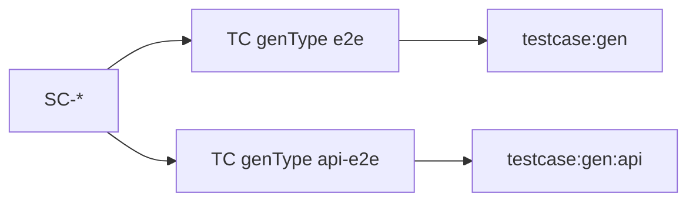

# Tests-docs (resource)

Vai trò **Tests-docs** trong bốn nhóm artifacts: [index.md](./index.md). Trang này mô tả **chuẩn nội dung và cấu trúc** của nhóm **tests-docs** trên disk.

**Tests-docs** là SSOT **tài liệu kiểm thử** — kịch bản cross-flow (`SC-*`), testcase theo màn/API (`TC-*.yaml`), ma trận phân vùng tương đương (`testMatrix`), trace về bundle trên **docs**. Đây là nơi team trả lời **kiểm gì** và **đúng nghiệp vụ nào**; **không** phải repo chạy Playwright (→ [code.md](./code.md) · **e2e-root**).

---

## Tests-docs chứa những gì?

- **Scenario (`SC-*`):** luồng E2E **xuyên nhiều màn / module**, bám `FLOW-*` trên docs hub.
- **Testcase (`TC-*.yaml`):** kế hoạch kiểm **theo function leaf** (một `W-*` / một màn chính), mirror path docs.
- **Catalog / locale (tùy init):** `catalog/locale.yaml` — tiêu đề section khi render.
- **Authoring (máy):** sửa `TC-*.yaml` / `SC-*.yaml` — schema, `testMatrix`, trace, gate.
- **Đọc cho team (người):** `cases:render` → `TC-*.md` cạnh YAML — **user case step-by-step** (precondition → bước → kết quả); **ma trận facet** + **traceability** hiển thị trên MD; machine steps / YAML gom trong `<details>`. VitePress tests hub (port 5174). Hướng dẫn author: [tpl-testcase-plan.md](../../harness/tests/templates/tpl-testcase-plan.md). **Không** sửa tay MD thay YAML.

**Không đặt ở tests-docs:** `*.bundle.yaml`, `ir/*`, spec nghiệp vụ; **không** coi `testcases/*.yaml` cạnh code FE là SSOT hub (có thể là bản sinh hoặc mirror sau `testcase:gen` — SSOT plan vẫn ưu tiên hub `cases/**` khi team dùng FlowGrid tests-docs).

---

## Vận hành team vs deliverable (Excel)

Nhiều team vẫn **bàn giao UAT / khách hàng** bằng **template Excel** testcase (cột: ID, mô tả bước, data, kết quả mong đợi, pass/fail…). FlowGrid **không** thay quy trình bàn giao đó — nhưng **tách rõ hai lớp tài liệu** để không có hai SSOT cãi nhau.

| Lớp | Mục đích | Định dạng & nơi lưu | Ai sửa khi đổi nghiệp vụ |
| --- | --- | --- | --- |
| **Vận hành (SSOT hub)** | Grill, `cases:gate`, trace bundle/docs | **Ghi:** YAML. **Đọc:** Markdown user case từng bước (`cases:render` → `TC-*.md`) | Sửa YAML (`/testcase`, `/scenario`) → `cases:render` |
| **Deliverable (bàn giao)** | Ký UAT, audit khách, archive theo hợp đồng — **không** feed codegen/gate | **Excel** (`.xlsx`) theo template dự án — đặt tách path, vd. `deliverables/testcases/`, `exports/uat/` hoặc drive release **có version** | **Xuất từ** SSOT hub sau khi chốt; không coi file Excel là nguồn cập nhật ngược vào gate |

**Nguyên tắc:**

- **SSOT trên disk** = YAML (`TC-*`, `SC-*`) — audit, automation, trace `W-*` / `AC-*`.
- **Bản team đọc** = Markdown **user case step-by-step** (sinh từ YAML, không chỉnh tay); Excel deliverable xuất **sau** bản đã chốt trên YAML/MD nội bộ.
- **Excel** = **ảnh chụp deliverable** theo template khách/PMO. Điền tay trên Excel trong UAT session là OK; nếu kết quả UAT **đổi** kỳ vọng kiểm thử lâu dài → cập nhật lại **docs** (nếu sai yêu cầu) và **YAML hub** (nếu sai plan), rồi **re-export** Excel cho bản bàn giao mới.
- **Cấm nhầm:** merge PR chỉ sửa `.xlsx` mà không cập nhật `TC-*.yaml` tương ứng — team mất trace và `cases:gate` / automation lệch Excel.

**Luồng gợi ý (team quen Excel):**

```text
docs bundle (user story, AC)
    → tests-docs TC-*.yaml (+ SC-* nếu cross-flow)
    → cases:render → TC-*.md (user case từng bước — team đọc)
    → export Excel (template dự án) → deliverables/…  [UAT / khách]
    → testcase:gen → Playwright (e2e-root)             [automation — tùy team]
```

Export Excel có thể là script nội bộ, macro template, hoặc bước thủ công copy từ MD — FlowGrid **chuẩn hóa SSOT** ở YAML; công cụ export Excel **không** bắt buộc trong core CLI (team gắn pipeline riêng nếu cần).

---

## Ba lane — không nhầm

| Lane | Root / pointer | Vai trò |
| --- | --- | --- |
| **Docs** | `FLOWGRID_DOCS_ROOT` | SSOT nghiệp vụ: bundle, acceptance, `FLOW-*` product |
| **Tests-docs** | `FLOWGRID_TESTS_DOC` | SSOT **plan** kiểm thử: `cases/**`, `scenarios/**` |
| **Code (e2e-root)** | repo FE, `--e2e-root` | **Chạy** automation: Playwright `.spec.ts`, PO, mock runtime |

Sai **yêu cầu** → sửa **docs** (và testcase liên quan) trước code. Gap **coverage** hoặc ma trận thiếu facet → sửa tests-docs. Lệch **script chạy** → code/e2e-root.

---

## Triển khai root

| Kiểu | Khi dùng |
| --- | --- |
| **Repo test riêng** | Project type **Test**, hoặc FE/BE/Fullstack trỏ `FLOWGRID_TESTS_DOC` sang repo/path khác (vd. `tests/fe-hub`, `base-tests`). |
| **Tests-docs in-repo** | Dự án nhỏ: `tests/`, `qa-docs/` trong repo FE — vẫn là **tests-docs resource** về nghĩa. |

### FlowGrid

| | |
| --- | --- |
| `FLOWGRID_TESTS_DOC` | Root tests-docs (CLI, audit, skills `/testcase`, `/scenario`). |
| `.flowgrid/config.json` | Ghi path tests-docs sau `init`. |
| `--tests-docs` | Flag khi engine/audit cần trỏ hub testcase (cùng ý env root). |
| `FLOWGRID_DOCS_ROOT` | Bắt buộc khi `cases:gate --strict` / audit testcase cần đọc **bundle** cùng leaf docs. |

Chi tiết env/flag & init: [references/cli-and-commands.md](../references/cli-and-commands.md). **`flowgrid doctor`** báo lỗi nếu MCP agent thiếu `FLOWGRID_TESTS_DOC` khi config có `testsRoot` (sau init chọn tests hub).

**e2e-root:** plan ở tests-docs; automation ở `frontend.e2eRoot` (**`tests/e2e`**) hoặc `backend.e2eRoot` (**`tests`**, gồm `tests/api-e2e/`) — [code.md § e2e-root](./code.md#e2e-root).

### VitePress (`flowgrid dev` · `flowgrid build`)

Khi **tests-docs in-repo**, `init` copy `engines/cases/vitepress` → `<testsRoot>/.vitepress`. CLI chạy `vitepress dev|build <testsRoot>` (dev port **5174** để không đụng docs hub). Path đọc từ `frontend.testsRoot` hoặc **`backend.testsRoot`** (repo Backend integration tests plan).

Repo **vừa có docs-hub vừa có tests-docs** (FE, **BE**, hoặc Fullstack in-repo): không cần hai script build riêng — `pnpm flowgrid:build` (= `flowgrid build`) gọi `vitepress build` lần lượt cho `docsRoot` và `testsRoot`. **Backend** vẫn cần **docs-hub** (spec API / surfaces) song song tests-docs — cùng cặp lệnh `flowgrid dev` / `build`, không chỉ dành cho FE.


---

## Cây thư mục (điều hướng)

Root = tests-docs hub. Path **mirror** docs hub (bỏ prefix `surfaces/` khi map sang `cases/` hoặc `scenarios/` — xem bảng dưới).

```text
catalog/
└─ locale.yaml                    # memberLocale, headings — cho cases:render

cases/                            # testcase plan — TC-*.yaml (SSOT)
└─ <mirror-docs-path>/            # vd. admin/CMP-ADM-AUTH-01/01/01/login/
   ├─ TC-AUTH-01.yaml
   └─ TC-AUTH-01.md              # user case step-by-step (render) — không sửa tay

scenarios/                        # cross-flow — SC-* (YAML; có thể kèm SC-*.md review)
└─ <mirror-FLOW-path>/            # thư mục = tên FLOW (không .md)
   └─ FLOW-checkout/
      └─ SC-CHK-01.yaml

plans/                            # tùy dự án — readiness / batch plan (optional)

index.md                          # cases:render có thể tạo/cập nhật index section
```

**Cấm path phẳng ad-hoc:** `cases/admin/auth/W-…` khi docs thật là `surfaces/admin/CMP-*/…` — path **phải** khớp cấu trúc docs (cluster số `02/01/…` giữ nguyên).

### Mirror `cases/` ↔ function leaf docs

| Docs (leaf function) | Tests-docs |
| --- | --- |
| `surfaces/<surface>/CMP-*/<NN…>/<slug>/` (`*.bundle.yaml`) | `cases/<surface>/CMP-*/<NN…>/<slug>/TC-*.yaml` |

Ví dụ:

- Docs: `surfaces/admin/CMP-ADM-ORD-01/02/01/login/login.bundle.yaml`
- Tests: `cases/admin/CMP-ADM-ORD-01/02/01/login/TC-LOGIN-01.yaml`

### Mirror `scenarios/` ↔ `FLOW-*.md` docs

Chỉ tạo scenario khi file **`FLOW-*.md`** đã có trên docs (không lấy nguồn từ `common/yaml/` hay `common/patterns/`).

Thứ tự tìm FLOW trên docs (cùng LCA common):

1. `surfaces/<surface>/<CMP>/<NN>/common/user-flows/FLOW-*.md`
2. `surfaces/<surface>/<CMP>/common/user-flows/FLOW-*.md`
3. `surfaces/<surface>/common/user-flows/FLOW-*.md`
4. `surfaces/common/user-flows/FLOW-*.md`
5. `architecture/03-user-flows/FLOW-*.md` (catalog / luồng kỹ thuật — chỉ khi team test theo FLOW kỹ thuật)

| Docs FLOW path | Tests hub scenarios |
| --- | --- |
| `surfaces/<rest>/common/user-flows/FLOW-checkout.md` | `scenarios/<rest>/common/user-flows/FLOW-checkout/SC-*.yaml` |
| `architecture/03-user-flows/FLOW-checkout.md` | `scenarios/architecture/03-user-flows/FLOW-checkout/SC-*.yaml` |

**Không** flatten `scenarios/auth/…`. **Không** dùng `common/` legacy một cấp ở root scenarios.

---

## Đọc SSOT nghiệp vụ trước khi viết test

| Việc | Rule |
| --- | --- |
| Nguồn coverage | Đọc **toàn bộ** `*.bundle.yaml` cùng leaf docs — **không** chỉ `ir/spec.yaml` + `ir/design.yaml` khi grill testcase |
| Bundle thiếu story/AC | **Dừng** — handoff `/spec` hoặc `/update-spec` trên docs; **không** bịa testcase |
| `flowgrid check` / split lệch | Reconcile bundle ↔ `ir/*` trên docs trước testcase |
| Trace | `traceability` trên TC: `bundleScreen`, `bundleScenarios[]`, `acceptanceRefs[]` (`AC-01`…), `actionRefs[]` (`btn_*`) — bắt buộc cho `cases:gate --strict` |
| Codegen Playwright | FE vẫn đọc `ir/design.yaml` sau split; **thiết kế** testcase bám **bundle** |

---

## Testcase `TC-*.yaml` (schema v2)

SSOT schema: `schemas/testcase.schema.json` (package FlowGrid). Mẫu vàng: `harness/tests/templates/TC.example.yaml`.

| Yêu cầu | Ghi chú |
| --- | --- |
| `schemaVersion: 2` | Bắt buộc cho release gate |
| `id` | `TC-…` ngắn |
| `title` | Ngắn (~15–20 ký tự); giải thích dài → `description` / `story` |
| `refs` | `screen` (`W-*` / `API-*`), `scenario` (`SC-*`), `module` (`CMP-*`) |
| `testMatrix` | Facet: `positive_boundary`, `negative_length`, `negative_format`, `negative_duplicate`, `concurrency_double_submit`, `network_interruption`, … |
| `steps` | ≥ 1 bước (ngôn ngữ QA / BDD) |
| `coverage` | Enum: `happy`, `validation`, `boundary`, `authorization`, `exception`, `concurrency`, … |
| `testIds.required` | Khớp `ui.testIds` / design bundle sau split — quy ước đặt tên & markup FE: [code.md § testId](./code.md#e2e-testids) |
| `genType` | `e2e` (plan hub — sinh spec ở e2e-root qua `testcase:gen`) |

**YAML thuần:** không nhúng biểu thức JS (`"a".repeat(256)`); ghi chuỗi literal hoặc quote đúng.

---

## Scenario `SC-*`

- Mô tả **hành trình xuyên flow**; frontmatter/list **`screens: [W-…, …]`** cho mọi màn chạm tới.
- Sau khi viết: `flowgrid audit scenario <file> --tests-docs <hub>` — lấp gap `SC_SCREEN_NO_TC` bằng `cases/**/TC-*.yaml` hoặc `coverage_deferred` + `QA-*` trên docs.
- Review dài có thể dùng `SC-*.md` (IEEE 29119 boundary table + Gherkin); **contract machine** ưu tiên YAML theo skill `/scenario`.

Mẫu tham khảo: `harness/tests/templates/SC.example.md`.

---

## ID chuẩn (tests lane)

| Prefix | Vai trò |
| --- | --- |
| `SC-*` | Scenario cross-flow |
| `TC-*` | Testcase plan (file YAML) |
| `W-*` / `API-*` | Tham chiếu màn/contract trên docs (trong `refs`, trace) |
| `FLOW-*` | Tham chiếu luồng docs (scenario folder name) |
| `CMP-*` | Module trong `refs.module` |
| `QA-*` | Open question trên docs khi defer coverage |

`SC-*` / `TC-*` **không** thay `DEP-*` (deployment) hay target kiến trúc cũ `CTR-*`.

---

## Lệnh & gate (tham chiếu)

| Việc | Gợi ý lệnh |
| --- | --- |
| Validate schema YAML | `flowgrid cases:check` / `pnpm cases:check` (alias sau init) |
| YAML → MD user case (từng bước) | `flowgrid cases:render` / `pnpm cases:render` |
| Coverage spec ↔ plan | `flowgrid cases:coverage` |
| Audit một TC + bundle | `flowgrid audit testcase <TC.yaml> --bundle <path/to.bundle.yaml>` |
| Release gate (IT/release) | `flowgrid cases:gate [--strict] [--docs-root $FLOWGRID_DOCS_ROOT]` |
| Sinh Playwright UI skeleton | `testcase:gen` (`genType: e2e`) trên **e2e-root** |
| Sinh Playwright API hook spec | `testcase:gen:api` (`genType: api-e2e`) → `tests/api-e2e/**/*.api.spec.ts` |

**`cases:gate --strict`:** JSON Schema v2 + audit testcase + `traceability` bundle + facet ma trận theo màn + (tùy) coverage scenario. Chạy trước wire/release khi team bật gate.

Mốc workflow: [workflows/gates.md](../workflows/gates.md) · tham số audit: [references/cli-and-commands.md](../references/cli-and-commands.md#audit--harness-pr-workflow).

---

## API hook / webhook (TC plan) {#api-hook-tc}

Dùng khi docs có **hợp đồng BE-only** (`feature.source.base: none`, `/api-spec`, `/grill-api-spec`) — webhook inbound/outbound, partner/public API.

### SSOT trên tests-docs

| Trường | Gợi ý |
| --- | --- |
| `genType` | **`api-e2e`** (bắt buộc cho `testcase:gen:api`) · UI portal dùng `e2e` |
| `refs.screen` | `API-*` (schema bắt `^API-` khi `api-e2e`) |
| `api` | `baseUrlEnv`, `baseURL`, `defaultHeaders` |
| `apiSteps[]` | `method`, `path`, `expectStatus`, `body`, `headers`, `expectJson` |
| `tags` | `integration`, `webhook`, `partner-api`, `contract-postman` |
| Mẫu YAML | `harness/tests/templates/TC.example-api.yaml` |

Skill author: **`/test-api`** · grill plan vẫn qua `/grill-testcase` + `audit testcase --bundle`.

### Sinh automation (Playwright `request`)

```bash
flowgrid testcase:gen:api --testcase cases/.../TC-PARTNER-EXPORT.yaml
flowgrid testcase:gen:api:dry --id TC-PARTNER-EXPORT
flowgrid testcase:gen:api --all
pnpm flowgrid:api-e2e-gen -- --testcase ...
```

- Chạy trên **e2e-root** (repo FE/code); input YAML từ **tests-docs** hub (`FLOWGRID_TESTS_DOC`).
- Output: `tests/api-e2e/<module>/<TC-id>.api.spec.ts`.
- Env: `FLOWGRID_API_TEST_BASE_URL` hoặc tên trong `api.baseUrlEnv`.

### Playwright vs Postman vs BE test

| Nhu cầu | Gợi ý |
| --- | --- |
| Hook/partner HTTP trong lane FlowGrid | **`genType: api-e2e`** + `testcase:gen:api` (Playwright `request`) |
| UI tạo data → partner đọc API | **`SC-*`** + 2 TC: `e2e` (UI) + `api-e2e` (hook); CI truyền `orderId` qua env giữa 2 job hoặc một spec hybrid tay |
| Collection đối tác / HMAC phức tạp | Postman + Newman trong `integrations/postman/`; tag TC `contract-postman` (chưa gen từ FlowGrid) |
| Chữ ký webhook, idempotency, DLQ | Test **BE** (Supertest/pytest/…) — không thay bằng tests-docs |



Gate: `cases:check` (schema hỗ trợ `api-e2e`) · `cases:gate --strict` · `audit testcase` với bundle integration trên docs-hub.

---

## Skill & vai trò (T-shaped)

| Skill | Owner hub | Mục đích |
| --- | --- | --- |
| `/testcase` | tests-docs | Author `TC-*.yaml` UI (`genType: e2e`) |
| `/test-api` | tests-docs | Author `TC-*.yaml` API hook (`genType: api-e2e`) |
| `/scenario` | tests-docs | Author `SC-*` bám `FLOW-*` |
| `/grill-testcase` | tests-docs | Grill plan YAML + bundle audit |
| `/grill-test` | **e2e-root** (FE/code repo) | Matrix TC ↔ PO ↔ `*.spec.ts` · `audit e2e` |
| `/test` | e2e-root | Sửa Playwright sau gen |
| `testcase:gen` | CLI | UI plan → `tests/e2e/**/*.spec.ts` |
| `testcase:gen:api` | CLI | API plan → `tests/api-e2e/**/*.api.spec.ts` |

QA thường sở hữu tests-docs; dev tham gia grill và wire. Chi tiết skill: [CLI & skills](../references/cli-and-commands.md) · harness `harness/tests/skills/`.

---

## Quan hệ với nhóm resource khác

- **Docs:** định nghĩa hành vi và acceptance — tests-docs **trace ngược** bundle; không sửa nghiệp vụ trên hub test.
- **Code:** `testcase:gen` và Playwright **thực thi**; `ir/design.yaml` cho locator/testId runtime.
- **DSL & platform:** tags `#e2e:*`, registry E2E — quy ước format trên generated spec, không thay `TC-*.yaml` SSOT.

Thứ tự làm việc và lane E2E: [workflows/test.md](../workflows/test.md).
