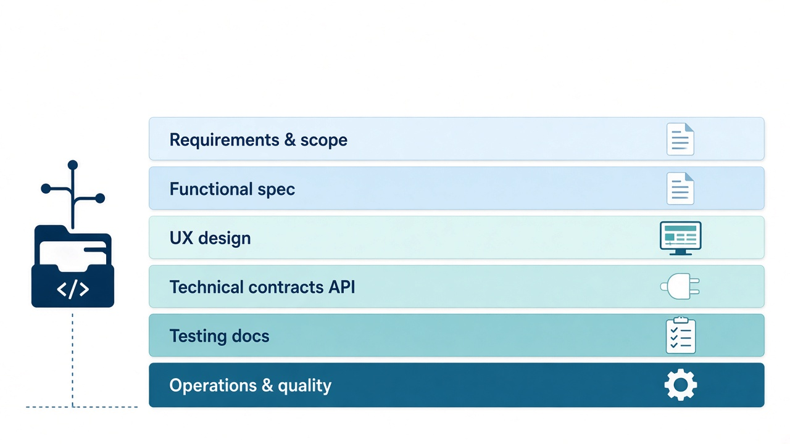
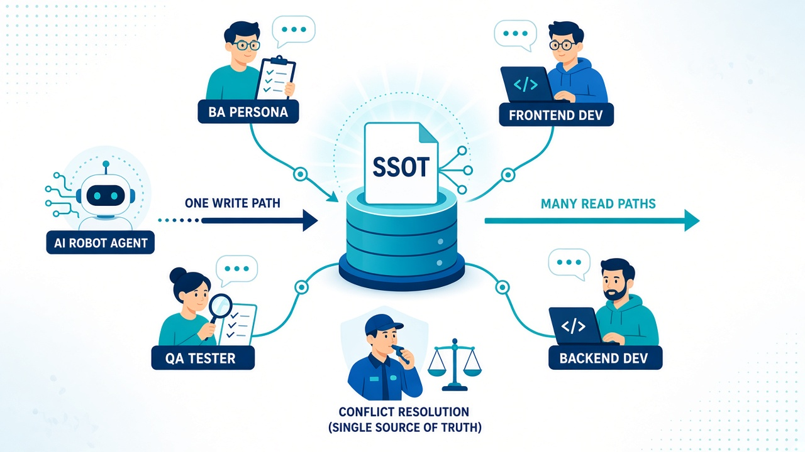
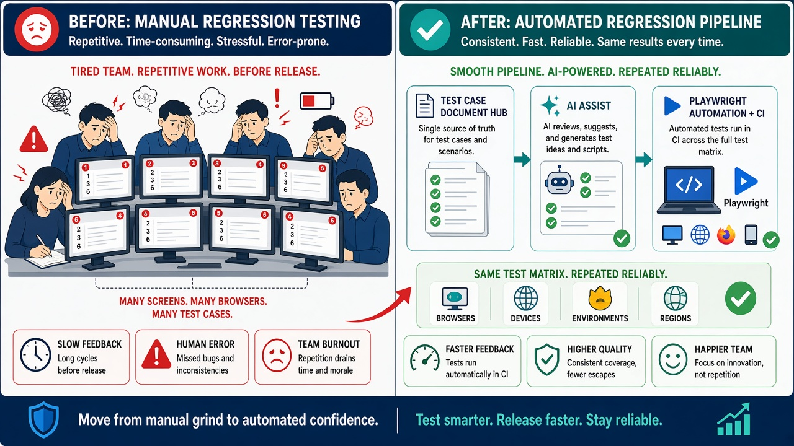
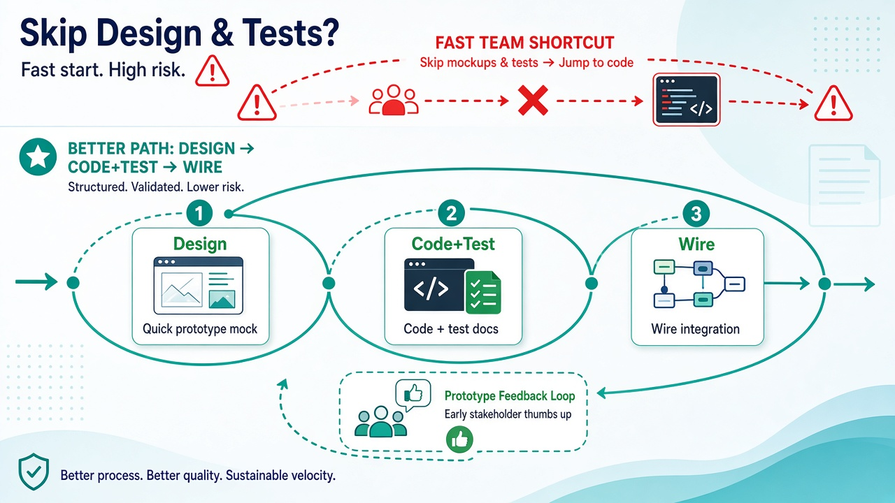
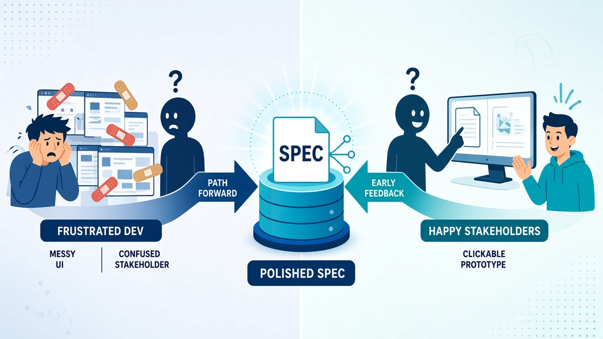
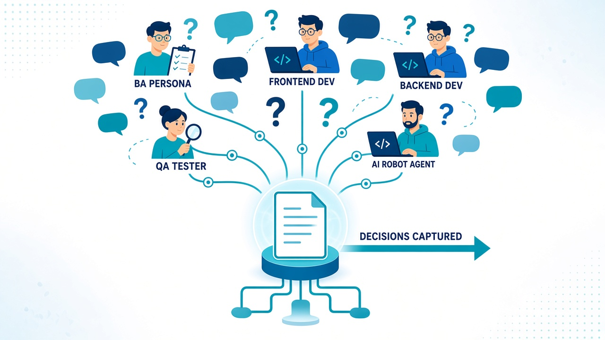
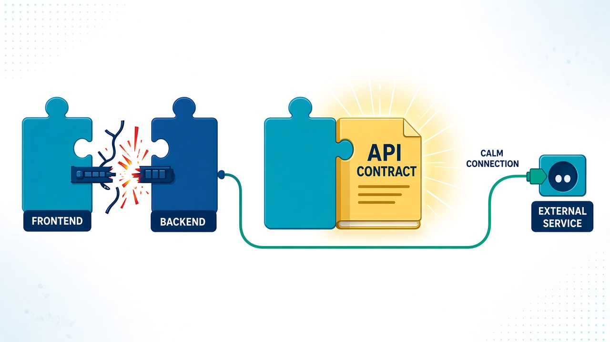
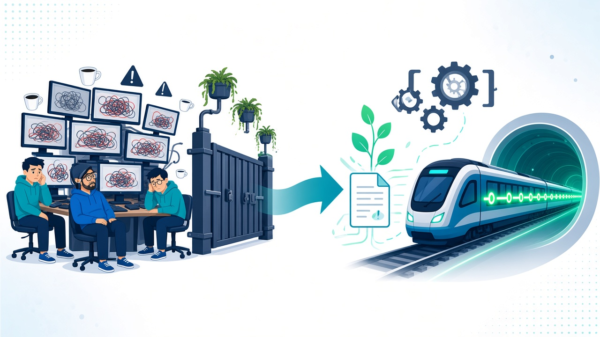

# Tổng quan

Tài liệu này dành cho member team phát triển phần mềm: giải thích **vì sao** cần bộ artifact đầy đủ và có cấu trúc, **vai trò SSOT** trong dự án, **cách các phase phát triển thường bị cắt giảm** khi đẩy nhanh — và **cách FlowGrid cùng AI hiệu chỉnh** để vẫn giữ lane quan trọng mà không trả lại toàn bộ chi phí viết tài liệu thủ công. Toolkit tối ưu ở chỗ: chuẩn hóa định dạng trên repo, skill và agent bám cùng lane, audit/gate phát hiện thiếu sót có cấu trúc, codegen và sinh testcase/E2E lấp phần **công số** — để team tập trung **grill, review và chốt** thay vì bỏ hẳn tài liệu vì “agile không cần doc”.

## Ba nguyên tắc vận hành

FlowGrid kết hợp **script deterministic** và **agent** trên cùng SSOT — hai lớp bổ trợ, không thay nhau:

1. **Phân vai kiểm tra (lượng / chất)** — `flowgrid audit *`, `cases:gate` báo thiếu field, schema, trace (`gaps[]`, `confirms[]`) bằng Node thuần; grill (`/grill-bqa`, `/grill-dev`, …) và review member xử lý logic nghiệp vụ, nhất quán UI ↔ API ↔ testcase. Agent bám skill chuẩn (`/spec`, `/legacy`, `/update-spec`, …), không tự điền thiếu sót im lặng — gap phải grill hoặc chốt qua `qa`. Chi tiết: [workflows/grill-and-human-review.md](../workflows/grill-and-human-review.md).
2. **Anti-Copy-Paste Guard & Common Catalog** — triệt tiêu code trùng lặp: skill `/init` tự động phát hiện các ứng viên `CMN-UI-*`, `CMN-API-*`, `CMN-DTO-*` và cảnh báo nhân bản trang; chuẩn hóa Rule qua `/common`; cài đặt 1 bản duy nhất trong thư mục `shared/`; và cưỡng chế qua `/spec` để tuyệt đối **không** copy code rác từ legacy sang module mới. Chi tiết: [Phase 0 — Setup](../workflows/phase-0-setup.md#4-bo-ky-nang-co-che-ngan-chan-duplicate-code-anti-copy-paste-guard).
3. **Kỷ luật workflow** — khi `gaps[]` + `confirms[]` vượt ngưỡng (~10), dừng hỏi lẻ, chuyển plan chia phase (Law 2); spec màn lớn phân **zone** (header, toolbar, bảng/form, footer) từng lượt để tránh lost-in-the-middle; `audit`/`gate` chạy sau artifact, **không** thay backlog hay sprint board. Mốc gate: [workflows/gates.md](../workflows/gates.md) · chuỗi đóng một function (`W-*`): [gates § Đóng một function](../workflows/gates.md#close-one-function).

Đội **T-shaped** dùng FlowGrid làm lane artifact trên một function (`W-*`): spec → prototype → API → tests-docs → wire — macro và vai trò: [workflows/index.md](../workflows/index.md).

## Ba ngữ cảnh triển khai

*Xem tài liệu hướng dẫn từng bước chi tiết + sơ đồ điều hướng:* **[Phase 0 — Setup & Khởi tạo dự án](../workflows/phase-0-setup.md)**.

| Ngữ cảnh | Đặc điểm | Quy trình chuẩn (Phase 0 ➔ Feature) |
| --- | --- | --- |
| **1. Greenfield** | Làm sản phẩm mới hoàn toàn từ con số 0 | `flowgrid setup` ➔ `/init` ➔ `/spec` ➔ `/prototype` ➔ `/api-spec` ➔ `/testcase` ➔ `/wire` |
| **2. Maintain** | Tiếp tục phát triển và bảo trì codebase hiện có | `flowgrid setup` ➔ đưa code vào `source-code/` ➔ `/init` quét map ➔ dùng kèm `/trace` khi viết `/spec` để đối chiếu logic ngầm |
| **3. Rebase / Modernization** | Đập đi làm lại từ hệ thống legacy cũ (đổi stack) | Đưa code cũ vào `source-legacy/` (READ-ONLY) ➔ `/init` bóc tách `CMN-*` kích hoạt Anti-Copy-Paste Guard ➔ đề xuất Golden Sample huấn luyện `build-template-code` ➔ dùng kèm `/legacy` khi viết `/spec` |

## Các lớp artifact một team cần

Một sản phẩm phần mềm “đủ nghiệp vụ” thường phải duy trì nhiều lớp đầu ra song song với code. Khi deadline gấp, các lớp này hay bị **cắt** hoặc **viết sơ** — tiết kiệm ngắn hạn, đổi lại mơ hồ, onboarding chậm, lệch FE–BE và regression mỗi release. Agile đúng nghĩa ưu tiên **trao đổi** để hiểu đúng bài toán; sau khi chốt, vẫn cần **ghi nhận** để lane sau (dev khác, QA, agent) không phải đoán.

- **Yêu cầu & phạm vi**
  - vision, mục tiêu, actor/persona;
  - phạm vi release, giả định, quyết định kiến trúc/sản phẩm.
- **Spec chức năng**
  - user story, acceptance;
  - luồng màn hình, rule nghiệp vụ;
  - open question (QA) chờ làm rõ.
- **Thiết kế trải nghiệm**
  - wireframe, mock, prototype;
  - thống nhất hành vi trước khi “đóng” UI production.
- **Hợp đồng kỹ thuật**
  - API, schema, integration;
  - data và gọi dịch vụ ngoài — FE, BE và hệ thống bên thứ ba cùng một bản chốt.
- **Kiểm thử**
  - testcase, scenario, test suite;
  - làm căn cho test thủ công và automation.
- **Vận hành & chất lượng**
  - technical debt, derived requirement;
  - ghi nhận phụ thuộc ngoài, ràng buộc vận hành, marker cập nhật sau release.

FlowGrid không thay thế việc team **chọn phạm vi** theo quy mô dự án; nó giúp khi đã chọn ghi nhận thì ghi **đúng chỗ, đúng format**, và duy trì **nhẹ** nhờ AI hỗ trợ draft — member vẫn review và chốt.

## SSOT — vai trò trung tâm

**Single Source of Truth (SSOT)** trong FlowGrid là **artifact trên disk** (docs-hub, tests-docs, contract trong repo code) được `flowgrid setup` và skill `/init` thiết lập chuẩn xác — **cùng version control với code**, không phải slide rời hoặc wiki tách repo không đồng bộ merge.

SSOT đóng các vai trò sau cho cả dự án:

- **Nguồn tin chính xác nhất** cho một chủ đề đã chốt: spec chức năng, ma trận testcase, API contract, user-flow catalog vs detail — mọi lane (BA, dev FE/BE, QA, agent) đọc **cùng file**, không mỗi người một bản Excel hoặc thread chat làm “bản chính”.
- **Trọng tài khi tranh luận:** hai cách hiểu khác nhau về hành vi màn hình, field API hay coverage test → so với SSOT (bundle, `TC-*.yaml`, `01-backend-spec.yaml`, …). Quyết định thay đổi phải **cập nhật artifact**; grill và audit giúp phát hiện chỗ chưa khớp trước khi merge code.
- **Khóa write rule — tránh nhân bản mâu thuẫn:** ví dụ user-flow — tầng Architecture giữ overview `FLOW-*` sơ, curated; chi tiết actor/action/exception nằm Common theo scope. Module `CMP-*` có **owner surface**; surface khác **map/link**, không copy SSOT. Function là leaf `W-*` / `API-*` với bundle + IR + API seq. Vi phạm rule → codegen, portal và agent dễ **lệch** spec thật.
- **Một địa chỉ cho agent:** slash skill và MCP đọc path cố định; prompt không phải mô tả lại cấu trúc dự án mỗi phiên. SSOT là “bản đồ” mà harness và engine audit cùng tin.
- **Điều kiện cho kiểm định máy:** `flowgrid audit *`, `cases:gate` so schema, field bắt buộc, trace testcase ↔ bundle — chỉ có ý nghĩa khi đã có **định dạng chuẩn** và một nơi chốt. Audit báo **lượng** (thiếu, lệch cấu trúc); grill nghiệp vụ và review release vẫn là **chất** — do member và lead.

SSOT **không** bắt buộc viết dài. SSOT có nghĩa **đủ field, đủ liên kết**, cập nhật khi đổi scope — AI sinh bản đầu và gợi ý patch; người giữ đúng nghiệp vụ và quyết định sản phẩm. Triết lý toolkit: **cung cấp SSOT, skill, audit/gate và đường gen E2E**; team **chọn chạy đúng luồng**, đọc gap, và **chốt**.

## Kiểm thử thủ công, IT và automation E2E

Regression thủ công trước release — nhất là sản phẩm nhiều màn hình — tốn người, dễ sót, khó đảm bảo cùng một độ phủ giữa các lần phát hành. Manual và exploratory vẫn cần cho ngữ cảnh mới; điểm đau là **lặp lại** cùng bộ kiểm tra đã biết.

Luồng khớp SSOT:

- **Testcase và scenario** là hub tại **tests-docs** (tách với repo chạy Playwright nếu cần).
- AI hỗ trợ sinh và mở rộng ma trận; QA **grill** nghiệp vụ và trace về bundle/spec.
- **Automation E2E** sinh từ document testcase; dev bổ sung lỗ hổng kỹ thuật còn thiếu.
- Trước release: chạy automation và đối chiếu doc ↔ spec E2E (audit e2e) để giảm lệch giữa “đã viết” và “đã chạy”.

Member QA chỉ có kỹ năng manual vẫn có thể nhờ AI gen lane automation; **không** thay policy release một vòng manual khi team vẫn yêu cầu — toolkit **hỗ trợ** giảm gánh IT lặp.

## Phase phát triển và hiệu chỉnh khi đi nhanh

Nhiều mô hình (spiral, dual-track, v.v.) đều có các **mốc tương đương**: khám phá & phạm vi → thiết kế chi tiết (UX, spec) → xây dựng FE/BE → kiểm thử → tích hợp & phát hành. Team tốc độ cao thường **gộp hoặc bỏ** bước để giảm chi phí. FlowGrid **không** ép waterfall đầy đủ; nó **giữ phase quan trọng** dưới dạng artifact + skill + gate, và **rút thời gian** nhờ prototype nhanh, spec có schema, AI/codegen — macro **design → code + test → wire** là cách gom các mốc trên cho một nhịp release.

### Cắt mock / design UI

- **Rủi ro**
  - UI lệch kỳ vọng stakeholder so với hình dung ban đầu.
  - Rework nhiều trên code production đã “đóng” layout và component.
  - Đến cuối sprint mới thấy thiếu sót nhưng không muốn rework lớn → **chắp vá** cho kịp release.
  - Không có **design kỹ thuật** (state, action, field, error path) chuẩn từ đầu → dev và QA tự suy diễn khác nhau.
- **Hiệu chỉnh**
  - Thay vì bỏ hẳn lane thiết kế hoặc vẽ tĩnh dài rồi sửa nhiều vòng: **prototype / mock sớm nhất, nhanh nhất** có thể.
  - Từ yêu cầu cơ bản, gạch đầu dòng team/stakeholder bàn bạc — **build màn hình prototype** để họ trải nghiệm sớm (AI + skill `/prototype` hỗ trợ lane này).
  - **Lấy feedback sớm**, sửa trên prototype rẻ hơn sửa trên production.
  - Sau khi **chốt prototype** → chốt **SSOT spec** trên docs-hub → design kỹ thuật (bundle/IR) → viết / cập nhật testcase — không nhảy thẳng code cứng khi hành vi chưa ổn.

### Spec chỉ trao đổi miệng

- **Rủi ro**
  - Dev, QA và stakeholder nhớ **khác phiên** — không có bản “đã chốt” để đối chiếu.
  - Agent sinh code/patch **sai ngữ cảnh** vì prompt không bám artifact.
  - Onboard member mới hoặc handoff giữa sprint **tốn thời gian** hỏi lại từ đầu.
  - CR giữa chừng không ai biết **delta** so với bản trước — dễ sót rule nghiệp vụ.
- **Hiệu chỉnh**
  - Sau trao đổi: capture vào **spec có schema** trên docs-hub (user story, rule, open question) — ngắn nhưng **đủ field**.
  - AI draft từ meeting note hoặc bullet; BA/dev **grill** trước codegen.
  - Mỗi thay đổi scope đáng kể → `/update-spec` (hoặc tương đương) + re-audit — SSOT luôn là trọng tài.
  - Chat và meeting giữ vai trò **khám phá**; SSOT giữ vai trò **đã quyết**.

### Không document testcase

- **Rủi ro**
  - **IT thủ công** lặp cùng checklist mỗi release — tốn người, dễ sót case đã biết.
  - Regression không **trace** về requirement — không biết bug “đã được spec chưa”.
  - QA và dev test **khác bộ** — báo pass nhưng production vẫn lỗi lane khác.
  - Không có căn để sinh automation — mỗi lần phải viết tay từ đầu.
- **Hiệu chỉnh**
  - Duy trì **tests-docs**: scenario, ma trận `TC-*.yaml`, suite có traceability về bundle.
  - AI hỗ trợ sinh / mở rộng ma trận; QA grill **chất** nghiệp vụ.
  - **`cases:gate`** trước khi coi testcase “đóng” cho scope — giảm merge “cho có”.
  - Document testcase là **đầu vào** cho E2E (mục kiểm thử phía trên), không tách rời spec đã chốt.

### Code API trước contract

- **Rủi ro**
  - FE gọi field/endpoint **khác** BE thực tế — phát hiện muộn ở wire hoặc UAT.
  - Integration với dịch vụ ngoài **đoán** schema — retry và hotfix tốn kém.
  - Refactor API sau khi UI đã bind — **breaking** nhiều màn hình.
  - Agent gen FE/BE **song song** không có SSOT contract → hai nhánh drift.
- **Hiệu chỉnh**
  - **API SSOT** trên artifact (vd. `01-backend-spec.yaml` theo seq) trước hoặc song song codegen có audit.
  - Lane **api-spec** / grill API; align FE–BE bằng `audit fe-be`, `audit api`.
  - Wire phase là **tích hợp có căn**, không phải lần đầu “mới biết contract sai”.
  - Thay đổi contract → cập nhật SSOT trước merge code tiêu thụ.

### Bỏ automation E2E

- **Rủi ro**
  - **“Đau IT”** mỗi release — cùng luồng critical path phải click lại từ đầu.
  - Độ phủ **không ổn định** giữa các phiên (người khác nhau, tâm trạng khác nhau).
  - Bug regression **lọt** dù manual đã “test rồi” — không có bộ chạy lặp determinism.
  - Team trì hoãn automation vì “không có thời gian viết” — vòng xoắn chi phí IT.
- **Hiệu chỉnh**
  - Testcase document là SSOT; sinh **Playwright** (hoặc stack E2E đã chọn) trên **e2e-root**.
  - Dev review phần kỹ thuật, selector, ổn định CI; QA giữ assert nghiệp vụ và ma trận.
  - Chạy automation ở pipeline hoặc trước release; **audit e2e** đối chiếu doc ↔ spec đã gen.
  - Manual/exploratory giữ cho case mới; automation giảm **lặp** case đã chốt trong tests-docs.

## Tóm tắt

- **Bài toán gốc**
  - Team cần nhiều lớp artifact (phạm vi, spec, UX, contract, test, chất lượng).
  - Đẩy nhanh → hay cắt doc hoặc viết sơ → chi phí ẩn: hiểu lệch, onboard chậm, regression.
  - Agile nhấn trao đổi; sau chốt vẫn cần capture có cấu trúc.
- **SSOT**
  - Artifact trên repo là nguồn tin chính, trọng tài conflict, khóa write rule, nền cho agent và audit.
  - Không đồng nghĩa văn phong dài; đủ field, đủ link, cập nhật khi đổi scope.
- **Kiểm thử**
  - tests-docs là căn testcase; e2e-root chạy automation bám document.
  - Giảm IT lặp mỗi release; manual vẫn cho exploratory và policy team.
- **Phase**
  - Có thể cắt phase nhưng không nên xóa hẳn ý nghĩa — thay bằng prototype nhanh, spec schema, gate, contract, E2E.
  - Macro design → code + test → wire gom nhịp làm việc thực tế; checklist audit từng leaf: [gates § Đóng một function](../workflows/gates.md#close-one-function).
- **Tối ưu FlowGrid + AI**
  - AI + skill + codegen lấp **công số** tạo và duy trì artifact.
  - Member **grill, review, chốt** — không gom cả repo một lần, không thay quyết định product owner.
  - Audit/gate báo thiếu/lệch có cấu trúc; giảm “tin miệng” ở mốc chuyển phase.

Cài đặt CLI, `flowgrid setup`, skill `/init`, bảng phase · skill và mô tả harness: xem **README** ở root repository FlowGrid.
