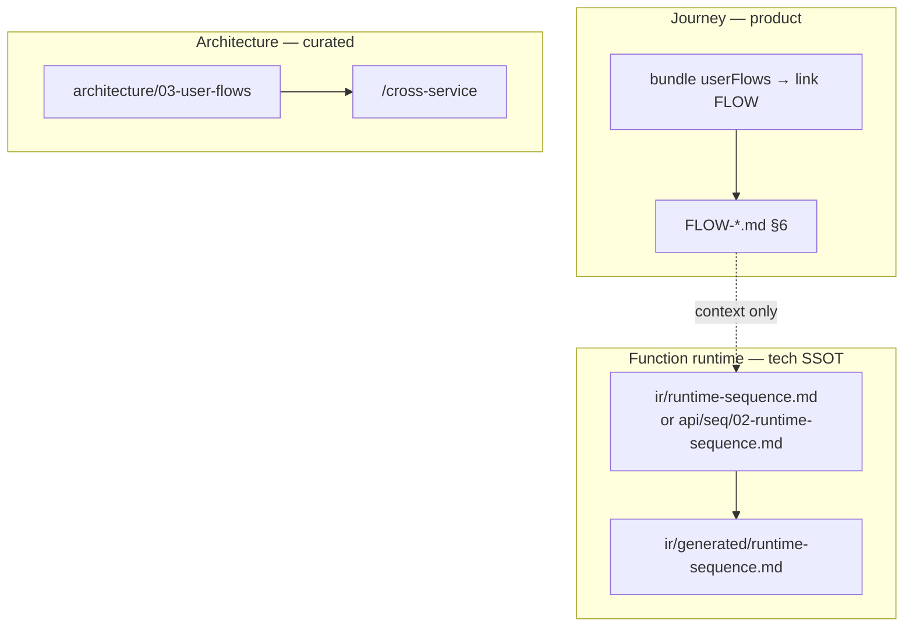

# Plan — Runtime sequence SSOT (agents + VitePress tech review)

**Status:** Proposed — **phase sau** [agent-design-context.md](./agent-design-context.md) (L2 interaction MD + link FLOW).  
**Draft extract:** `harness/docs/extracts/runtime-sequence.md` (ý tưởng; chưa bundle registry đầy đủ).

---

## 1. Vấn đề

| Hiện trạng | Hệ quả |
| --- | --- |
| DSL / `feature.bundle.yaml` + `stateMatrix` / `actions` | Đủ cho màn đơn giản; **không** đủ cho multi-call, saga, async, race, rollback |
| Agent đọc bundle + `01` trước codegen | Sinh code “đúng template, sai thứ tự / thiếu nhánh lỗi” (~2/10 theo quan sát team) |
| `FLOW-*` + `audit flow` | Có `sequenceDiagram` ở **journey** — tốt cho BA/QA, nhưng **granularity sai** cho một leaf `W-*` / một cụm API |
| VitePress leaf | `spec.md` + `api.md` + `data-model.md` — **không** có trang sequence runtime cho BE review |

**Giả thuyết đã kiểm chứng:** Khi có sequence diagram đúng tầng, agent phân tích và đề xuất ổn hơn rõ rệt.

**Mục tiêu:** SSOT diagram **theo function leaf** + publish site + **bắt buộc đọc** trong grill/codegen — không thay DSL, **bổ sung**.

---

## 2. Ba tầng diagram (không gộp)



| Tầng | Path | Đối tượng | Nội dung |
| --- | --- | --- | --- |
| **A — Journey** | `FLOW-*.md`, `common/user-flows/` | BA, QA, PO | `[W-*]` handoff, BR, **không** path HTTP chi tiết |
| **B — Function runtime** | Xem §3 | Dev FE/BE, agent grill/codegen | `W-*`, `API-*`, service, DB, queue, `alt/else` |
| **C — Architecture** | `03-user-flows`, skill cross-service | Tech lead, SRE | Xuyên hệ, ít file (~10–20%) |

**Rule:** Agent **code** target `W-*` → bắt buộc tầng **B** (nếu trigger §4). Tầng A chỉ bổ sung ngữ cảnh; không copy nguyên FLOW vào leaf.

---

## 3. SSOT authoring (tầng B)

```text
surfaces/<surface>/CMP-*/<NN…>/<slug>/
  <slug>.bundle.yaml
  ir/
    runtime-sequence.md              # SSOT khi chưa có api/ hoặc FE-led
    generated/
      runtime-sequence.md            # CHỈ render — member không sửa
  api/<seq>/
    01-backend-spec.yaml             # SSOT contract (giữ nguyên)
    02-runtime-sequence.md           # SSOT khi đã có api/ (ưu tiên BE review)
```

**Precedence render:** `ir/runtime-sequence.md` → nếu không có → `api/<primary-seq>/02-runtime-sequence.md` (primary = seq gắn `01` resolve từ bundle, cùng logic `resolveBackendSpecForBundle`).

**Template:** `templates/shared/tpl-runtime-sequence.md` (sau init → `.flowgrid/templates/`).

**Liên kết bundle:** Giữ `userFlows:` link `FLOW-*`; thêm (phase 2, optional) frontmatter `runtimeSequence: ir/runtime-sequence.md` chỉ khi path không theo convention — **default không cần field mới**.

---

## 4. Khi bắt buộc có diagram (trigger)

`flowgrid audit runtime-sequence <bundle.yaml>` — **warning** (không chặn split) khi **bất kỳ**:

| Trigger | Nguồn detect |
| --- | --- |
| ≥ 2 endpoint trong `01` | parse `01-backend-spec.yaml` |
| `stateMatrix` ≥ 3 trạng thái hoặc ≥ 2 transition có side-effect | `ir/design.yaml` / bundle |
| `asyncEvents` / `backgroundTrigger` / tag `#call-external` | `01` hoặc bundle tags |
| ≥ 3 `actions` có `apiRef` khác nhau | `ir/design.yaml` |
| Tag authoring `#multi-step` (explicit) | bundle `tags` |

**Nội dung tối thiểu khi có file:**

- Mermaid `sequenceDiagram`
- ≥ 1 khối `alt/else` (422 / 409 / timeout / 401)
- Participant có `[W-*]` hoặc `[API-*]` nếu leaf đã có ID
- Nếu có async: `rect rgb(...)` (đồng bộ rule `audit flow`)

---

## 5. Publish VitePress (member tech review)

| Bước | Hành vi |
| --- | --- |
| `flowgrid split` | Không đổi — IR như hiện tại |
| `flowgrid render` | Copy SSOT → `ir/generated/runtime-sequence.md` + banner “generated” |
| Sidebar leaf | Thêm mục **Runtime sequence** cạnh **API summary** (chỉ khi file generated tồn tại) |
| `tpl-api-contract.md` | Bảng “Read before writing”: thêm dòng Dev BE đọc runtime sequence **trước** grill `01` |

**Không** nhét diagram vào `api.md` (tránh file quá dài); trang riêng để diff/review PR docs.

---

## 6. Agent / skill (đọc trước codegen)

**Read order cố định** (ghi vào `runtime-sequence.md` extract + `api-spec`, `spec`, `grill-dev`, `grill-api-spec`, `prototype`):

1. `ir/generated/runtime-sequence.md` (hoặc authoring nếu chưa render)
2. `FLOW-*` từ `userFlows`
3. `ir/design.yaml` + `01-backend-spec.yaml`
4. `ir/generated/spec.md`

**Extract bundle:** thêm `runtime-sequence.md` vào `architecture-core` + `spec-requirement`.

**Không** yêu cầu sequence cho màn list CRUD 1 GET + 1 POST đơn — tránh audit noise (trigger §4).

---

## 7. Pha triển khai

| Phase | Việc | Deliverable | Breaking |
| --- | --- | --- | --- |
| **0** | Chốt plan + naming `02-runtime-sequence.md` | PR comment / doc này | — |
| **1** | Render + VitePress nav | `render-runtime-sequence.mjs`, `surfaces-nav`, `writeBundleMarkdownFile` | Không |
| **2** | `audit runtime-sequence` + `audit-run` + `audit-commands.md` | Engine + test fixture | Không |
| **3** | Skills + extract registry + `bundle-authoring.md` + `backend.md` workflow | Harness sync | Không |
| **4** | Init: copy `tpl-runtime-sequence.md`; optional seed `02` khi `api-spec` tạo trio | `init-scaffold` / api-spec skill | Không |
| **5** | MCP / ArtifactGraph: index `runtime-sequence` path cho `flowgrid_docs_route` | `src/docs/scan` hoặc route keys | Không |
| **6** | Pilot 2–3 leaf phức tạp trên hub thật; đo lại grill pass rate | Case study trong `docs/plans/` | — |

**WIP trong repo (chưa chốt):** một phần Phase 1 (render + nav) đã có file — **không publish npm** cho đến khi Phase 2–3 xong hoặc team revert WIP.

---

## 8. Việc **không** làm (scope guard)

- Không thay `01-backend-spec.yaml` bằng Mermaid làm SSOT codegen.
- Không bắt sequence trong `architecture/` cho từng màn CRUD.
- Không auto-gen diagram từ OpenAPI (chất lượng thấp) — agent/member **author** + audit.
- Không gộp tầng A vào tầng B (tránh HTTP chi tiết trong FLOW product).

---

## 9. Rủi ro & giảm thiểu

| Rủi ro | Giảm thiểu |
| --- | --- |
| Member không vẽ diagram | Warning audit + grill-api-spec checklist; không block split |
| Diagram lệch `01` | Traceability table trong template; `audit fe-be` + review BE |
| Trùng FLOW vs leaf | FLOW chỉ link; leaf diagram focus một `W-*` / một use-case API |
| Agent vẫn bỏ qua | Skill MANDATORY read + grill-dev fail nếu trigger §4 và missing file (phase 3) |

---

## 10. Chốt với team (checklist)

- [ ] Đồng ý tên file `02-runtime-sequence.md` cạnh `01`
- [ ] Đồng ý trigger audit (warning vs critical sau pilot)
- [ ] BE owner review trên VitePress đủ hay cần export PNG/PDF (defer)
- [ ] Có bật gate CI `audit runtime-sequence` trên PR docs hub không (phase 6)

**Sau khi chốt:** implement Phase 1→3 trong một release minor; consumer `harness sync` + doc “đọc runtime sequence trước grill”.
