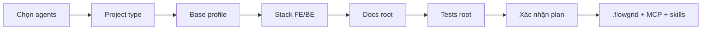

<!-- flowgrid-catalog -->
**[Danh mục tài liệu](CATALOG.md)**
<!-- /flowgrid-catalog -->

# FlowGrid

**FlowGrid** là nền tảng **CLI + harness** dành cho team phát triển phần mềm khi làm việc với **agent AI** (Cursor, Claude Code, Gemini/Antigravity, Codex, OpenCode, Hermes, Kiro, Kilo Code, … — chọn ở bước `flowgrid init`).

- **Workflow cho team** — các phase phát triển theo quy chuẩn: **design**; phát triển **code + test**; **wire**.
- **Quản lý artifact** — quy trình và SSOT trên disk cho dự án phần mềm:
  - **Spec / requirement** (docs-hub — SSOT):
    - user story, bundle spec;
    - thiết kế UI, action;
    - QA: open question;
    - artifact khác: technical debt, technical derived, call external service, …
  - **Document testcase** (tests-docs):
    - testcase, test suite;
    - scenario test.
- **Toolkit T-shaped** — hỗ trợ member mở rộng lane khi làm việc với AI:
  - **Dev** — skill dev chuyên sâu, kèm chút kỹ năng BA: nhờ AI phân tích / grill → spec đạt khoảng **70–80%** so với BA thông thường.
  - **BA** — phân tích, tạo requirement spec: nhờ AI code **prototype** theo yêu cầu, **không** cần nhờ dev.
  - **QA / Test** — skill manual test: nhờ AI sinh automation **E2E**; dev review bổ sung lỗ hổng còn thiếu theo document testcase.

FlowGrid **không** thay IDE hay model. Nó gắn **quy trình**, **định dạng artifact** và **lệnh kiểm định** vào repo để agent và member đi **cùng một lane**, **từng bước một**.

## Tổng quan

- **CLI (`flowgrid`)** — cài tool; `init` theo loại dự án; chạy audit, gate, codegen; `doctor`; sync harness.
- **Harness (skills + MCP)** — sau `init`, agent gọi slash command (vd. `/spec`, `/testcase`) theo `SKILL.md` đã sync; MCP server `flowgrid` nối engine docs / test / codegen với workspace.
- **Script audit** — kiểm tra **lượng** trên artifact (schema, field bắt buộc, trace testcase ↔ bundle) bằng Node thuần; output JSON `gaps[]`; bổ trợ grill **chất** của member và agent.
- **Workflow theo phase phát triển** — bám vòng đời thực tế **một tính năng**:
  - **Phân tích** — yêu cầu, phạm vi, kiến trúc (overview, module, luồng nghiệp vụ).
  - **Đặc tả** — bundle, user story, API contract trên **docs-hub**.
  - **Prototype UI** — feedback sớm, thống nhất hành vi trước code production.
  - **Backend** — spec API; sinh / xử lý service theo adapter stack (NestJS, FastAPI, …).
  - **Tests-docs** — scenario, ma trận `TC-*.yaml`; gate trước khi coi testcase **đóng**.
  - **E2E automation** — sinh Playwright từ testcase; regression trên **e2e-root** (repo FE); giảm **IT thủ công** lặp trước release.
  - **Wire** — ghép FE với API thật; audit đối chiếu tests-docs ↔ spec E2E.
- **Skill ↔ vai trò member (T-shaped)** — mỗi phase gắn skill và vai trò gợi ý; AI **hỗ trợ đúng việc, đúng người** — **không** gom cả repo một lần:
  - **Lead / BA** — phạm vi, kiến trúc, grill nghiệp vụ (`/overview`, `/grill-bqa`, …).
  - **Dev FE** — prototype, wire, unit / E2E lane code.
  - **Dev BE** — contract, implementation API, align FE–BE (`audit fe-be`).
  - **QA** — testcase trên **tests-docs**, grill testcase, theo dõi coverage E2E.
  - **Member** — vẫn **review, grill, chốt**; agent chuẩn hóa YAML/Markdown, gợi ý patch, chạy codegen — **không** tự quyết thay product owner.
- **Ba loại artifact trên disk** — có thể nhiều repo, nối bằng env:
  - **docs-hub** — `*.bundle.yaml`, IR, kiến trúc & function (`FLOWGRID_DOCS_ROOT`).
  - **tests-docs** — `cases/**`, `TC-*.yaml`, scenario (`FLOWGRID_TESTS_DOC`, `--tests-docs`).
  - **Code** — FE / BE / fullstack; test tự động trên **e2e-root** (`--e2e-root`), tách khỏi hub testcase.

## Phase · vai trò · skill

| Phase (tóm tắt) | Vai trò thường gặp | Hỗ trợ FlowGrid (ví dụ) |
| --- | --- | --- |
| Phân tích & phạm vi | Lead / BA | `/overview`, `/architecture`, `/module` |
| Đặc tả chức năng | BA / Dev | `/spec`, `/grill-bqa`, `flowgrid audit spec` |
| Prototype UI | Dev FE | `/prototype`, portal/codegen adapters |
| Backend & contract | Dev BE | `/api-spec`, `/api`, `audit api`, `audit fe-be` |
| Testcase (tests-docs) | QA / Dev | `/testcase`, `/scenario`, `cases:gate` |
| E2E automation | QA / Dev | `testcase:gen`, Playwright trên **e2e-root** |
| Tích hợp & kiểm tra trước release | Dev FE + QA | `/wire`, `flowgrid audit e2e` |

`flowgrid audit *` và `cases:gate` dùng ở các mốc trên để phát hiện lệch artifact trước khi sang phase kế tiếp.

---

## Cài đặt

**Yêu cầu:** Node.js **≥ 24** (Linux / macOS / WSL / Git Bash).

### GitHub private (PAT + curl)

**Không** `raw.githubusercontent.com/ShanYuCoder/flowgrid/...`. Bootstrap (public) tải `install.sh` qua GitHub API, rồi cài tarball từ Release.

PAT: **Contents: Read** trên `ShanYuCoder/flowgrid`.

```bash
export FLOWGRID_GITHUB_TOKEN=github_pat_XXXXX
export FLOWGRID_REF=latest

curl -fsSL \
  https://raw.githubusercontent.com/ShanYuCoder/flowgrid-docs/main/scripts/install-from-release.sh \
  | bash -s -- "$FLOWGRID_GITHUB_TOKEN"
```

Ghim tag:

```bash
export FLOWGRID_GITHUB_TOKEN=github_pat_XXXXX
export FLOWGRID_REF=v0.2.3

curl -fsSL \
  https://raw.githubusercontent.com/ShanYuCoder/flowgrid-docs/main/scripts/install-from-release.sh \
  | bash -s -- "$FLOWGRID_GITHUB_TOKEN"
```

**Cập nhật (GitHub):** chạy lại bootstrap khi có Release mới.

**Gỡ:** `flowgrid uninstall`

### 2. Khởi tạo repo (`flowgrid init`)

```bash
cd your-project
flowgrid init
```

| Bước | Ý nghĩa & Phân tích | Chi tiết từng lựa chọn |
| --- | --- | --- |
| **1. Select Agents/Skills to integrate** | **Tích hợp Harness & MCP vào Agent IDE/CLI**<br>Copy toàn bộ Kỹ năng (skills), quy chuẩn (rules) và cấu hình MCP (`flowgrid`) vào thư mục của Agent AI mà dự án sử dụng. Giúp Agent AI tự động nhận biết slash command, context và tool API FlowGrid.<br>*Nếu bỏ trống:* Bỏ qua copy harness/MCP (chỉ tạo `.flowgrid/` + scaffold), có thể sync sau bằng `flowgrid harness sync`. | • **`gemini`**: Gemini CLI / VS Code → copy `.agents/` (`mcp.json` + skills)<br>• **`antigravity`**: Google Antigravity IDE → copy `.antigravity/` (`mcp_config.json` + skills)<br>• **`cursor`**: Cursor IDE → copy `.cursor/mcp.json` + rules<br>• **`claude`**: Claude Code CLI<br>• **`codex`**: Codex CLI<br>• **`opencode`**: OpenCode<br>• **`hermes`**: Hermes Agent<br>• **`kiro`**: Kiro<br>• **`kilo`**: Kilo Code |
| **2. Select project type** | **Khai báo phân loại Repository (Lane)**<br>Định hình loại repo để FlowGrid áp dụng đúng quy chuẩn harness, tự động scaffold cấu trúc thư mục, và giúp các lệnh `audit`, `codegen`, `doctor` cũng như Agent AI nhận diện đúng vai trò trong hệ thống.<br>*Khuyến nghị:* Fork/clone base tham khảo chuẩn cùng lane trước khi `init`. | • **`Frontend`**: Repo chứa mã nguồn UI (Vue, React, Nuxt, Next,...)<br>• **`Backend`**: Repo chứa mã nguồn Server/API (NestJS, FastAPI, Go,...)<br>• **`Fullstack`**: Repo chứa cả Frontend & Backend trong cùng codebase<br>• **`Document`**: Repo trung tâm chứa tài liệu kiến trúc, specs, API contract (`docs-hub`)<br>• **`Test`**: Repo trung tâm chứa kịch bản kiểm thử, catalog testcase (`tests-docs hub`) |
| **3. Base Architecture Profile** *(Chỉ xuất hiện khi type ≠ Document)* | **Lựa chọn mức độ chuẩn hóa kiến trúc**<br>Xác định xem dự án đi theo kiến trúc khung chuẩn adapter của FlowGrid (Greenfield) hay sử dụng kiến trúc tùy biến / kế thừa sẵn có (Brownfield / Legacy). | • **`standard`**: Base kiến trúc chuẩn (Nuxt4, Next.js, NestJS, FastAPI,...). Tự động chạy `registry:sync` quét đồng bộ components & capabilities.<br>• **`custom`**: Base tùy biến / dự án sẵn có lệch khung chuẩn. Cấu hình sau init hoặc học qua Golden Sample (`custom-base`). |
| **4. Frontend / Backend technology (Adapter)** *(Tùy thuộc project type)* | **Chọn Adapter mã nguồn sinh Code & Quét Registry**<br>Khai báo framework mã nguồn chính xác để CLI và Agent AI sinh code (codegen), quét registry (`components/ui`, API endpoints) và kiểm tra audit đúng cú pháp framework đó. | **Dành cho Frontend / Fullstack:**<br>• `nuxt4`: Nuxt 4 (Vue 3)<br>• `nextjs`: Next.js (React)<br>• `custom`: Vue/React/Angular khác<br><br>**Dành cho Backend / Fullstack:**<br>• `nestjs`: NestJS (TypeScript)<br>• `fastapi`: FastAPI (Python)<br>• `custom`: Go, Express, Spring Boot, Python khác |
| **5. Documentation (docs-hub) location** *(Dành cho FE, BE, Fullstack)* | **Trỏ vị trí tài liệu kiến trúc (`docs-hub`)**<br>Khai báo nơi lưu trữ tài liệu spec/design. Nếu tài liệu nằm chung repo thì chọn In-repo để scaffold thư mục `docs/`. Nếu nằm ở repo `base_docs` riêng thì chọn Pointer trỏ đường dẫn. | • **`This repository`** (In-repo): Tạo & scaffold trực tiếp thư mục `docs/` trong repo này.<br>• **`Other location`** (Pointer): Nhập path tương đối/tuyệt đối trỏ sang repo Docs-hub ngoài (`FLOWGRID_DOCS_ROOT`). |
| **6. Tests-docs hub location** *(Dành cho FE, BE, Fullstack)* | **Trỏ vị trí kịch bản kiểm thử (`tests-docs`)**<br>Khai báo nơi chứa kế hoạch testcase/QA specs (`TC-*.yaml`). Tương tự docs-hub, có thể tạo thư mục `tests/` nội bộ hoặc trỏ sang repo `base-test-docs` tách biệt. | • **`This repository`** (In-repo): Tạo & scaffold thư mục `tests/` trong repo này.<br>• **`Other location`** (Pointer): Nhập path tương đối/tuyệt đối trỏ sang repo Tests-docs ngoài (`FLOWGRID_TESTS_DOC`). |
| **7. Automation / Playwright e2e-root** *(Dành cho FE, BE, Fullstack)* | **Định vị đường dẫn code Test tự động (Automation Code)**<br>Phân định rõ vị trí chứa code kiểm thử chạy được (Playwright TS, Page Objects, API E2E request specs) nhằm tách biệt với kịch bản mô tả YAML (tests-docs). | • **`Mặc định FE / Fullstack`**: `tests/e2e` (Playwright *.spec.ts & Page Objects)<br>• **`Mặc định Backend`**: `tests/api-e2e` (Playwright API E2E / Newman / request specs)<br>• **`Custom path`**: Đường dẫn tùy chỉnh do người dùng tự nhập |
| **8. Product i18n (đa ngôn ngữ sản phẩm)** *(Chỉ khi scaffold Docs-hub)* | **Cấu hình đa ngôn ngữ sản phẩm (gồm 2 sub-step)**<br>Khai báo danh sách ngôn ngữ hỗ trợ cho sản phẩm (vd: Việt, Anh, Nhật) và ngôn ngữ mặc định. Cấu hình này lưu tại `.flowgrid/product-i18n.yaml` làm căn cứ để Agent sinh các bản dịch dictionary/i18n cho UI.<br>*Quy trình 2 sub-step:*<br>• Sub-step 1: Nhập danh sách locale hỗ trợ.<br>• Sub-step 2: Chọn ngôn ngữ mặc định (*tự động bỏ qua nếu ở sub-step 1 chỉ nhập 1 ngôn ngữ*). | • **Sub-step 1 — Danh sách locale**: Nhập mã BCP-47 phân cách bằng dấu phẩy (mặc định: `vi`; nhập `vi,en,ja` nếu đa ngôn ngữ).<br>• **Sub-step 2 — Ngôn ngữ mặc định**: Chọn 1 ngôn ngữ trong danh sách trên làm default (*bỏ qua nếu Sub-step 1 chỉ nhập 1 ngôn ngữ*). |
| **9. Docs prose language** *(Khi scaffold Docs-hub hoặc Tests-hub)* | **Ngôn ngữ mô tả tài liệu & testcase**<br>Quy định ngôn ngữ tự nhiên (narrative/prose) được Agent AI sử dụng khi viết nội dung tài liệu spec, mô tả kịch bản testcase và hướng dẫn QA. | • **`vi`** (Mặc định): Viết văn bản mô tả bằng Tiếng Việt (các tiêu đề, keys, struct names luôn giữ Tiếng Anh).<br>• **Mã ngôn ngữ khác**: Nhập locale mong muốn (vd: `en` cho Tiếng Anh hoàn toàn). |
| **10. Installation Plan & Confirm** | **Rà soát & Xác nhận kế hoạch khởi tạo**<br>CLI hiển thị tổng hợp lại toàn bộ thông tin đã chọn (Project Type, Base Profile, Adapters, Paths, Locales, Agents) để người dùng rà soát trước khi thực thi ghi file. | • **`Proceed with initialization? (Yes)`**: Đồng ý khởi tạo. Ghi cấu hình, sinh scaffold và copy harness.<br>• **`No / Cancel`**: Hủy bỏ wizard, không ghi đè hay thay đổi bất kỳ file nào. |
| **11. Post-init execution** *(Tự động chạy sau confirm)* | **Ghi cấu hình & Khởi tạo tài nguyên trên đĩa**<br>Thực thi khởi tạo các tài nguyên hệ thống theo đúng thông số đã xác nhận. | • Ghi file `.flowgrid/config.json` & tạo `platform-repos.local.json`.<br>• Copy harness, skills, MCP config vào thư mục Agent chọn ở Bước 1.<br>• Scaffold cấu trúc thư mục `docs/`, `tests/` (nếu chọn In-repo).<br>• Kích hoạt `codegraph init` (nếu CLI `codegraph` đã có trên PATH). |

#### Base tham khảo (phối hợp tốt nhất với `flowgrid init`)

Các repo dưới đây là **golden sample** public — layout, registries, harness skill/MCP và convention artifact đã được căn theo lane FlowGrid. **Tham khảo (fork/clone) base đúng lane** thường cho kết quả tốt hơn repo trống + init một mình: wizard **project type** / **adapter** khớp thư mục, `flowgrid audit *` và codegen ít báo lệch path, và team docs · QA · dev dùng chung vocab (`CMP-*`, `TC-*`, bundle, scenario).

**Bộ ba multi-repo (mẫu khuyến nghị):**

| Lane | Vai trò | Base |
| --- | --- | --- |
| R2 — docs-hub | Spec, kiến trúc, grill design | [base_docs](https://github.com/ShanYuCoder/base_docs) |
| R3 — tests-docs | Scenario, `TC-*.yaml`, coverage E2E | [base-test-docs](https://github.com/ShanYuCoder/base-test-docs) |
| Code | FE / BE / fullstack theo stack | Một repo trong bảng [Base code theo adapter](#base-code-theo-adapter) bên dưới |

Trên repo **code**, bước init **5–6** chọn **Other** (hoặc env `FLOWGRID_DOCS_ROOT`, `FLOWGRID_TESTS_DOC`) để trỏ sang hub docs và tests-docs — giống cách các base trên đã thiết kế để chạy song song.

**Quy trình gợi ý:** fork base → `cd` repo → `flowgrid init` (type + stack như bảng) → `flowgrid doctor` → làm việc bằng slash skill (`/spec`, `/testcase`, …). Repo mới hoàn toàn: vẫn có thể `init` trên cwd trống, nhưng so layout với base tương ứng khi scaffold xong.

| Project type (bước 2) | Base tham khảo |
| --- | --- |
| **Document** (docs-hub) | [ShanYuCoder/base_docs](https://github.com/ShanYuCoder/base_docs) |
| **Test** (tests-docs) | [ShanYuCoder/base-test-docs](https://github.com/ShanYuCoder/base-test-docs) |

##### Base code theo adapter

Bước 2 chọn **Frontend** / **Backend** / **Fullstack**, bước 3–4 chọn profile + adapter; repo mẫu khớp stack:

| Vai trò | Adapter / stack (init) | Base tham khảo |
| --- | --- | --- |
| Frontend | `nuxt4` | [base-nuxt4](https://github.com/ShanYuCoder/base-nuxt4) |
| Frontend | `nextjs` | [base-nextjs](https://github.com/ShanYuCoder/base-nextjs) |
| Frontend | `dotnet-line` | [base-line](https://github.com/ShanYuCoder/base-line) |
| Backend | `nestjs` | *(monorepo fullstack)* [base-nextjs-nestjs](https://github.com/ShanYuCoder/base-nextjs-nestjs) hoặc [base-nuxt4-nestjs](https://github.com/ShanYuCoder/base-nuxt4-nestjs) — API trong `server/` / `apps/api` |
| Backend | `fastapi` | [base-fast-api](https://github.com/ShanYuCoder/base-fast-api) |
| Backend | `laravel` | [base-laravel](https://github.com/ShanYuCoder/base-laravel) |
| Backend | `dotnet-integration` | [base-donet](https://github.com/ShanYuCoder/base-donet) |
| Fullstack | `nextjs` + `nestjs` | [base-nextjs-nestjs](https://github.com/ShanYuCoder/base-nextjs-nestjs) |
| Fullstack | `nuxt4` + `nestjs` | [base-nuxt4-nestjs](https://github.com/ShanYuCoder/base-nuxt4-nestjs) |

Tất cả base code ở bảng trên **public trên GitHub** (org `ShanYuCoder`) — có thể xem README từng repo để biết lệnh dev/test và pilot feature (vd. Auth) trước khi `init` dự án thật.

Sau init: **`.flowgrid/config.json`**; dùng slash skill (vd. `/spec`) trong agent đã chọn.



Wizard tương tác: chạy `flowgrid init` trên repo dự án. Bảng bước, `flowgrid doctor` / `harness sync`: [CLI & commands](/references/cli-and-commands.md) (Audit & Harness · MCP).

### 3. Kiểm tra

```bash
flowgrid doctor
```
