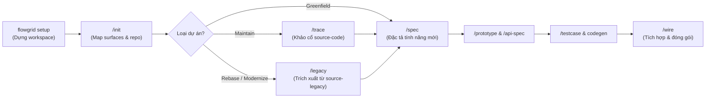

> [!IMPORTANT]
> 📚 **TÀI LIỆU THAM KHẢO:**
> 
> - 📖 **[Tài liệu dự án (GitHub)](https://github.com/ShanYuCoder/flowgrid-docs)** — Đọc tài liệu và tra cứu trực tiếp trên GitHub repository.
> - ⚙️ **Thư mục [workflows/](https://github.com/ShanYuCoder/flowgrid-docs/tree/main/workflows/)** — Chi tiết các phase phát triển và quy trình vận hành.

# FlowGrid

**FlowGrid** là nền tảng **CLI + AI Harness** chuẩn hóa quy trình phát triển phần mềm theo mô hình **SSOT (Single Source of Truth)** dành cho team làm việc cùng **Agent AI** (Cursor, Gemini/Antigravity, Claude Code, Codex, OpenCode,...).

**AI phục vụ con người** — không bắt member viết YAML phức tạp từ đầu:

```text
Requirement thô (bullet / ảnh / legacy code)
  → AI chuẩn hóa bundle + IR + render MD
  → Khử trùng lặp qua Anti-Copy-Paste Guard (Common Catalog CMN-*)
  → Prototype + review BA/QA/Dev
  → Codegen E2E / BE / wire + safety net
```

### 1. Tư duy AI hỗ trợ mở rộng năng lực T-Shaped Team
AI không thay thế con người mà đóng vai trò đòn bẩy mở rộng lane chuyên môn (*T-shaped*), giúp san phẳng rào cản và giảm điểm nghẽn giao tiếp nội bộ:
- **Dev (mở rộng kỹ năng BA):** Dùng AI phân tích nghiệp vụ và phản biện (*grill*) để tự nâng chuẩn spec/requirement đạt **70–80%** năng lực BA, chủ động làm rõ luồng mà không phải chờ đợi.
- **BA (mở rộng kỹ năng Dev):** Tự chuyển hóa yêu cầu nghiệp vụ thành màn hình trực quan mà không cần phụ thuộc vào dev ở khâu tiền khả thi.
- **QA (mở rộng kỹ năng Automation):** Từ kịch bản kiểm thử nghiệp vụ, tận dụng AI sinh code automation để chuyển dịch từ manual tester sang QA automation.

### 2. Nguyên tắc Early Feedback Prototype
- **Thống nhất hành vi sớm nhất có thể:** Thay vì chờ thiết kế UI/UX kéo dài hoặc đợi dev code xong mới thấy sai lệch, AI hỗ trợ sinh ngay **Prototype tương tác thực tế** (HTML/Vue/React) trực tiếp từ spec.
- **Chốt giao diện & luồng với Stakeholder:** Cho phép PO/BA và khách hàng bấm thử, trải nghiệm luồng thao tác và góp ý phản hồi ngay từ phase thiết kế.
- **Triệt tiêu 80% nguy cơ rework:** Mọi sai sót về luồng dữ liệu, thao tác thừa hay hiểu sai nghiệp vụ đều được giải quyết trên bản prototype rẻ tiền trước khi dev bắt tay vào viết code production.

### 3. Khép vòng chất lượng với Automation Test E2E
- **Tự động hóa từ tài liệu Testcase:** Từ ma trận kịch bản kiểm thử (`TC-*.yaml`), AI hỗ trợ sinh tự động mã kiểm thử **E2E Playwright** (`*.spec.ts`).
- **Giải phóng áp lực IT / Regression:** Triệt tiêu hoàn toàn công sức kiểm thử hồi quy lặp đi lặp lại thủ công trước mỗi đợt release, bảo đảm các tính năng đã chạy không bị vỡ khi hệ thống mở rộng.

### 4. Triệt tiêu code trùng lặp với Anti-Copy-Paste Guard
- **Chặn đứng sao chép mã rác:** Trong các dự án bảo trì hoặc hiện đại hóa, mã nguồn thường bị copy-paste tràn lan qua nhiều module (cùng một Confirm Modal, bảng phân trang, hay logic xuất file bị viết lại ở 4–5 nơi khác nhau).
- **Quy chuẩn hóa dùng chung khép kín:** Skill `/init` tự động phát hiện và bóc tách các đoạn code lặp lại vào **Common Catalog** (`CMN-UI-*`, `CMN-API-*`, `CMN-DTO-*`). Hệ thống bắt buộc chuẩn hóa qua `/common`, tạo 1 bản duy nhất (`shared/`), và cưỡng chế qua `/spec` để tuyệt đối cấm Dev và Agent AI copy-paste code legacy sang module mới.

### 5. Nguyên tắc vận hành: Đầy đủ khung chuẩn — Linh hoạt theo rủi ro
FlowGrid cung cấp đầy đủ các phase và tài nguyên SSOT từ đầu đến cuối, **nhưng không bắt buộc mọi tính năng phải thực hiện máy móc 100% các bước**:
- **Tính năng đơn giản / phạm vi nhỏ / rủi ro thấp:** Team hoàn toàn có thể chủ động **cắt giảm** (viết tài liệu vắn tắt, bỏ qua prototype, không cần viết E2E test) nhằm tối ưu nhân sự và đẩy nhanh tốc độ release.
- **Tính năng trọng yếu / phức tạp / hay phát sinh lỗi (Hotspots & High-risk):** Khi đối mặt với nghiệp vụ rủi ro cao, dễ vỡ tiến độ hoặc dễ phát sinh bug, team **nên tuân thủ nghiêm ngặt đầy đủ các bước**:
  - Đặc tả chi tiết (`spec`) ➔ Phản biện nghiệp vụ (`grill`) ➔ Prototype sớm ➔ Chốt API contract ➔ Viết testcase ➔ Chạy kiểm thử tự động **Automation Test E2E**.

---

## 1. Cài đặt CLI

**Yêu cầu:** Node.js **≥ 24** (Linux / macOS / WSL / Git Bash).

```bash
export FLOWGRID_GITHUB_TOKEN=github_pat_XXXXX
export FLOWGRID_REF=latest

curl -fsSL \
  https://raw.githubusercontent.com/ShanYuCoder/flowgrid-docs/main/scripts/install-from-release.sh \
  | bash -s -- "$FLOWGRID_GITHUB_TOKEN"
```

*Ghim phiên bản cụ thể (tùy chọn):*
```bash
export FLOWGRID_REF=v0.2.3
```

*Gỡ cài đặt:*
```bash
flowgrid uninstall
```

---

## 2. Khởi tạo Workspace (`flowgrid setup`)

Chạy lệnh setup để tạo mới hoặc thiết lập workspace:

```bash
# Tạo thư mục workspace mới và khởi tạo khung dự án
flowgrid setup my-workspace

# Hoặc khởi tạo ngay trong thư mục hiện tại
flowgrid setup
```

CLI sẽ tự động tạo khung cấu trúc SSOT chuẩn:
- **`source-code/`**: Thư mục / chứa các Submodule repository mã nguồn chính đang phát triển.
- **`source-legacy/`**: Thư mục / chứa các Submodule repository chứa mã nguồn cũ khảo cổ (**Strictly READ-ONLY**).
- **`registries/`**: Danh mục Components, Capabilities và Design Tokens chuẩn.
- **`architecture/`**, **`overview/`**, **`surfaces/`**, **`qa/`**: Cấu trúc tài liệu SSOT theo chuẩn Arc42.
- **Harness & MCP config**: Đồng bộ skills và cấu hình MCP server cho Agent AI đã chọn.

### Base code tham khảo theo Adapter

Khi đưa các repository vào `source-code/`, bạn có thể tham khảo hoặc fork từ các base mẫu chuẩn đã tích hợp sẵn quy cách FlowGrid:

| Vai trò | Adapter / Stack | Base tham khảo |
| --- | --- | --- |
| Frontend | `nuxt4` | [base-nuxt4](https://github.com/ShanYuCoder/base-nuxt4) |
| Frontend | `nextjs` | [base-nextjs](https://github.com/ShanYuCoder/base-nextjs) |
| Frontend | `dotnet-line` | [base-line](https://github.com/ShanYuCoder/base-line) |
| Backend | `nestjs` | *(monorepo fullstack)* [base-nextjs-nestjs](https://github.com/ShanYuCoder/base-nextjs-nestjs) hoặc [base-nuxt4-nestjs](https://github.com/ShanYuCoder/base-nuxt4-nestjs) — API trong `server/` / `apps/api` |
| Backend | `fastapi` | [base-fast-api](https://github.com/ShanYuCoder/base-fast-api) |
| Backend | `laravel` | [base-laravel](https://github.com/ShanYuCoder/base-laravel) |
| Backend | `dotnet-integration` | [base-donet](https://github.com/ShanYuCoder/base-donet) |
| Fullstack | `nextjs` + `nestjs` | [base-nextjs-nestjs](https://github.com/ShanYuCoder/base-nextjs-nestjs) |
| Fullstack | `nuxt4` + `nestjs` | [base-nuxt4-nestjs](https://github.com/ShanYuCoder/base-nuxt4-nestjs) |

Tất cả base code ở bảng trên **public trên GitHub** (org `ShanYuCoder`) — có thể xem README từng repo để biết lệnh dev/test và pilot feature (vd. Auth) trước khi setup dự án thật.

---

## 3. End-to-End Workflow với Agent AI

Sau khi setup, mở workspace trên Agent AI (Cursor, Antigravity, Claude Code,...) và thực hiện quy trình:



| Bước | Lệnh / Skill | Mô tả |
| :--- | :--- | :--- |
| **1. Setup** | `flowgrid setup [name]` | Khởi tạo skeleton, cấu hình MCP và harness cho agent. |
| **2. Discover** | `/init` | Agent quét workspace, map surfaces, bóc tách **Common Catalog** (`CMN-*`) và kích hoạt **Anti-Copy-Paste Guard** (ngăn chặn copy code trùng lặp từ legacy). |
| **2.1. Lập Plan** | `/help-plan` | Phân tích `inition-inventory.md`, config và hiện trạng để lên Action Plan chi tiết từng bước cho yêu cầu mới, rà soát toàn diện các User Flow liên đới. |
| **2.2. Huấn luyện Template** | `build-template-code` | Tự động phân tích **Golden Sample** (module mẫu sạch nhất) để sinh custom codegen templates theo đúng kiến trúc dự án. |
| **3. Khảo cổ** | `/trace` *(Maintain)*<br>`/legacy` *(Rebase)* | • `/trace`: Quét mã nguồn trong `source-code` để đối chiếu & sinh spec.<br>• `/legacy`: Đọc Read-Only từ `source-legacy`, trích xuất spec/template sang `source-code`. |
| **4. Đặc tả** | `/spec`, `/grill-bqa` | Viết Leaf Bundle spec cho từng màn hình/tính năng, phản biện logic nghiệp vụ. |
| **5. Thiết kế & API** | `/prototype`, `/api-spec` | Sinh HTML prototype tương tác & định nghĩa API contract (`01-backend-spec.yaml`). |
| **6. Kiểm thử** | `/testcase`, `testcase:gen` | Xây dựng ma trận `TC-*.yaml` và sinh code kiểm thử tự động E2E Playwright. |
| **7. Tích hợp** | `/wire` | Đấu nối FE với API thật, chạy audit đối chiếu spec ↔ code và hoàn tất. |

---

## 4. Kiểm tra hệ thống

Kiểm tra tính toàn vẹn của harness và cấu hình trong workspace:

```bash
flowgrid doctor
```
