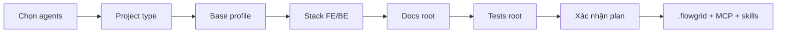

<!-- flowgrid-catalog -->
**[Danh mục tài liệu](CATALOG.md)**
<!-- /flowgrid-catalog -->

# FlowGrid

**FlowGrid** là nền tảng **CLI + harness** dành cho team phát triển phần mềm khi làm việc với **agent AI** (Cursor, Claude Code, Gemini/Antigravity, Codex, OpenCode, Hermes, Kiro, Kilo Code, … — chọn ở bước `flowgrid init`).

- **Workflow cho team** — các phase phát triển theo quy chuẩn: **design**; phát triển **code + test**; **wire**.
- **Quản lý artifact** — quy trình và SSOT trên disk cho dự án phần mềm:
  - **Spec / requirement** (docs-hub — SSOT):
    - user story, bundle spec;
    - thiết kế UI, action;
    - QA: open question;
    - artifact khác: technical debt, technical derived, call external service, …
  - **Document testcase** (tests-docs):
    - testcase, test suite;
    - scenario test.
- **Toolkit T-shaped** — hỗ trợ member mở rộng lane khi làm việc với AI:
  - **Dev** — skill dev chuyên sâu, kèm chút kỹ năng BA: nhờ AI phân tích / grill → spec đạt khoảng **70–80%** so với BA thông thường.
  - **BA** — phân tích, tạo requirement spec: nhờ AI code **prototype** theo yêu cầu, **không** cần nhờ dev.
  - **QA / Test** — skill manual test: nhờ AI sinh automation **E2E**; dev review bổ sung lỗ hổng còn thiếu theo document testcase.

FlowGrid **không** thay IDE hay model. Nó gắn **quy trình**, **định dạng artifact** và **lệnh kiểm định** vào repo để agent và member đi **cùng một lane**, **từng bước một**.

## Tổng quan

- **CLI (`flowgrid`)** — cài tool; `init` theo loại dự án; chạy audit, gate, codegen; `doctor`; sync harness.
- **Harness (skills + MCP)** — sau `init`, agent gọi slash command (vd. `/spec`, `/testcase`) theo `SKILL.md` đã sync; MCP server `flowgrid` nối engine docs / test / codegen với workspace.
- **Script audit** — kiểm tra **lượng** trên artifact (schema, field bắt buộc, trace testcase ↔ bundle) bằng Node thuần; output JSON `gaps[]`; bổ trợ grill **chất** của member và agent.
- **Workflow theo phase phát triển** — bám vòng đời thực tế **một tính năng**:
  - **Phân tích** — yêu cầu, phạm vi, kiến trúc (overview, module, luồng nghiệp vụ).
  - **Đặc tả** — bundle, user story, API contract trên **docs-hub**.
  - **Prototype UI** — feedback sớm, thống nhất hành vi trước code production.
  - **Backend** — spec API; sinh / xử lý service theo adapter stack (NestJS, FastAPI, …).
  - **Tests-docs** — scenario, ma trận `TC-*.yaml`; gate trước khi coi testcase **đóng**.
  - **E2E automation** — sinh Playwright từ testcase; regression trên **e2e-root** (repo FE); giảm **IT thủ công** lặp trước release.
  - **Wire** — ghép FE với API thật; audit đối chiếu tests-docs ↔ spec E2E.
- **Skill ↔ vai trò member (T-shaped)** — mỗi phase gắn skill và vai trò gợi ý; AI **hỗ trợ đúng việc, đúng người** — **không** gom cả repo một lần:
  - **Lead / BA** — phạm vi, kiến trúc, grill nghiệp vụ (`/overview`, `/grill-bqa`, …).
  - **Dev FE** — prototype, wire, unit / E2E lane code.
  - **Dev BE** — contract, implementation API, align FE–BE (`audit fe-be`).
  - **QA** — testcase trên **tests-docs**, grill testcase, theo dõi coverage E2E.
  - **Member** — vẫn **review, grill, chốt**; agent chuẩn hóa YAML/Markdown, gợi ý patch, chạy codegen — **không** tự quyết thay product owner.
- **Ba loại artifact trên disk** — có thể nhiều repo, nối bằng env:
  - **docs-hub** — `*.bundle.yaml`, IR, kiến trúc & function (`FLOWGRID_DOCS_ROOT`).
  - **tests-docs** — `cases/**`, `TC-*.yaml`, scenario (`FLOWGRID_TESTS_DOC`, `--tests-docs`).
  - **Code** — FE / BE / fullstack; test tự động trên **e2e-root** (`--e2e-root`), tách khỏi hub testcase.

## Phase · vai trò · skill

| Phase (tóm tắt) | Vai trò thường gặp | Hỗ trợ FlowGrid (ví dụ) |
| --- | --- | --- |
| Phân tích & phạm vi | Lead / BA | `/overview`, `/architecture`, `/module` |
| Đặc tả chức năng | BA / Dev | `/spec`, `/grill-bqa`, `flowgrid audit spec` |
| Prototype UI | Dev FE | `/prototype`, portal/codegen adapters |
| Backend & contract | Dev BE | `/api-spec`, `/api`, `audit api`, `audit fe-be` |
| Testcase (tests-docs) | QA / Dev | `/testcase`, `/scenario`, `cases:gate` |
| E2E automation | QA / Dev | `testcase:gen`, Playwright trên **e2e-root** |
| Tích hợp & kiểm tra trước release | Dev FE + QA | `/wire`, `flowgrid audit e2e` |

`flowgrid audit *` và `cases:gate` dùng ở các mốc trên để phát hiện lệch artifact trước khi sang phase kế tiếp.

---

## Cài đặt

**Yêu cầu:** Node.js **≥ 24** (Linux / macOS / WSL / Git Bash).

Hai kênh — chọn một:

| Kênh | Nguồn |
| --- | --- |
| **npm (public)** | `@shanyucoder/flowgrid` — [npmjs.com](https://www.npmjs.com/package/@shanyucoder/flowgrid) |
| **GitHub (private)** | PAT + script bootstrap bên dưới (repo `flowgrid` private) |

### 1a. npm (registry public)

Cài global qua npm client. `flowgrid update` khi đã cài từ registry.

### 1b. GitHub private (PAT + curl)

**Không** `raw.githubusercontent.com/ShanYuCoder/flowgrid/...`. Bootstrap (public) tải `install.sh` qua GitHub API, rồi cài tarball từ Release.

PAT: **Contents: Read** trên `ShanYuCoder/flowgrid`.

```bash
export FLOWGRID_GITHUB_TOKEN=github_pat_XXXXX
export FLOWGRID_REF=latest

curl -fsSL \
  https://raw.githubusercontent.com/ShanYuCoder/flowgrid-docs/main/scripts/install-from-release.sh \
  | bash -s -- "$FLOWGRID_GITHUB_TOKEN"
```

Ghim tag:

```bash
export FLOWGRID_GITHUB_TOKEN=github_pat_XXXXX
export FLOWGRID_REF=v0.2.3

curl -fsSL \
  https://raw.githubusercontent.com/ShanYuCoder/flowgrid-docs/main/scripts/install-from-release.sh \
  | bash -s -- "$FLOWGRID_GITHUB_TOKEN"
```

**Cập nhật (GitHub):** chạy lại bootstrap khi có Release mới.

**Gỡ:** `flowgrid uninstall`

### 2. Khởi tạo repo (`flowgrid init`)

```bash
cd your-project
flowgrid init
```

| Bước | Câu hỏi init | Ý nghĩa / gợi ý nhập |
| --- | --- | --- |
| **1** | **Select Agents/Skills to integrate** | Agent IDE/CLI (Cursor, Claude, …). Copy **skills** + **MCP** (`flowgrid`) vào thư mục agent. Có thể bỏ trống, sync sau: `flowgrid harness sync`. |
| **2** | **Select project type** | **Document** — docs-hub. **Frontend** / **Backend** / **Fullstack** — code (+ pointer docs/tests). **Test** — tests-docs. **Khuyến nghị:** fork/clone [base tham khảo](#base-tham-khảo-phối-hợp-tốt-nhất-với-flowgrid-init) cùng lane — phối hợp FlowGrid ổn nhất (path, registries, audit, codegen). |
| **3** | **Base Architecture Profile** | **Standard** (Nuxt4, Next.js, NestJS, FastAPI, …) hoặc **Custom** (+ **Golden Sample** tùy chọn). |
| **4** | **Frontend / Backend technology** | Adapter codegen (`nuxt4`, `nextjs`, `nestjs`, `fastapi`, …). Fullstack: FE + BE (mặc định Nest). |
| **5** | **Docs-hub location** (FE / BE / Fullstack) | **This repository** — scaffold `docs/` (integration/hook surfaces trên repo BE). **Other** — path pointer → `FLOWGRID_DOCS_ROOT`. **Document**: cwd = hub. |
| **6** | **Tests-docs location** (FE / BE / Fullstack) | **This repository** — scaffold `tests/` (+ `/test-api`, `testcase:gen:api` cho hook). **Other** — path pointer → `FLOWGRID_TESTS_DOC`. **Test**: cwd = hub. |
| **7** | **Languages** (chỉ **Document**) | **Đa ngôn ngữ global** dự án (i18n toàn hệ thống, không phải bản dịch từng file docs): vd. `vi,en,ja` + locale mặc định; một ngôn ngữ thì nhập một. |
| **8** | **Installation Plan** + **Proceed?** | Xem lại và xác nhận. |
| **9** | *(sau confirm)* | `.flowgrid/`, scaffold, harness, MCP, `artifactgraph/`. |
| **10** | **Optional toolkits** | Tuỳ chọn **Codegraph** — chỉ chạy nếu CLI `codegraph` đã cài trên PATH; không có thì bỏ qua, làm sau: `codegraph init` + `platform-dna codegraph:wire`. |

#### Base tham khảo (phối hợp tốt nhất với `flowgrid init`)

Các repo dưới đây là **golden sample** public — layout, registries, harness skill/MCP và convention artifact đã được căn theo lane FlowGrid. **Tham khảo (fork/clone) base đúng lane** thường cho kết quả tốt hơn repo trống + init một mình: wizard **project type** / **adapter** khớp thư mục, `flowgrid audit *` và codegen ít báo lệch path, và team docs · QA · dev dùng chung vocab (`CMP-*`, `TC-*`, bundle, scenario).

**Bộ ba multi-repo (mẫu khuyến nghị):**

| Lane | Vai trò | Base |
| --- | --- | --- |
| R2 — docs-hub | Spec, kiến trúc, grill design | [base_docs](https://github.com/ShanYuCoder/base_docs) |
| R3 — tests-docs | Scenario, `TC-*.yaml`, coverage E2E | [base-test-docs](https://github.com/ShanYuCoder/base-test-docs) |
| Code | FE / BE / fullstack theo stack | Một repo trong bảng [Base code theo adapter](#base-code-theo-adapter) bên dưới |

Trên repo **code**, bước init **5–6** chọn **Other** (hoặc env `FLOWGRID_DOCS_ROOT`, `FLOWGRID_TESTS_DOC`) để trỏ sang hub docs và tests-docs — giống cách các base trên đã thiết kế để chạy song song.

**Quy trình gợi ý:** fork base → `cd` repo → `flowgrid init` (type + stack như bảng) → `flowgrid doctor` → làm việc bằng slash skill (`/spec`, `/testcase`, …). Repo mới hoàn toàn: vẫn có thể `init` trên cwd trống, nhưng so layout với base tương ứng khi scaffold xong.

| Project type (bước 2) | Base tham khảo |
| --- | --- |
| **Document** (docs-hub) | [ShanYuCoder/base_docs](https://github.com/ShanYuCoder/base_docs) |
| **Test** (tests-docs) | [ShanYuCoder/base-test-docs](https://github.com/ShanYuCoder/base-test-docs) |

##### Base code theo adapter

Bước 2 chọn **Frontend** / **Backend** / **Fullstack**, bước 3–4 chọn profile + adapter; repo mẫu khớp stack:

| Vai trò | Adapter / stack (init) | Base tham khảo |
| --- | --- | --- |
| Frontend | `nuxt4` | [base-nuxt4](https://github.com/ShanYuCoder/base-nuxt4) |
| Frontend | `nextjs` | [base-nextjs](https://github.com/ShanYuCoder/base-nextjs) |
| Frontend | `dotnet-line` | [base-line](https://github.com/ShanYuCoder/base-line) |
| Backend | `nestjs` | *(monorepo fullstack)* [base-nextjs-nestjs](https://github.com/ShanYuCoder/base-nextjs-nestjs) hoặc [base-nuxt4-nestjs](https://github.com/ShanYuCoder/base-nuxt4-nestjs) — API trong `server/` / `apps/api` |
| Backend | `fastapi` | [base-fast-api](https://github.com/ShanYuCoder/base-fast-api) |
| Backend | `laravel` | [base-laravel](https://github.com/ShanYuCoder/base-laravel) |
| Backend | `dotnet-integration` | [base-donet](https://github.com/ShanYuCoder/base-donet) |
| Fullstack | `nextjs` + `nestjs` | [base-nextjs-nestjs](https://github.com/ShanYuCoder/base-nextjs-nestjs) |
| Fullstack | `nuxt4` + `nestjs` | [base-nuxt4-nestjs](https://github.com/ShanYuCoder/base-nuxt4-nestjs) |

Tất cả base code ở bảng trên **public trên GitHub** (org `ShanYuCoder`) — có thể xem README từng repo để biết lệnh dev/test và pilot feature (vd. Auth) trước khi `init` dự án thật.

Sau init: **`.flowgrid/config.json`**; dùng slash skill (vd. `/spec`) trong agent đã chọn.



Wizard tương tác: chạy `flowgrid init` trên repo dự án. Bảng bước, `flowgrid doctor` / `harness sync`: [CLI & commands](/references/cli-and-commands.md) (Audit & Harness · MCP).

### 3. Kiểm tra

```bash
flowgrid doctor
```
