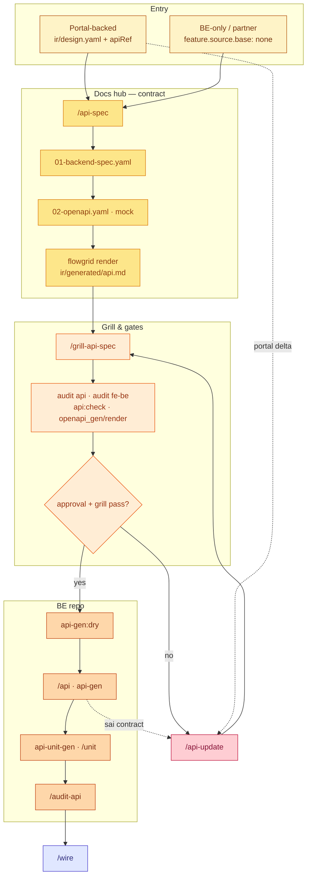
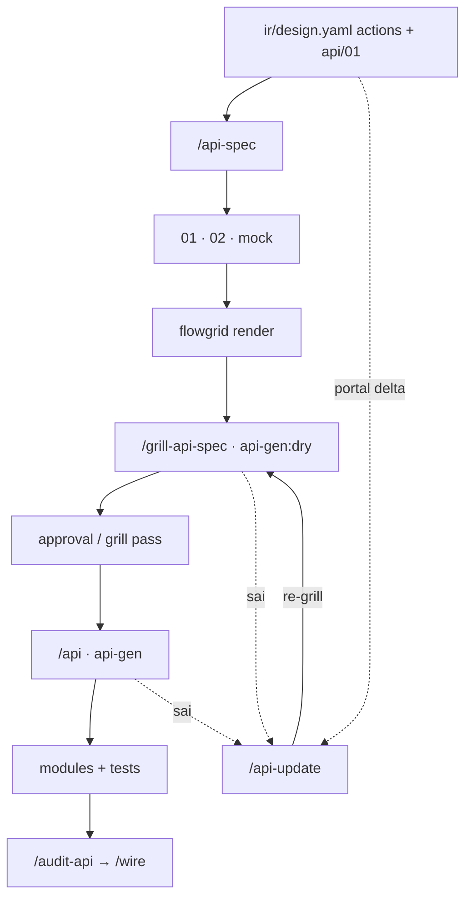
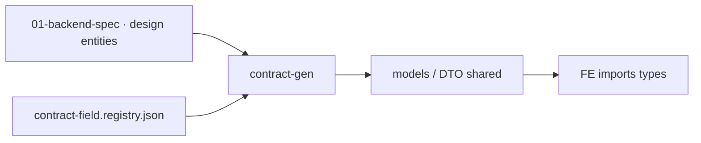

# Workflow — Backend (API & code)

**Phạm vi (SSOT):** lane **Code + test** — phần **backend**: contract leaf (`01`), OpenAPI sibling, grill API, codegen, unit BE, align FE–BE trước wire.

**Không viết ở đây:** cấu trúc leaf / bundle ↔ IR → [artifacts/docs.md](../artifacts/docs.md) · artifact code multi-repo → [artifacts/code.md](../artifacts/code.md) · tham số CLI → [references/cli-and-commands.md](../references/cli-and-commands.md) · map lệnh audit → [references/audit-commands.md](../references/audit-commands.md).

**Thuộc macro:** [index.md#full-cycle](./index.md#full-cycle) · phase **2c API** (song song 2a scaffold FE, 2b tests; hội tụ tại [wire.md](./wire.md)). Data model tầng 3: [architecture-data.md](./architecture-data.md) · Design handoff: [design.md § Handoff](./design.md#handoff-ra-lane-khác).

---

## API cycle (Phase 2c) {#api-cycle}

Gam **amber** khớp [full cycle](./index.md#full-cycle). Entry sau Design khi actions / `apiRef` đã rõ (hoặc ngay từ đầu cho **BE-only**).



### Portal ↔ BE repo (rút gọn)



### Sub-lane: shared types (`contract-gen`)



`contract:gen`, envelope, list wire: [artifacts/code.md](../artifacts/code.md#contract-field-registry) · [§ Portal ↔ API](../artifacts/code.md#portal-api).

---

## SSOT — ai đọc gì {#ssot-reading}

| Vai trò | Đọc (review / sign-off) | Ghi / implement |
|---------|-------------------------|-----------------|
| BA / PO | [VitePress](../artifacts/docs.md#team-reading--một-mặt-ssot-chung-review--uat--sign-off) `ir/generated/spec.md` + `data-model.md`; endpoint tóm tắt `ir/generated/api.md` | Không sửa `01` tay — delta qua `/update-spec` / Dev |
| Dev BE (contract) | Site `api.md` trước; chi tiết codegen: `api/<seq>/01-backend-spec.yaml` | `/api-spec`, `/api-update`, `/grill-api-spec` |
| Dev FE (integration) | `ir/design.yaml` `apiRef`, mock `03` | Không dùng `01` làm input layout — grill-prototype đọc design |
| Agent BE codegen | **`01-backend-spec.yaml` only** — không `ir/design.yaml` / `ir/spec.yaml` | `flowgrid api-gen` với `--spec` tới `01` |

**Quy tắc file:**

- Một function leaf: `api/<seq>/01-backend-spec.yaml` = **một module + một primary entity** (không gộp cả CMP vào một `01`).
- `flowgrid check` chỉ cho `*.bundle.yaml` ↔ IR — **không** chạy trên `01`.
- Sau sửa `01`: `api:check` → `openapi_gen` → `openapi_render` → `render` (cập nhật `api.md`).

Đọc chung trên site: `ir/generated/spec.md`, `data-model.md`, `api.md` (VitePress leaf sidebar). Authoring & OpenAPI chain: [tpl-api-contract.md](../../templates/shared/tpl-api-contract.md).

---

## Hai chế độ entry {#entry-modes}

| Chế độ | `feature.source` | Input grill-api | `audit fe-be` |
|--------|------------------|-----------------|---------------|
| **Portal-backed** | `base` ≠ `none` | `ir/design.yaml` + `01` | **Có** — `apiRef` ↔ endpoint/entity trên `01` |
| **BE-only** | `base: none` (webhook, partner, public API) | **`01` only** — không coi `ir/design.yaml` là contract | Không (không bundle portal) |

**Reuse API:** action/item `#reuse-api` + `reuseFrom` trên design — **không** duplicate trio `01/02/03` trên leaf reuse.

Hashtag domain: `#call-external`, `#cross-entity-service` · codegen: `#gen:*` (grill gán, script thực thi). Chi tiết skill: harness `/grill-api-spec`, `/api-spec`.

---

## Điều kiện trước lane {#preconditions}

- **Docs hub in-repo** (hoặc `FLOWGRID_DOCS_ROOT`): SSOT `01` nằm dưới `surfaces/…`, không mirror tùy tiện sang BE repo làm nguồn sửa.
- **Portal-backed:** Design đủ để map actions → endpoint; rubric Design mục API: [design-leaf-signoff.md](./design-leaf-signoff.md) (mục 4).
- **BE repo:** adapter đã init (`api-gen`, `api-unit-gen` theo stack) — path resolve qua config / env ([code.md](../artifacts/code.md)).
- **Entity / bảng mới:** ERD Phase 0 đã cập nhật hoặc team chấp nhận skip có ghi nhận ([architecture-data.md](./architecture-data.md)).

---

## Router `/api` (chọn command) {#api-router}

| Trạng thái | Command |
|------------|---------|
| Chưa có `01-backend-spec` | `/api-spec` |
| Portal delta / `pendingTechDebt` | `/api-update` |
| Chỉ sửa BE nội bộ | `/api-update --be-only` |
| Chưa codegen-ready | `/grill-api-spec` |
| Grill + `approval.status` pass | `/api` → `api-gen` |

**Một session = một command** — đọc `.harness/progress.md` trước khi tiếp tục cùng feature slug. Đổi phase (spec → gen → wire) → chat mới (cùng policy [design.md](./design.md#một-session--một-command)).

### Chuỗi thường gặp

| Mục tiêu | Chuỗi |
|----------|--------|
| Feature mới (portal) | `/api-spec` → `render` → `/grill-api-spec` → approval → `api-gen:dry` → `api-gen` |
| Portal đổi spec | `/api-update` → re-grill → gates → gen lại phần impact |
| Pilot từng phần | `/api-spec` (list) → grill → code → `/api-update` (export, …) |
| Webhook / partner | `/api-spec` (`base: none`) → `/grill-api-spec` → `/api` |

### Gap loop

| Khi | Hành động |
|-----|-----------|
| `grill-api-spec` hoặc codegen **sai** | `/api-update` → **re-grill** |
| Portal đổi spec giữa chừng | `/api-update` (không full `/api-spec` lại từ đầu) |
| `pendingTechDebt` / QA | Merge qua `/api-update` hoặc `/qa-resolve` trên target `01` |

---

## Bước trong lane {#steps}

| Thứ tự | Việc | Vai trò | Skill / gate (ví dụ) |
|--------|------|---------|----------------------|
| 1 | Inventory endpoint từ design / requirement | Dev BE / fullstack | `/api-spec` → `01` + `02` + mock |
| 2 | Render đọc site | Member (any) | `flowgrid render` → `ir/generated/api.md` |
| 3 | Grill contract + hashtag codegen | Dev + member | `/grill-api-spec` |
| 4 | Gates contract (docs hub) | Dev BE | `audit api`; portal: `audit fe-be`; `api:check`; `openapi_gen`; `openapi_render` |
| 5 | Dry-run codegen | Dev BE | `flowgrid api-gen:dry -- --spec …/01` |
| 6 | Gen + implement + unit | Dev BE | `/api`, `api-unit-gen`, `/unit`, `/grill-api-unit` |
| 7 | Audit trước wire | Dev BE | `/audit-api` · lặp `audit fe-be` nếu portal đổi |

Mốc trong chuỗi đóng leaf: [gates.md § Contract BE](./gates.md#close-one-function) (bước 5).

### `/api-spec` — đầu ra

- `api/<seq>/01-backend-spec.yaml` — SSOT BE (modules, entities, endpoints, errors, `codegen.profile`).
- Sibling `02-openapi.yaml` (gen, không sửa tay khi thiếu field — vá `01` rồi gen lại).
- `03-mock.yaml` (tùy stack / policy prototype).
- Portal: giữ `apiRef` trên `ir/design.yaml` khớp path/method trên `01`.

### Grill trong Backend

- **Reuse & matrix:** `#reuse-api`, HTTP/error matrix (409, 422, 403), optimistic locking, permission.
- **BE-only:** auth scheme, idempotency, retry, partner errors (`#err:signature-invalid`, …).
- **Readiness:** `approval.status`, `codegen.profile|entity|module`, `endpoints[].action`, `#gen:*` — thiếu → STOP, không `api-gen`.

Grill vs audit: [grill-and-human-review.md](./grill-and-human-review.md). Audit **không** thay member chốt `confirms[]`.

---

## Sign-off contract API (tùy team) {#api-signoff}

Voluntary — không engine lock thứ tự grill Design. Gợi ý trước `api-gen` production:

| # | Mục | Kiểm tra |
|---|-----|----------|
| 1 | **Structural** | `flowgrid audit api` — `gaps[]` xử lý hoặc `#tech-debt:QA-*` có chủ đích |
| 2 | **FE–BE** (portal) | `flowgrid audit fe-be` — `apiRef` ↔ `01` không blocker |
| 3 | **Toolchain** | `api:check`, `openapi_gen`, `openapi_render` exit 0 |
| 4 | **Readable** | VitePress `api.md` + (nếu cần) member đọc `02` preview — BA hiểu phạm vi endpoint |
| 5 | **Approval** | `approval.status: approved` trên `01` theo policy team |
| 6 | **QA** | Không `openQuestions` ẩn trên `01`; debt trong `qa` đã accept |

Ghi nhận (PR / progress):

```text
API sign-off: <page-id or API-id> | seq: <api/01> | reviewer: <name> | date: YYYY-MM-DD
```

---

## Handoff {#handoff}

- **Wire:** sau grill API + unit policy → [wire.md](./wire.md) (`/wire`, E2E post-wire).
- **Test:** [test.md](./test.md) song song khi `TC-*` đã có — partner/webhook: Newman / BE integration hoặc Playwright `request` ([§ API hook](./test.md#integration-api-hooks)).
- **Design lùi:** portal đổi UX ảnh hưởng contract → `/api-update` hoặc `/update-spec` + split, không patch lệch chỉ trên BE repo.
- **FE scaffold:** phase 2a có thể chạy trước wire; contract types qua `contract-gen` khi policy bật.

---

## Liên kết nhanh

| Chủ đề | Trang |
|--------|--------|
| Đóng một `W-*` (mốc 5 BE) | [gates.md](./gates.md#close-one-function) |
| Design sign-off (mục API) | [design-leaf-signoff.md](./design-leaf-signoff.md) |
| OpenAPI skill | [references/skills/openapi.md](../references/skills/openapi.md) |
| Grill API | [references/skills/grill-api-spec.md](../references/skills/grill-api-spec.md) |
