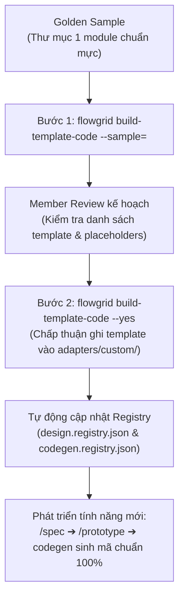

# Huấn luyện Template từ Golden Sample (`build-template-code`)

Tài liệu này giải thích chi tiết bài toán thích ứng với các kiến trúc mã nguồn tùy biến trong dự án thực tế, và cách FlowGrid sử dụng công cụ `build-template-code` (kèm skill `/build-templates`) để học tự động từ một **Golden Sample** (module mẫu chuẩn).

---

## 1. Bài toán & Thách thức trong dự án thực tế

Trong phát triển phần mềm doanh nghiệp, hầu hết các dự án không đi theo một khung công nghệ cố định:
- **Đa dạng UI Library & Framework:** Dự án có thể sử dụng Vue 3 với Element Plus, Ant Design, Tailwind, Angular, React với MUI, hoặc các hệ thống Design System nội bộ tự phát triển. Phía Backend có thể là NestJS, FastAPI, Spring Boot, Laravel, Go, .NET, v.v.
- **Quy chuẩn mã nguồn riêng biệt:** Mỗi công ty, mỗi dự án đều có coding convention, quy tắc phân lớp kiến trúc (Clean Architecture, Onion, DDD, Modular Monolith) và cấu trúc thư mục riêng biệt.

### Vấn đề nảy sinh nếu không có cơ chế tùy biến template:
1. **Lệch chuẩn sinh mã (Codegen Mismatch):** Nếu Agent AI hoặc CLI chỉ sinh code theo khung mẫu mặc định (như Nuxt4 + shadcn hay NestJS mặc định), toàn bộ code sinh ra sẽ bị lệch hoàn toàn so với kiến trúc dự án thực tế.
2. **Cảnh báo ảo `#needs-component`:** Các component có sẵn của dự án (ví dụ `el-table`, `el-dialog`, `a-form`,...) không nằm trong bộ từ điển `design.registry.json` mặc định, khiến Agent lầm tưởng là hệ thống chưa có và liên tục tạo tag chờ viết component mới.
3. **Tốn công chỉnh sửa thủ công:** Dev phải sửa tay lại gần như toàn bộ code sau khi sinh, làm mất đi giá trị tự động hóa và tăng nguy cơ gây lỗi không nhất quán.

---

## 2. Mục đích & Vai trò của `build-template-code`

Thay vì bắt lập trình viên phải ngồi viết tay hàng chục file template sinh code phức tạp (`.hbs`, `.stub`, `.j2`, `.scriban`) cho từng tầng (Controller, Service, Repository, DTO, View, Component), FlowGrid cung cấp giải pháp **học tự động từ Golden Sample**:

- **Golden Sample là gì?** Là một thư mục chứa một module tính năng hoàn chỉnh, mẫu mực, đang chạy tốt và đạt chuẩn quy cách kiến trúc trong chính dự án của bạn (hoặc một dự án tham chiếu).
- **Cơ chế hoạt động:**
  1. `build-template-code` phân tích cấu trúc các file trong thư mục module mẫu (từ layout màn hình, form, bảng biểu đến API controller, entity).
  2. Bóc tách các đoạn mã logic nghiệp vụ đặc thù thành các biến giữ chỗ (placeholder như `{{entity}}`, `{{fields}}`, `{{actions}}`).
  3. Tự động đóng gói thành bộ template tái sử dụng lưu vào `.flowgrid/adapters/custom/`.
  4. Quét và đồng bộ danh mục linh kiện giao diện cùng các capability vào `design.registry.json` (cho Frontend) và `codegen.registry.json` (cho Backend).

**Kết quả đạt được:** Sau khi hoàn thành huấn luyện, khi team làm bất kỳ màn hình hoặc tính năng mới nào qua chu kỳ `/spec` ➔ `flowgrid gen`, Agent AI và engine codegen sẽ sinh mã **chính xác 100% theo đúng cấu trúc, đúng thư viện UI và đúng phong cách code của dự án**, y hệt như do một senior developer trong team tự tay viết.

---

## 3. Quy trình thực thi (Tam giác đồng bộ Tri-Sync)



---

## 4. Hướng dẫn từng bước

### Bước 1: Phân tích module mẫu và xuất kế hoạch (`--sample`)
Chỉ định đường dẫn tới thư mục một module mẫu hoàn chỉnh (chấp nhận đường dẫn tuyệt đối hoặc tương đối):

```bash
flowgrid build-template-code --sample=./source-code/src/modules/orders
```

*Cơ chế an toàn:* Bước này **hoàn toàn chưa ghi đè hay thay đổi bất kỳ file template nào**. CLI chỉ quét và tạo ra file kế hoạch `.flowgrid/template-plan.json` chứa:
- Danh sách các file template dự kiến sinh.
- Các vị trí placeholder được nhận diện.
- Các component UI và endpoints API được bóc tách.

### Bước 2: Kiểm tra và áp dụng template (`--yes`)
Sau khi kiểm tra file plan, chạy lệnh xác nhận:

```bash
flowgrid build-template-code --yes
```

CLI sẽ ghi các file template tương ứng vào thư mục `.flowgrid/adapters/custom/` của repo tương ứng:

| Công nghệ | Đuôi template | File Registry đồng bộ |
| :--- | :--- | :--- |
| **Nuxt, Next, NestJS** | `.hbs` (Handlebars) | `design.registry.json` (FE) · `codegen.registry.json` (BE) |
| **Laravel / PHP** | `.stub` | `codegen.registry.json` |
| **FastAPI / Python** | `.j2` (Jinja2) | `codegen.registry.json` |
| **.NET / C#** | `.scriban` | `codegen.registry.json` |

*Ghi đè khi cần thiết:* Nếu cần cập nhật lại toàn bộ template đã tồn tại, thêm cờ `--force`:
```bash
flowgrid build-template-code --yes --force
```

### Bước 3: Phát triển tính năng mới với Custom Template
Kể từ thời điểm này, toàn bộ quy trình phát triển chức năng mới diễn ra bình thường theo quy chuẩn FlowGrid:
1. Viết spec với `/spec`.
2. Phản biện nghiệp vụ và giao diện với `/grill-bqa`, `/prototype`.
3. Khi chạy lệnh sinh code (`flowgrid gen`), hệ thống sẽ tự động sử dụng bộ custom template vừa được tạo để sinh mã đúng chuẩn dự án.
