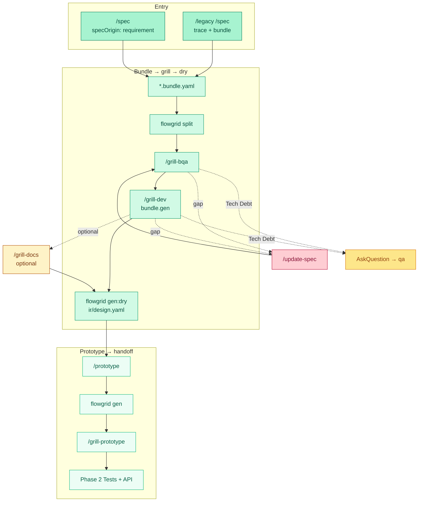
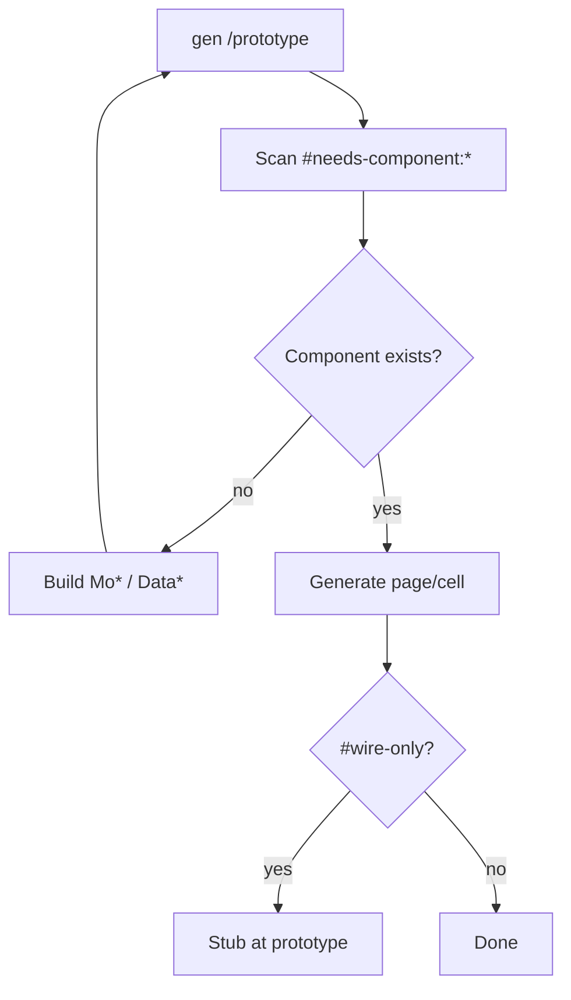

# Workflow — Design

**Phạm vi (SSOT):** lane **Design** (macro) — từ phân tích / spec đến prototype đã grill, sẵn sàng codegen dry-run.

**Không viết ở đây:** cấu trúc bundle/IR → [artifacts/docs.md](../artifacts/docs.md) · DNA/tag → [artifacts/dsl.md](../artifacts/dsl.md).

**Thuộc macro:** [index.md](./index.md) · Phase 0 setup: [phase-0-setup.md](./phase-0-setup.md) · Grill: [grill-and-human-review.md](./grill-and-human-review.md).

---

## Design cycle (Phase 1) {#design-cycle}

Gam **emerald** khớp [Workflow tổng quan](./index.md). Optional `/grill-docs` = amber trong diagram (không default).

Khởi tạo dự án & mapping surfaces: [phase-0-setup.md](./phase-0-setup.md) — **trước** khi viết spec chi tiết.

### `#needs-component` (trong `/prototype`)

`gen` **không** tự implement Mo* — placeholder + HANDOFF; lặp với `/prototype` đến khi không còn `#needs-component` unresolved.

### Promote design registry (cuối `/prototype`)

Component **tái sử dụng** hoặc shell/widget chuẩn (không domain-only) phải **promote** `.flowgrid/registries/design.registry.json` (`planned` → `implemented`, `aliasIndex`, `registry` pass), rồi grill spec lại với `#widget:` / `#shell:` thay `#needs-*`. Domain-only / `#wire-only` giữ trong feature — không promote.

Tiêu chí promote, map hashtag và review PR: [artifacts/dsl.md — Registry & promote](../artifacts/dsl.md#registry--promote).

---

## Điều kiện (repo code FE)

- **Standard base:** FE đã `flowgrid registry:sync` (init hoặc sau đổi UI/composables) — `/spec` map `#ui:`, `#shell:`, `#composable:` từ `.flowgrid/registries/design.registry.json` tại Workspace SSOT ([dsl.md](../artifacts/dsl.md#registry--script-sau-init-repo-code)).
- **Trước `gen:dry`:** `grillStatus.dev: done` + `flowgrid split` / `check` không lỗi trên bundle leaf.

## Bước trong lane

| Thứ tự | Việc | Vai trò | Skill / gate (ví dụ) |
|--------|------|---------|----------------------|
| 0b | ERD / ownership (khi entity hoặc bảng mới) | Lead / Dev data | `/db-erd` → `common/db-erd.md` — xem [architecture-data.md](./architecture-data.md) |
| 1 | Phân tích phạm vi, module, luồng & **Module API** | Lead / BA | `/overview`, `/module` (chốt `W-*`), `/user-flow` |
| 2 | Spec bundle + IR (gồm **bind/db** & **link apiBindings**) | BA / Dev | `/spec`, `/legacy /spec`, đọc ERD LCA, tái sử dụng `#reuse-api`, `split` + `render` |
| 3 | Grill nghiệp vụ / kỹ thuật / hòa giải | BA + Dev | `/grill-bqa`, `/grill-dev`, `/grill-docs` (optional) — sau mỗi patch bundle: **split lại** |
| 4 | Chốt codegen readiness (docs hub) | Dev | `flowgrid gen:dry` trên `ir/design.yaml` (FE repo, `FLOWGRID_DOCS_ROOT`) |
| 5 | Prototype UI (mock API) + promote registry Mo* tái dùng | Dev FE | `flowgrid gen` → `/prototype` → `flowgrid registry` validate |
| 6 | Grill prototype (checklist UI) | Dev FE / BA | `/grill-prototype` **sau** bước 5 — layout, copy VI, mock boundary, testIds (không Playwright) |

### Module API Catalog Pre-Allocation & Centralized Reference Binding

Để chống conflict git giữa các Member phát triển các màn hình song song (ví dụ: màn Detail và màn Edit cùng dùng chung API chi tiết):

1. **PM / Leader Pre-Allocation**:
   - Khi chạy `/module` cho `CMP-*`, Leader có thể quy hoạch trước danh mục API chung tại thư mục `common/yaml/`.
2. **BE Lead Contract-First Pre-Design**:
   - Tách toàn bộ API dùng chung khỏi thư mục feature `CMP-*/api/`. Lưu tập trung tại thư mục LCA cấp module `common/yaml/<slug>/` hoặc `surfaces/common/yaml/`.
3. **FE Member Reference Binding**:
   - Trong Leaf Spec (`W-*.bundle.yaml`), FE Member **chỉ tái sử dụng** bằng `#reuse-api` + `reuseFrom`. Thư mục Feature `CMP-*` chỉ chứa UI Spec và Private API (nếu có). Thao tác này giúp PR của các Member làm song song **100% sạch conflict**.

Song song (không chặn emerald): sau grill round 1 có thể bắt đầu `/testcase` trên tests-docs hub ([gates.md](./gates.md)).

### Data model — hai tầng {#data-model-two-stages}

| Tầng | Artifact | Ai |
|------|----------|-----|
| ERD tổng (Phase 0) | `<LCA>/common/db-erd.md` | `/db-erd` trước leaf mới |
| Chi tiết màn (Phase 1) | `spec.entities`, `design.sections[].db`, `spec.ui.list` columns | `/spec` — [bundle-authoring § Data](../../templates/shared/bundle-authoring.md#data-model--phase-0-erd-vs-screen-detail) |
| Contract BE | `api/.../01-backend-spec.yaml` | `/api-spec`, `/grill-dev` |

`/spec` **không** tạo `db-erd.md`; **bắt buộc đọc** ERD đã có khi khai báo `db.schema` / `db.field`. Cột list/detail/form: `key` + `meaning` + (nếu persisted) `db` hoặc `#derived-data`.

### `/spec` — đầu ra kỹ thuật

- Input thô (bullet, ảnh, legacy) + ERD LCA → `*.bundle.yaml` (user stories, screen access, **entities + db binding**, dictionary, validation, action flows, state matrix).
- `flowgrid split` + `flowgrid render` → `ir/generated/spec.md` (mục lục, overview, metrics, non-goals) cho review BA — không viết `.md` tay.
- Câu treo: `qa/*.yaml` → `/qa-resolve`.
- **Sign-off (tùy team):** rubric 6 mục [design-leaf-signoff.md](./design-leaf-signoff.md) — voluntary, không engine gate grill order.

### Grill trong Design

- **Nghiệp vụ:** 5 tầng validation, optimistic locking, ma trận HTTP (409, 422, 403 IDOR), `#reuse-api`.
- **Prototype:** mock đủ Empty/Loading/Error, long text, pagination; `data-testid` sớm.
- **Grill-prototype:** session riêng **sau** `/prototype` — checklist UI (xem bước 6); không thay `gen:dry` (bước 4). Trong session `/prototype`, chạy `gen:dry` đầu tiên theo [team-flow-prototype](../../harness/fe/rules/team-flow-prototype.mdc).

Chi tiết audit + zone + AskQuestion, **load policy** grill và `grillStatus`: [grill-and-human-review.md](./grill-and-human-review.md#design-grill-chain).

### Một session = một command

Đổi phase (spec → prototype → test) → **chat mới**. Không gộp implementation lane vào cùng session Design.

---

## Handoff ra lane khác

- **Backend** → [backend.md](./backend.md) khi `api/<seq>/01` và actions trong `ir/design.yaml` đã rõ.
- **Test** → [test.md](./test.md) khi bắt đầu `TC-*.yaml` (có thể song song sau prototype round 1).
- **Wire** — chỉ sau grill API + testcase scope; xem [wire.md](./wire.md).
