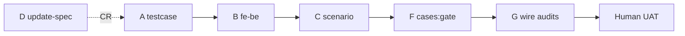
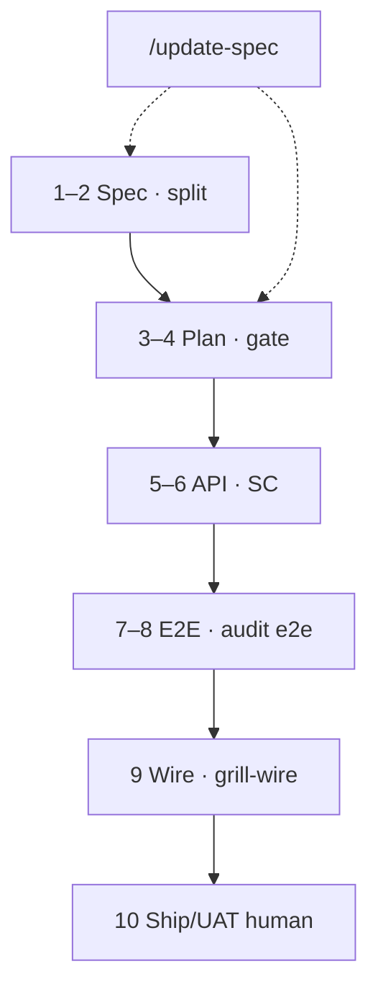

# Gate & mốc kiểm định

**Phạm vi (SSOT):** **khi** chạy `flowgrid audit *`, `cases:gate`; chuyển phase an toàn; chuỗi completeness artifact (bundle ↔ TC ↔ FE-BE ↔ scenario).

**Không viết ở đây:** tham số lệnh → [references/cli-and-commands.md](../references/cli-and-commands.md#audit--harness-pr-workflow).

**Bối cảnh:** [index.md](./index.md#full-cycle) · grill người: [grill-and-human-review.md](./grill-and-human-review.md) · sign-off Design leaf (tùy team): [design-leaf-signoff.md](./design-leaf-signoff.md) · Wire/Ship: [wire.md](./wire.md).

---

## Khi nào chạy (theo lane) {#when-to-run}

| Mốc | Lệnh / skill gợi ý | Ai đọc kết quả |
|-----|-------------------|----------------|
| Sau `/spec`, `/update-spec` | `flowgrid audit spec` (`--type`) | BQA / Dev grill |
| Grill contract (docs) | `/grill-api-spec` · `audit api` | Dev BE + BQA |
| BE trước wire | `/audit-api` · `audit api` | Dev BE |
| Trước đóng testcase | `cases:check`, `audit testcase` (+ `--bundle`) | QA |
| Release tests-docs | `cases:gate` (`--strict`, `--docs-root`) | QA + `/grill-testcase` |
| Pre-wire E2E | scoped `test:e2e` · (policy) `audit e2e` | Dev FE + QA |
| **Sau `/wire`** | **`/grill-wire`** hoặc chuỗi `audit e2e` + `audit fe-be` + `audit scenario` | Dev FE + QA |
| Matrix TC ↔ PO (chi tiết) | `/grill-test` sau `/test` green | QA / Dev FE |
| Legacy adoption | `audit legacy` | Lead |
| **Trước merge/UAT leaf** | Bước 1–10 [§ đóng function](#close-one-function) · human chốt [grill § sign-off](./grill-and-human-review.md#human-signoff) | Lead / PM / QA |

Tool **không** tự chạy — member gọi CLI/skill. Bỏ bước → rủi ro process (xem [grill-and-human-review.md](./grill-and-human-review.md)).

---

## Luồng tham chiếu (team làm đúng)

### Tạo mới function / màn

```text
/spec → audit spec → grill-bqa / grill-dev → split (lặp sau mỗi patch bundle / grill)
→ /testcase (bundle SSOT, schema v2, traceability) — có thể song song sau grill round 1 (design.md)
→ cases:gate [--strict] + FLOWGRID_DOCS_ROOT
→ testcase:gen → Playwright (e2e-root)
→ (policy) manual E2E một vòng trước release
```

### Change request

```text
/update-spec → audit spec (bắt buộc trong skill) → split
→ re-grill-bqa / grill-dev nếu đổi UX hoặc bundle.gen
→ patch TC cùng W-* / bundle impact
→ cases:gate --strict
→ /grill-testcase (đọc gate output)
→ gen + IT + manual E2E (policy team)
→ nếu đã wire: `/grill-wire` lại sau patch TC/spec
```

### Sau wire — behaviour đổi

```text
UAT / staging phát hiện lệch acceptance
→ docs /update-spec (hoặc /api-update) — KHÔNG vá ngầm trên FE
→ split/render → tests /grill-testcase nếu matrix đổi
→ FE /wire hoặc /test → /grill-wire
→ human sign-off leaf (bước 10)
```

Chi tiết loop: [wire.md § gap](./wire.md#gap-loop) · [grill-and-human-review § sau wire](./grill-and-human-review.md#post-wire-loop).

---

## Chuỗi completeness (SSOT chain) {#ssot-chain}

Policy testcase: `/testcase` đọc **`*.bundle.yaml`** (không tách đọc IR lẻ). Thiếu bundle hoặc `flowgrid check` lệch → STOP, split từ docs-hub trước.

| Phase | Đã ship (engine/skill) | Mục tiêu |
|-------|------------------------|----------|
| **A** | `audit testcase --bundle` | Scenario/AC/action ↔ TC |
| **B** | `audit fe-be` + grill-dev | `apiRef` ↔ `01-backend-spec` |
| **C** | `audit scenario` + `/scenario` | `FLOW` / SC `screens[]` ↔ `cases/**` |
| **D** | `/update-spec` rules | Delta design ↔ `userStories` / AC |
| **F** | `cases:gate`, TC schema v2 | Release gate tests-docs |
| **G** | `/wire` + `/grill-wire` | Post-wire `audit e2e` + `fe-be` + `scenario`; plan ↔ API thật |
| **E** | *(DevOps, optional)* | CI: `check`, `cases:gate`, `doctor`, `audit e2e` scoped |



---

## Đóng leaf — sơ đồ 10 mốc {#close-leaf-overview}



Bảng chi tiết bước → lệnh: [§ Đóng một function](#close-one-function).

---

## Đóng một function (`W-*`) {#close-one-function}

Chuỗi gợi ý trước khi coi **một leaf** (màn / API seq) đã khớp artifact — không thay checklist release cả sản phẩm. Macro team: [Workflow tổng quan](./index.md).

**Prerequisite (dự án, một lần):** [phase-0-setup.md](./phase-0-setup.md) — Khởi tạo workspace, `registry:sync` hoặc khảo cổ mã nguồn trước hàng loạt `/spec`.

| # | Mốc | Lệnh / skill | Đọc kết quả |
| --- | --- | --- | --- |
| 1 | Spec & grill | `flowgrid audit spec` (`--type`) · `/grill-bqa` · `/grill-dev` | `gaps[]` / confirms xử lý; member chốt |
| 2 | IR đồng bộ | `flowgrid split` · `flowgrid check` | Bundle ↔ `ir/*` khớp trước testcase/codegen |
| 3 | Plan tests-docs | `/testcase` · `/grill-testcase` | `cases:check` · `audit testcase --bundle` |
| 4 | Gate plan | `cases:gate --strict` + `FLOWGRID_DOCS_ROOT` | Schema v2, trace, ma trận facet |
| 5 | Contract BE | `audit api` · `audit fe-be` | `apiRef` ↔ `01-backend-spec.yaml` |
| 6 | Cross-flow (nếu SC) | `audit scenario` | `screens[]` có `TC-*.yaml` hoặc defer có `QA-*` |
| 7 | E2E (e2e-root) | `testcase:gen` · `/test` · `/grill-test` | Matrix TC ↔ PO ↔ `*.spec.ts` |
| 8 | Plan ↔ chạy | `flowgrid audit e2e` (`--e2e-root`, `--tests-docs`) | Plan hub khớp spec Playwright scoped |
| 9 | Wire (API thật) | `/wire` · E2E post-wire scoped — [wire.md](./wire.md#wire-gates) | `/grill-wire` hoặc `audit e2e` · `audit fe-be` · `audit scenario` · lifecycle `wire` |
| 10 | Ship / UAT (leaf) | Manual acceptance theo bundle AC (policy team) · merge/release checklist product | **Human** chốt “đủ scope”; behaviour mới → `/update-spec` **trước** bước 10 |

**Audit pass ≠ Ship:** JSON không có `critical` không thay PM/QA ký UAT — [grill-and-human-review § sign-off](./grill-and-human-review.md#human-signoff).

Bỏ bước → gap có thể lọt; toolkit không chạy chuỗi tự động — member hoặc CI gọi từng mốc ([grill-and-human-review.md](./grill-and-human-review.md)).

---

## Bảng audit ↔ artifact

| Lệnh | Kiểm tra chính |
|------|----------------|
| `audit spec` | Bundle + UX affordance (`UX_*`, `confirms`) |
| `audit api` | Contract API YAML |
| `audit testcase` | TC v2; `--bundle` cross-ref bundle |
| `audit fe-be` | Bundle `apiRef` vs backend spec |
| `audit scenario` | SC screens vs TC |
| `audit flow` | `FLOW-*.md` |
| `audit e2e` | `TC-*.yaml` (tests-docs) ↔ Playwright spec (`--e2e-root`, `--tests-docs`) |
| `audit legacy` | Adoption index |
| `cases:gate` | Schema + audit TC + trace + facets |

Skill ↔ audit inventory: [references/audit-commands.md § skill](../references/audit-commands.md).

---

## Công cụ phân tích rủi ro (human-in-the-loop)

| Lệnh | Cảnh báo | Người quyết định |
|------|----------|------------------|
| `audit spec` | `gaps[]`; **`confirms[]`** wizard (`CONFIRM_UX_*`, **`CONFIRM_DB_*`** vs ERD/`01`); `warnings[]` metrics/placeholder — **không** chặn split | `/spec`, BQA, Dev grill |
| `cases:gate` | Schema, matrix facet, trace bundle | QA / grill-testcase |
| `audit testcase --bundle` | Scenario / AC / action chưa map | Author TC |
| `audit scenario` | `screens[]` chưa có TC | Owner cross-flow |
| `audit e2e` | `missingInPlaywright`, `matrixRowsUncovered` | `/test` · `/grill-test` · post-wire `/grill-wire` |
| `audit fe-be` | `FEBE_*` | `/api-update` (docs) · re-wire |

Output `--json` dùng cho **review và sign-off**, không thay judgment “đủ cho release” ([grill-and-human-review.md](./grill-and-human-review.md#human-signoff)).

### E2E automation vs manual

| Lớp | Mục đích |
|-----|----------|
| Plan SSOT (`TC-*.yaml`) | Matrix, steps, testIds, trace bundle |
| Generated IT (Playwright) | Regression trên FE — `testcase:gen` |
| Manual E2E một vòng | Degrade / UX / ngữ cảnh — **policy team**, không encode bắt buộc trong toolkit |

Playwright chứng minh code chạy theo plan đã author; chất lượng plan và cập nhật sau CR vẫn là người.
