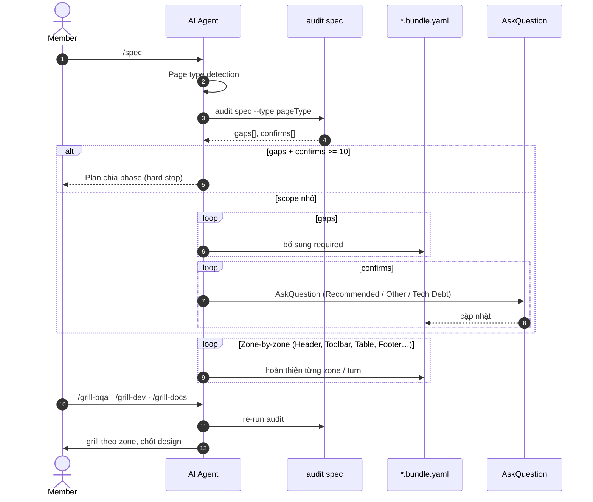
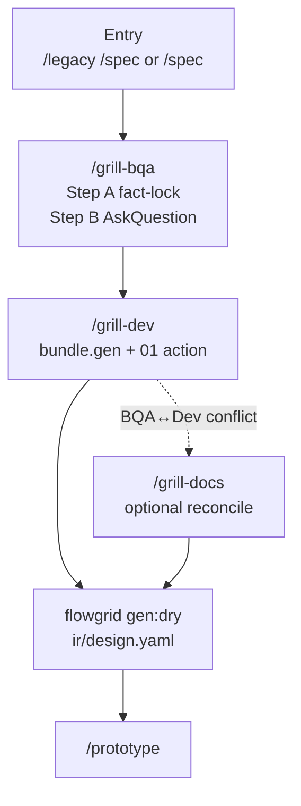
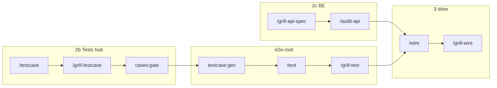

# Grill, review và trách nhiệm người

**Phạm vi (SSOT):** member **review, grill, chốt**; AI không thay PO; **chất** (grill / reasoning) vs **lượng** (audit script `gaps[]` / `confirms[]`).

**Không viết ở đây:** tham số lệnh audit → [references/cli-and-commands.md](../references/cli-and-commands.md#audit--harness-pr-workflow) · tag QA → [artifacts/dsl.md](../artifacts/dsl.md).

**Bối cảnh lane:** [design.md](./design.md) · [backend.md](./backend.md) · [test.md](./test.md) · [wire.md](./wire.md) · mốc gate: [gates.md](./gates.md#close-one-function).

---

## Triết lý một câu

**Tool cung cấp SSOT, skill, audit/gate có mã lỗi — team chọn chạy đúng luồng, đọc gap, và chốt quyết định.**

AI **chuẩn hóa** YAML/IR; member **review** Markdown + prototype trực quan. Tool **không** cam kết zero bug nếu bỏ grill/audit hoặc merge gate “cho có”.

| Tool (product) | Team (out of product) |
|----------------|----------------------|
| Skills `/spec`, `/update-spec`, `/testcase`, `flowgrid audit *`, `cases:gate`, `testcase:gen` | Chạy skill khi cần; đọc gap JSON; grill nghiệp vụ |
| AskQuestion + `qa` | Chọn Recommended / Other / **Log as Tech Debt** · team: [qa-team.md](./qa-team.md) |
| `/update-spec` + re-audit trong skill | Cập nhật `TC-*.yaml` sau CR; QA manual E2E (policy team) |

**Out of scope product:** deploy/CI, ALM/sprint, dashboard “ai quên grill”, bắt PM full BQA trước sketch nhanh.

| Tình huống | Ai chịu trách nhiệm |
|------------|---------------------|
| Bỏ grill/audit khi skill yêu cầu | Member + lead |
| `/update-spec` không sync TC / traceability | Author CR + QA |
| Matrix Playwright sơ sài | Author test + `/grill-test` |
| Bỏ `/grill-wire` sau API thật | Dev FE + QA — `FEBE_*` / plan gap lọt |
| UAT fail nhưng merge vì “audit OK” | PM/Lead — audit không thay acceptance judgment |
| Release lọt bug do bỏ bước | Process người — tool không cam kết zero bug |

---

## Script (lượng) vs Agent (chất)

```text
        YÊU CẦU SPEC / TC / API
                    │
        ┌───────────┴───────────┐
        ▼                       ▼
  DETERMINISTIC AUDIT      AI AGENT (GRILL)
  gaps[] · confirms[]      logic nghiệp vụ, zone,
  UX_* · FEBE_*            nhất quán UI↔API↔TC
```

| Output audit | Ai xử lý |
|--------------|----------|
| `gaps[]` (required thiếu) | Agent bổ sung bundle/YAML (hoặc member chỉ đường) |
| `confirms[]` (optional) | **AskQuestion** từng câu — ≥3 lựa chọn, có **Log as Tech Debt** |
| `gaps[]` + `confirms[]` **≥ 10** | **Hard stop** — lập Implementation Plan chia phase (3–5 item/phase), không spam chat |

**Page type** trước `flowgrid audit spec`: đọc `gen.codegen.profile` hoặc suy từ prompt — luôn truyền `--type`.

| Gợi ý prompt | `pageType` |
|--------------|------------|
| danh sách, list, bảng | `list` |
| tạo mới, form, nhập | `create` |
| chi tiết, xem | `detail` |
| đăng nhập, login | `auth` |
| CRUD, quản lý danh mục | `admin-crud` |

**UX affordance** (`UX_*`, `CONFIRM_UX_*`, `uxAffordanceGaps` trong JSON): delete confirm, `disabledReason`, filter+pagination, breadcrumb detail — khớp rule UX chung trong harness.

---

## Luồng `/spec` + audit + zone (sequence)



### Zone-based analysis (chống lost-in-the-middle)

Trang lớn: **không** all-in-one một prompt — chia **zone** (ví dụ list: Header → Search/Filter → Table → Pagination/Empty) · một turn / zone.

Grill: hỏi phản biện **theo zone** (ví dụ filter timezone, format tiền tệ cột).

---

## Chuỗi grill Design (BQA → Dev → dry → prototype) {#design-grill-chain}

Sau `/spec` hoặc `/legacy /spec` — khớp [design cycle](./design.md#design-cycle); diagram dưới chỉ **nhánh grill** trước prototype.



Sau `PROTO` trên macro [design.md](./design.md#design-cycle): `flowgrid gen` + lặp `#needs-component` trong session `/prototype`, rồi **`/grill-prototype`** (checklist UI) trước handoff test.

**Câu hỏi treo:** **không** dùng `openQuestions` trên bundle/YAML. AskQuestion → ghi field đã chốt, hoặc `qa/<SHORT>_NNNN.yaml` rồi `/qa-resolve` (tag `#tech-debt:QA-*` — [artifacts/dsl.md](../artifacts/dsl.md)).

### Load policy (agent)

| Phase | Load | Không load / không làm |
| --- | --- | --- |
| `/grill-bqa` | Toàn bộ `ir/design.yaml` (layout/copy) + `ir/spec.yaml` prose | Sửa tay `ir/*`; invent field |
| `/grill-dev` | `ir/design.yaml` + sibling `api/<seq>/01` | `bundle.spec.api`; dùng `ir/spec.yaml` làm codegen input |
| `/grill-docs` | Bundle + IR reconcile (BQA ↔ Dev) | Archaeology lại từ đầu |

Skill harness: [references/skills/grill-bqa](../references/skills/grill-bqa.md), [grill-dev](../references/skills/grill-dev.md), [grill-docs](../references/skills/grill-docs.md), [qa-resolve](../references/skills/qa-resolve.md).

### `grillStatus` (trên bundle)

| Field | Set bởi |
| --- | --- |
| `bqaFacts` / `bqaOpen` | `/grill-bqa` |
| `dev` | `/grill-dev` khi `codegen.profile` + entity/module + `01` `action` đủ — `flowgrid split` **fail** nếu `done` thiếu |

Delta sau pilot: `/update-spec` → re-audit spec → grill lại nếu cần — [gates.md](./gates.md).

---

## Grill theo vai trò (tóm tắt)

| Skill | Trọng tâm |
|-------|-----------|
| `/grill-bqa` | Nghiệp vụ, validation, user story, UX affordance |
| `/grill-dev` | `bundle.gen`, actions, `#gen:*`, `#needs-component`, split `ir/design` |
| `/grill-docs` | Hòa giải BQA ↔ Dev — **không** thay từng grill riêng |
| `/grill-prototype` | UI vs spec, mock boundary, testIds |
| `/grill-api-spec` | Contract YAML trên docs hub |
| `/audit-api` | Code BE vs `01` trước `/wire` |
| `/grill-test` | Matrix spec ↔ TC ↔ Playwright — audit, không regen hàng loạt |
| `/grill-wire` | Sau `/wire`: chuỗi `audit e2e` + `fe-be` + `scenario`; route gap spec/test/code |
| `/grill-testcase` | Plan YAML trên tests-docs — gap spec → paste `/docs-hub /update-spec` |
| `/grill-api-spec` | Contract YAML — trước codegen BE / wire |
| `/audit-api` | Code BE vs `01` — human chốt trước wire FE |

`/qa-resolve` đóng `qa/*` — không hallucinate câu treo trên bundle.

---

## Grill sau Design (test · API · wire) {#post-design-grill}

Sau [design grill chain](#design-grill-chain) và macro impl — **grill chất** vẫn xen kẽ **audit lượng**:



| Giai đoạn | Grill (chất) | Audit (lượng) | Member chốt |
|-----------|--------------|---------------|-------------|
| Plan | `/grill-testcase` — AC/matrix đủ facet | `cases:gate`, `audit testcase --bundle` | QA: plan đủ nghiệp vụ, không chỉ happy path |
| Automation | `/grill-test` — PO/testIds | `audit e2e` | Dev+QA: spec khớp TC, không raw locator |
| Contract | `/grill-api-spec` | `audit api`, `audit fe-be` | BE+Dev: field/status thật |
| Wire | HANDOFF `#wire-only` | `/grill-wire` full chain | Không ship bypass auth/mock |

Lane SSOT: [test.md](./test.md) · [backend.md](./backend.md) · [wire.md](./wire.md).

---

## Vòng gap sau wire (human + agent) {#post-wire-loop}

Khi staging/UAT hoặc `/grill-wire` chứng minh **spec/plan/contract** sai — **quay lane docs/tests**, không vá một dòng FE rồi đóng:

| Phát hiện | Grill/audit nguồn | Hành động member |
|-----------|-------------------|------------------|
| UX/AC/copy | UAT, grill-test | `/update-spec` → re-audit spec → `/grill-testcase` nếu matrix đổi |
| `01` / DTO | `audit fe-be`, `/audit-api` | `/api-update` → BE deploy → `/wire` |
| TC thiếu post-wire facet | `audit e2e` | tests-hub patch YAML → `cases:gate` → `testcase:gen` → `/test` → `/grill-wire` |
| Chủ đích hoãn | AskQuestion **Tech Debt** | `qa` + `QA-*` / `coverage_deferred` trên SC |

Extract FE: `wire-audit-loop.md` · tests: `wire-test-handoff.md` · docs: `wire-spec-feedback.md`.

---

## Human sign-off vs audit pass {#human-signoff}

| | Audit / gate (tool) | Human sign-off (team) |
|--|---------------------|------------------------|
| **Câu hỏi** | Artifact khớp SSOT? | Khách hàng/PO chấp nhận behaviour? |
| **Output** | `gaps[]`, exit code gate | Biên bản UAT, merge approval, release note |
| **Ai** | Agent + Dev/QA đọc JSON | PM, BQA, Lead (policy) |
| **Khi** | Sau mỗi skill bắt buộc audit | **Bước 10** [gates § đóng leaf](./gates.md#close-one-function) |

Checklist gợi ý trước coi leaf **Ship-ready** (không thay release cả product):

| # | Mục | Nguồn evidence |
|---|-----|----------------|
| 1 | Spec/grill đã chốt cho scope | `audit spec` không blocker; grill round done |
| 2 | Plan + gate tests-docs | `cases:gate --strict` |
| 3 | E2E + wire audits | `/grill-wire` hoặc tương đương — [wire sign-off](./wire.md#wire-signoff) |
| 4 | Manual/UAT (nếu team bật) | AC bundle / TC đã grill — **người** ký |
| 5 | Không behaviour mới chưa spec | Mọi delta qua `/update-spec` trước bước 10 |

**Script pass + human chưa UAT** → vẫn **STOP** ở bước 10, không coi là “FlowGrid đã guarantee”.

---

## Trước codegen — quy ước grill

Ràng buộc chi tiết nằm trong skill (`harness/docs/skills/…`, `harness/tests/skills/…`) và output `flowgrid audit *`. Bảng dưới tóm tắt hành vi thường gặp khi chạy lane Design tới codegen.

| Chủ đề | Quy ước |
| --- | --- |
| Page type | `/spec` / grill gọi `flowgrid audit spec --type <pageType>` — output `gaps[]` / `confirms[]` |
| Khối lượng confirms | Tổng `gaps` + `confirms` ≥ 10 → skill dừng, lập plan phase (không hỏi lẻ tẻ) |
| Trang lớn | Phân **zone** — một turn / zone (tránh lost-in-the-middle) |
| Chuỗi Design | BQA → Dev → (`/grill-docs` nếu conflict) → `gen:dry` — [§ design grill chain](#design-grill-chain) |
| Gap chưa chốt | Ghi `qa/*` hoặc xử lý trong bundle — không invent |
| Sau `/update-spec` | Skill yêu cầu **re-audit spec** trước split/merge an toàn |
| Sau wire gap | `/grill-testcase` hoặc `/update-spec` → lặp automation + `/grill-wire` |
| Đóng leaf | Chuỗi 10 bước + human bước 10 — [gates.md](./gates.md#close-one-function) |

Mốc audit/gate theo lane: [gates.md § khi nào chạy](./gates.md#when-to-run) · [SSOT chain](./gates.md#ssot-chain) · [sơ đồ 10 mốc](./gates.md#close-leaf-overview).
