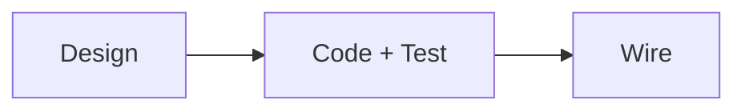
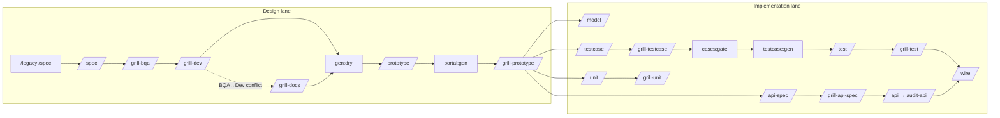
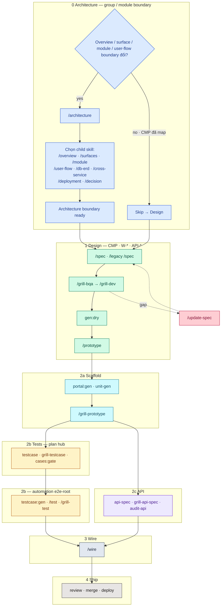
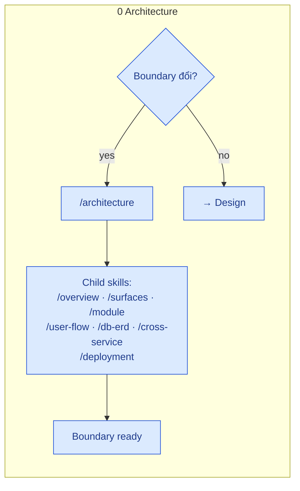
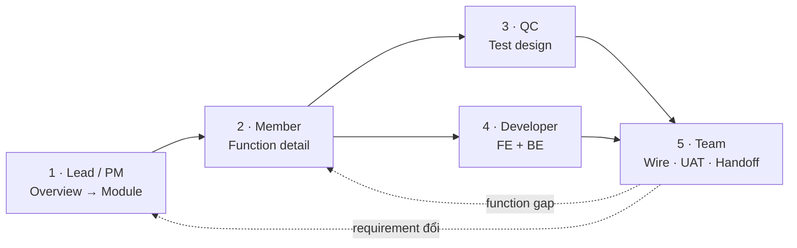
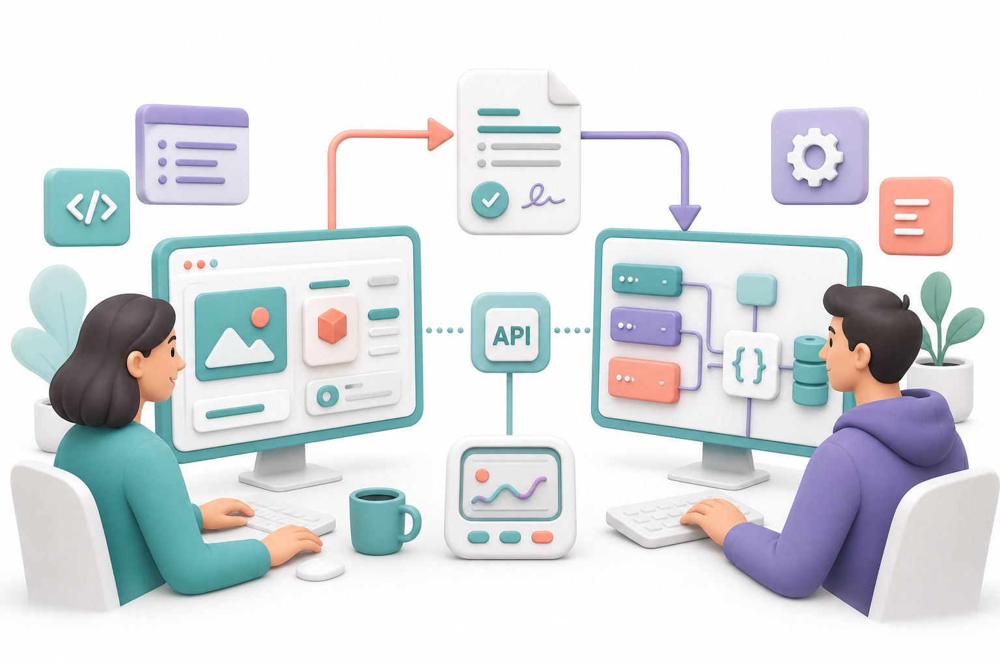
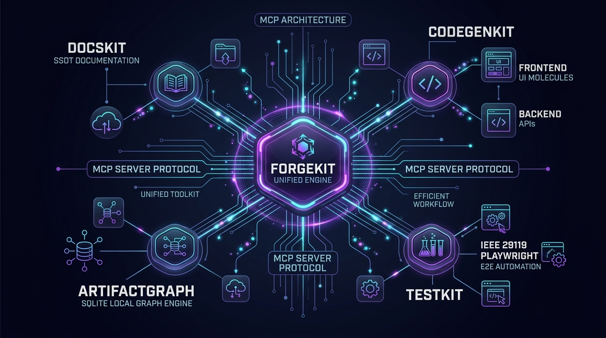
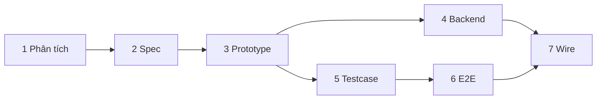
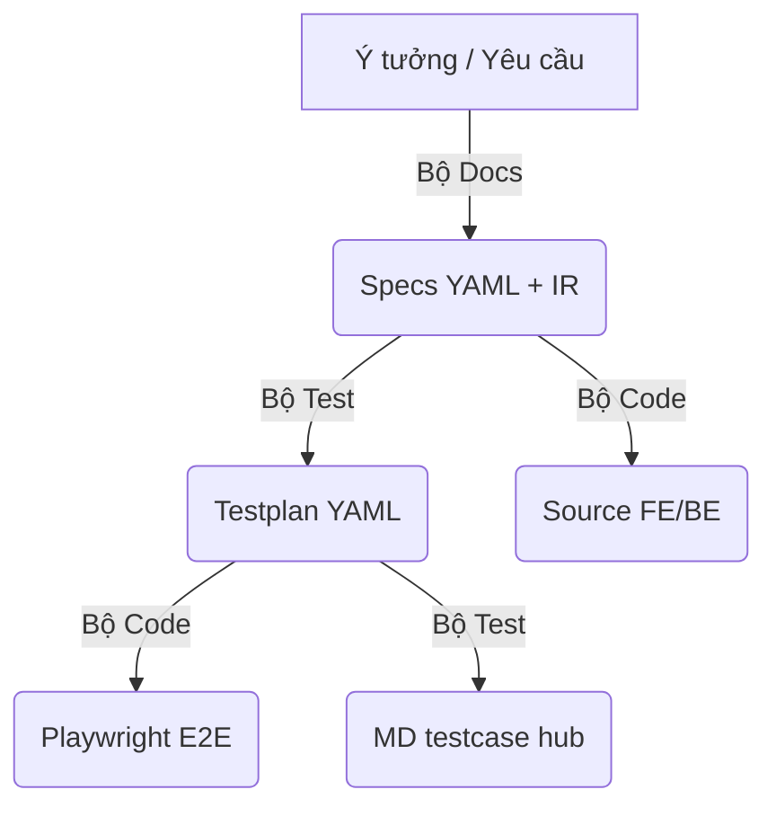

# Workflows — tổng thể

**Phạm vi (SSOT):** góc nhìn **team** — phase **lớn**, **ai làm gì** ở từng bước, **sơ đồ** và link xuống workflow chi tiết theo lane.

**Không viết ở đây:** định nghĩa file artifact → [artifacts/](../artifacts/) · lệnh/skill → [references/cli-and-commands.md](../references/cli-and-commands.md) · [skills (web)](../references/cli-and-commands.md#skills-harness-vs-docs).

### Đọc trang này thế nào

- **Chỉ** bản đồ macro: phase lớn, ai làm gì, link xuống lane — **không** thay checklist từng lệnh.
- **Checklist đóng một leaf (`W-*`):** [gates § Đóng một function](./gates.md#close-one-function) (**10 mốc**, bước 10 = human UAT/Ship) — SSOT khi grill/audit.
- **Grill vs audit, zone, AskQuestion:** [grill-and-human-review.md](./grill-and-human-review.md).
- Chi tiết từng phase nhỏ (Design cycle, API lane, E2E lane, Wire): các file lane bên dưới — cập nhật lane trước, rồi chỉnh diagram ở đây cho khớp.

---

## Cách làm việc với AI (tóm tắt)

**AI phục vụ con người** — không bắt member viết YAML phức tạp từ đầu:

```text
Requirement thô (bullet / ảnh / legacy code)
  → AI chuẩn hóa bundle + IR + render MD
  → Prototype + review BA/QA/Dev
  → Codegen E2E / BE / wire + safety net
```

- **Một session = một slash command** — đổi phase → chat mới.
- Grill & gate: [grill-and-human-review.md](./grill-and-human-review.md) · [gates.md](./gates.md) · [đóng một function (`W-*`)](./gates.md#close-one-function).
- **Hướng dẫn 3 Ngữ cảnh Triển khai (Greenfield, Modernization, Maintain):** [use-cases-guide.md](./use-cases-guide.md).
- **Prep SSOT spec (drill chung):** [spec-ssot-prep.md](./spec-ssot-prep.md) · Brownfield: [legacy-brownfield.md](./legacy-brownfield.md) · Custom base: [custom-base.md](./custom-base.md).

### YAML vs Markdown (hai lớp)

| | YAML (máy) | Markdown (người) |
|--|------------|------------------|
| Dùng cho | Agent, codegen, CI, `flowgrid split/render` | BA, QA, PO, review PR |
| Mục đích | SSOT chính xác | Đọc trên Docs Hub (`ir/generated/*.md`) |
| Excel/Word | Có thể **xuất** từ YAML/MD; ngược lại dễ mất cấu trúc | Deliverable khách hàng vẫn OK |

### Cấu trúc leaf (một function)

```text
surfaces/<surface>/CMP-*/<NN…>/
├── <slug>.bundle.yaml
├── ir/design.yaml · ir/spec.yaml · ir/generated/spec.md · data-model.md · api.md
├── api/<seq>/01-backend-spec.yaml   # khi có BE
└── (tests-docs & e2e-root: repo/path riêng — xem artifacts)
qa/ · qa/index.md
```

---

## Ba macro-phase (release) {#ba-macro-phase-release}

| Macro | Ý nghĩa | Workflow chi tiết |
|-------|---------|-------------------|
| **Design** | Phân tích, spec, grill, prototype — chốt hành vi trước code production | [design.md](./design.md) |
| **Code + test** | Backend, tests-docs, E2E automation (song song / lệch pha theo team) | [backend.md](./backend.md) · [test.md](./test.md) |
| **Wire** | FE ↔ API thật, regression, chuẩn bị release | [wire.md](./wire.md) |



Grill & chốt người: [grill-and-human-review.md](./grill-and-human-review.md). **Khi** chạy audit/gate: [gates.md](./gates.md). **Chuỗi đóng một leaf:** [gates § Đóng một function](./gates.md#close-one-function).

---

## Lane Design vs Implementation (session agent)

Một **chat mới** khi đổi phase. Mẫu prompt: [references/skills/](../references/skills/spec.md).



*Design lane:* `/grill-docs` chỉ khi BQA↔Dev conflict — xem [design.md](./design.md#design-cycle). *Impl:* `cases:gate` trước `testcase:gen`; `/grill-test` sau `/test` green ([test.md](./test.md#test-e2e-lane)).

---

## Full cycle — Phase 0…4 {#full-cycle}

Trước coi một màn/API **đóng** cho scope hiện tại: [gates § Đóng một function](./gates.md#close-one-function) (spec → gate → fe-be → E2E → wire → **human Ship/UAT**). Grill vs audit: [grill-and-human-review.md](./grill-and-human-review.md#human-signoff).

Palette (khớp diagram dưới):

| Phase | Hue | Subgraph / accent | Node tint |
|-------|-----|-------------------|-----------|
| **0** Architecture | Blue | `#93C5FD` / `#1D4ED8` | `#DBEAFE` |
| **1** Design | Emerald | `#6EE7B7` / `#047857` | `#D1FAE5` |
| **2a** Scaffold | Cyan | `#67E8F9` / `#0E7490` | `#CFFAFE` |
| **2b** Tests | Amber | `#FCD34D` / `#B45309` | `#FEF3C7` |
| **2c** API | Violet | `#C4B5FD` / `#6D28D9` | `#EDE9FE` |
| **3** Wire | Slate | `#94A3B8` / `#334155` | `#E2E8F0` |
| **4** Ship | Stone | `#A8A29E` / `#44403C` | `#E7E5E4` |
| Gap (`/update-spec`) | Rose | — | `#FECDD3` |



Chi tiết emerald (Design): [design.md](./design.md#design-cycle). API: [backend.md](./backend.md#api-cycle). Tests: [test.md](./test.md#test-cycle). Wire: [wire.md](./wire.md#wire-cycle).

### Phase map

| Phase | Đại diện | Detail |
|-------|----------|--------|
| **0** Architecture | Overview → module → `FLOW-*` · **ERD** (`db-erd.md`) · deployment | `/architecture` + [architecture-data.md](./architecture-data.md) |
| 1 Design | spec → grill → dry → prototype → grill-prototype | [design.md](./design.md) |
| 2a Scaffold | `portal:gen` · HANDOFF / manifests | codegen FE (adapter repo) |
| 2b Tests (plan) | `/testcase` · `/grill-testcase` · `cases:gate` | [test.md](./test.md) |
| 2b Tests (E2E) | `testcase:gen` · `/test` · `/grill-test` | [test.md](./test.md#test-e2e-lane) |
| 2c API | `/api-spec` · `/grill-api-spec` · api-gen · `/audit-api` | [backend.md](./backend.md) |
| 3 Wire | `/wire` · regression E2E | [wire.md](./wire.md) |
| 4 Ship | review · merge · deploy | — |

**Skip Phase 0** khi chỉ sửa screen/API trong module đã map surface + user-flow **+ `db-erd` LCA** ổn định (không thêm bảng/entity persisted mới).

### Phase 0 — Data model (ERD) {#phase-0-data-model}

ERD **không** thuộc `/spec` leaf — skill **`/db-erd`**, file `<LCA>/common/db-erd.md`, sau `/module` / `/user-flow` khi có entity mới.

Hai tầng: **(1)** ERD tổng Phase 0 · **(2)** `spec.entities` + `design.sections[].db` trên từng màn · **(3)** `01-backend-spec` lane API.

Chi tiết: [architecture-data.md](./architecture-data.md).

### Architecture gate (Phase 0 — thu nhỏ) {#architecture-gate}



---

## Ma trận trách nhiệm (ai làm gì)

Vai trò theo **trách nhiệm đối với thay đổi**, không gắn cứng chức danh. Một người có thể đảm nhiệm nhiều vai; mỗi artifact vẫn cần **owner** và **reviewer** rõ.

| Vai trò | Phạm vi | Artifact / output chính | Skill / công cụ (ví dụ) |
|---------|---------|-------------------------|-------------------------|
| **Solution Architect / Tech Lead** | System scope, `FLOW-*`, deployment, cross-system | `FLOW-*`, `DEP-*` | `/architecture`, `/overview`, `/user-flow`, `/deployment` |
| **Product / Feature Owner** | Ranh giới capability, module ownership | `CMP-*` README, mapping area/module | `/module` |
| **Business Analyst** | Actor, rule, acceptance, câu hỏi mở | Function requirement + grill | `/spec`, `/legacy /spec`, `/grill-bqa` |
| **Software Engineer** | Function detail, contract, feasibility | `ir/design.yaml`, `api/01` | `/spec`, `/grill-dev`, `/update-spec`, `/api-spec` |
| **Quality Engineer** | Scenario, testcase, traceability | `SC-*`, `TC-*` (tests-docs hub) | `/testcase`, `/scenario`, `cases:gate` |
| **Implementation owner** | Dry-run, gen, wire, verify | Source FE/BE repo | `/prototype`, `/api`, `/wire`, `testcase:gen` |

Grill, gate và ranh giới tool vs người: [grill-and-human-review.md](./grill-and-human-review.md) · [gates.md](./gates.md) · [đóng function](./gates.md#close-one-function).

---

## Quy trình vận hành dự án (5 phase)

Luồng **theo dự án** (PM/Lead → member → QC → dev → ship). Map sang macro **Design → Code+test → Wire** và bảng 7 bước bên dưới.



### 1. Lead / PM — Overview đến Module


- **Greenfield:** `/architecture` → `/overview`, `/user-flow`, `/module`; thêm `/deployment`, `/decision`, `/cross-cutting` khi cần.
- **Legacy cùng base:** modifier `/legacy` + skill tương ứng; kiến trúc mục tiêu vẫn qua `/architecture`.
- **Maintain / base khác:** [custom-base.md](./custom-base.md) (`flowgrid init` Custom + Golden Sample → `build-template-code`).

**Kết quả:** scope, boundary, `FLOW-*` overview, module `CMP-*` có owner và function index.

### 2. Member — Function / màn hình


- **Prep:** [spec-ssot-prep.md](./spec-ssot-prep.md) — `registry:sync` hoặc custom-base · brownfield: `/adopt` trước leaf.
- Mới: `/spec` · từ code cũ: `/legacy /spec` → [legacy-brownfield.md](./legacy-brownfield.md).
- Grill: `/grill-bqa`, `/grill-dev`, `/grill-docs` · prototype: `/prototype`, `/grill-prototype`.
- Output leaf: `CMP-*/<NN…>/` (`bundle`, `ir/`, `api/<seq>/`), `qa` → `/qa-resolve`.

Chi tiết lane: [design.md](./design.md).

### 3. Tester / QC — tests-docs


- `/testcase`, `/grill-testcase`, `cases:render`, `cases:gate` · automation: `testcase:gen` trên FE repo.
- Plan SSOT ở tests-docs hub; Playwright **không** thay plan YAML.

Chi tiết: [test.md](./test.md).

### 4. Developer — FE + BE



- FE: scaffold/prototype, route, state, validation · BE: `/api-spec` → `/grill-api-spec` → `api-gen` → `/audit-api` · parity field FE↔BE (`audit fe-be`).
- Song song với testcase; hội tụ trước wire.

Chi tiết: [backend.md](./backend.md) · [artifacts/code.md](../artifacts/code.md).

### 5. Project team — Wire, UAT, handoff


- `/wire`, `/grill-wire`, E2E scoped · UAT theo acceptance (human bước 10) · behaviour đổi → `/update-spec` trước đóng.

Chi tiết: [wire.md](./wire.md) · [gates bước 9–10](./gates.md#close-one-function) · [human sign-off](./grill-and-human-review.md#human-signoff).

### Công cụ hỗ trợ (tóm tắt)



| Công cụ | Trách nhiệm |
|---------|-------------|
| Skill `/…` | Workflow theo tầng và vai trò |
| FlowGrid Docs | Bundle, split/render, VitePress hub |
| FlowGrid Code/Test | UI/API codegen, Playwright E2E |
| `flowgrid audit *`, `cases:gate` | Gap có mã — người đọc và chốt |

---

## Một tính năng — bước nhỏ (7 lane)

| # | Bước | Macro | Vai trò thường gặp | Hỗ trợ FlowGrid (ví dụ) |
|---|------|-------|--------------------|-------------------------|
| 1 | Phân tích & phạm vi | Design | Lead / BA | `/overview`, `/architecture`, `/module` |
| 2 | Đặc tả + grill | Design | BA / Dev | `/spec`, `/grill-bqa`, `/grill-dev`, `audit spec`, `split` (lặp sau patch) |
| 3 | Dry + prototype + grill UI | Design | Dev FE / BA | `gen:dry` → `gen` + `/prototype` → `/grill-prototype` · FE `registry:sync` |
| 4 | Backend & contract | Code + test | Dev BE | `/api-spec`, `/grill-api-spec`, `/api`, `/audit-api`, `audit api`, `audit fe-be` |
| 5 | Testcase (tests-docs) | Code + test | QA / Dev | `/testcase`, `/grill-testcase`, `/scenario`, `cases:gate` |
| 6 | E2E automation | Code + test | QA / Dev | `/test`, `/grill-test`, `testcase:gen` |
| 7 | Tích hợp trước release | Wire | Dev FE + QA | `/wire`, audit E2E / scenario |



---

## Ba bộ máy (docs · code · test)



---

## Nguyên tắc vận hành

- **Audit (lượng)** vs **grill (chất)** — `gaps[]` / `confirms[]`; member chốt (không thay PO).
- **Ba artifact root** — [artifacts/index.md](../artifacts/index.md).

### Danh mục slash command (index)

| Command | Mục đích chính |
|---------|----------------|
| `/spec`, `/legacy /spec` | Bundle + IR + render |
| `/grill-bqa`, `/grill-dev`, `/grill-docs` | Grill nghiệp vụ / kỹ thuật / hòa giải (docs optional) |
| `/prototype`, `/grill-prototype` | UI mock boundary · sau `portal:gen` / dry |
| `/testcase`, `/grill-testcase`, `/scenario`, `cases:gate` | Plan tests-docs hub |
| `/test`, `/grill-test`, `testcase:gen` | E2E trên e2e-root |
| `/grill-api` | Docs router → `/grill-api-spec` |
| `/api-spec`, `/grill-api-spec`, `/api`, `/audit-api` | Contract docs → code BE |
| `/model`, `/wire` | Types · nối API thật |
| `/unit`, `/grill-unit` | Unit lane (tách E2E) |
| `/update-spec`, `/qa-resolve` | CR delta · đóng QA |
| `/adopt` | Legacy index + common catalog |

**Ngoài bảng (macro vẫn dùng — skill/CLI có trong harness):**

| Command / CLI | Mục đích |
| --- | --- |
| Phase **0** | `/architecture` → `/overview`, `/surfaces`, `/module`, `/user-flow`, `/deployment`, `/decision`, … |
| Cross-flow tests | `/scenario` · `audit scenario` |
| API hook E2E | `/test-api` · `testcase:gen:api` — [test.md](./test.md) |
| OpenAPI hub | `/openapi` |
| Common (docs) | `/common` — `patterns/` + `processes/FLOW-*.md` only · UI base + [custom-base](./custom-base.md) |
| Grill phụ | `/architecture-grill` |
| Unit lane | `/api-unit` · `/grill-api-unit` (BE) — cùng nhóm `/unit` · `/grill-unit` (FE) |
| Render plan MD | `cases:render` |
| Script FE (adapter) | `portal:gen` ≈ `flowgrid gen` · `portal:registry` · `portal:lifecycle` — [artifacts/code.md](../artifacts/code.md) |

Danh mục lệnh đầy đủ: [cli-and-commands.md](../references/cli-and-commands.md). Chi tiết slash: [references/skills/spec.md](../references/skills/spec.md) (Example prompt).
