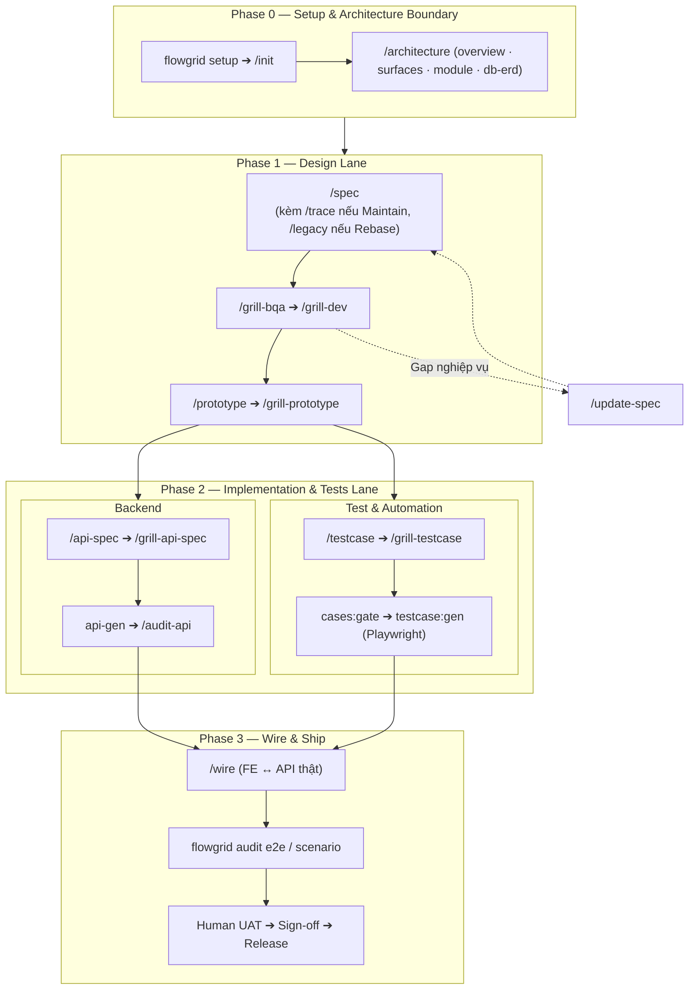

# Workflow Tổng quan

Đây là workflow tổng thể đầy đủ các bước từ [Phase 0 Setup](./phase-0-setup.md) dự án đến Phase [Wire](./wire.md) kết thúc chu kỳ phát triển một tính năng:

- **Khởi tạo & cấu hình dự án (Phase 0):** Xem hướng dẫn chi tiết tại [Phase 0 — Setup & Khởi tạo dự án](./phase-0-setup.md) cho 3 kịch bản: Greenfield, Maintain, Rebase.
- **Checklist đóng một leaf (`W-*`):** [gates § Đóng một function](./gates.md#close-one-function) (**10 mốc**, bước 10 = human UAT/Ship) — SSOT khi grill/audit.
- **Grill vs audit, zone, AskQuestion:** [grill-and-human-review.md](./grill-and-human-review.md).
- **Chi tiết từng phase nhỏ:** Tham khảo các lane: [Design](./design.md) ➔ [Backend](./backend.md) ➔ [Test](./test.md) ➔ [Wire](./wire.md).

---

## 1. Chu kỳ phát triển một tính năng (End-to-End Cycle)

Mỗi tính năng hoặc màn hình (`W-*` / leaf) đều trải qua chu kỳ 4 phase chuẩn:

| Phase | Trọng tâm | Trách nhiệm chính | Chi tiết lane |
| :--- | :--- | :--- | :--- |
| **Phase 0: Setup & Boundary** | Thiết lập repo, mapping surfaces, kiến trúc và ranh giới module | Lead / Architect | [Phase 0 Setup](./phase-0-setup.md) · [Architecture](./architecture-data.md) |
| **Phase 1: Design** | Đặc tả leaf bundle, grill nghiệp vụ, sinh prototype tương tác | BA / Dev FE | [Design](./design.md) |
| **Phase 2: Code & Test** | Chốt API contract backend, lập ma trận testcase, sinh automation E2E | Dev BE / QA | [Backend](./backend.md) · [Test](./test.md) |
| **Phase 3: Wire & Ship** | Đấu nối FE ↔ API thật, chạy regression E2E, UAT & Sign-off | Dev FE + QA + PO | [Wire](./wire.md) · [Gates](./gates.md) |

---

## 2. Chi tiết từng Phase thực thi

### Phase 0: Setup & Boundary
- **Khởi tạo:** Chạy `flowgrid setup [name]` để sinh cấu trúc SSOT skeleton (`source-code/`, `source-legacy/`, `registries/`, Arc42 docs).
- **Nhận diện:** Mở Agent chạy skill `/init` để map surfaces và cấu hình repo maps `platform-repos.local.json`.
- **Kiến trúc:** Dùng `/architecture`, `/overview`, `/surfaces`, `/module`, `/db-erd` để chốt ranh giới hệ thống trước khi đi sâu vào từng màn hình.
- *Chi tiết:* [phase-0-setup.md](./phase-0-setup.md) và [architecture-data.md](./architecture-data.md).

### Phase 1: Design Lane
- **Viết spec:**
  - *Mới hoàn toàn:* Chạy `/spec` để sinh bundle spec (`<slug>.bundle.yaml`, `ir/design.yaml`, `ir/spec.yaml`).
  - *Dự án Maintain:* Dùng kèm skill `/trace` để đối chiếu mã nguồn `source-code/`.
  - *Dự án Rebase:* Dùng kèm skill `/legacy` để trích xuất logic từ `source-legacy/`.
- **Phản biện (*Grill*):** Chạy `/grill-bqa` (nghiệp vụ) và `/grill-dev` (khả thi kỹ thuật) để hoàn thiện spec.
- **Early Feedback Prototype:** Chạy `/prototype` sinh giao diện tương tác (HTML/Vue/React) để PO/BA bấm thử và chốt hành vi trước khi code production.
- *Chi tiết:* [design.md](./design.md).

### Phase 2: Implementation & Tests Lane
- **Backend API:**
  - Định nghĩa contract REST/DTO tại `api/<seq>/01-backend-spec.yaml` với `/api-spec`.
  - Phản biện contract với `/grill-api-spec`, sinh code controller/service với `api-gen` và kiểm tra với `/audit-api`.
- **Tests-docs & Automation E2E:**
  - QA xây dựng ma trận kịch bản tại tests-docs hub với `/testcase`, `/scenario` và `/grill-testcase`.
  - Chạy `cases:gate` để chốt kế hoạch testcase, sau đó chạy `testcase:gen` để tự động sinh code Playwright E2E (`*.spec.ts`) trên repo FE.
- *Chi tiết:* [backend.md](./backend.md) và [test.md](./test.md).

### Phase 3: Wire & Ship
- **Tích hợp (*Wire*):** Dev FE chạy `/wire` đấu nối UI với API thật, thay thế mock data.
- **Kiểm định hồi quy:** Chạy bộ test Playwright E2E tự động và audit đối chiếu spec ↔ code (`flowgrid audit e2e`).
- **Human UAT & Release:** Member/PO kiểm tra UAT bước cuối theo acceptance criteria và ký đóng màn ([gates § Bước 10](./gates.md#close-one-function)).
- *Chi tiết:* [wire.md](./wire.md) và [gates.md](./gates.md).

---

## 3. Ma trận trách nhiệm (T-Shaped Team)

Quy định vai trò theo **trách nhiệm đầu ra**, không gắn cứng vào chức danh nhân sự:

| Vai trò | Phạm vi chính | Đầu ra (Artifacts) | Skill / Lệnh gợi ý |
| :--- | :--- | :--- | :--- |
| **Solution Architect / Lead** | Kiến trúc hệ thống, ranh giới module, deployment | `overview/`, `architecture/`, `FLOW-*` | `/architecture`, `/overview`, `/surfaces`, `/module`, `/db-erd` |
| **Business Analyst (BA)** | Yêu cầu nghiệp vụ, acceptance criteria, câu hỏi mở | Spec leaf bundle, Prototype UI sớm | `/spec`, `/grill-bqa`, `/prototype` |
| **Software Engineer (Dev)** | Kỹ thuật màn hình, API contract, implementation | `ir/design.yaml`, `01-backend-spec.yaml`, code thật | `/spec`, `/grill-dev`, `/api-spec`, `/api`, `/wire` |
| **Quality Engineer (QA)** | Ma trận testcase, kịch bản kiểm thử, automation | `TC-*.yaml`, Playwright E2E (`*.spec.ts`) | `/testcase`, `/scenario`, `testcase:gen`, `/test` |

---

## 4. Danh mục Slash Commands chính (Cheat Sheet)

| Lệnh / Skill | Phase | Mục đích chính |
| :--- | :--- | :--- |
| `flowgrid setup [name]` | Phase 0 | Khởi tạo skeleton workspace và cấu hình harness. |
| `/init` | Phase 0 | Quét workspace, nhận diện surfaces và lập repo maps. |
| `/architecture` | Phase 0 | Khai báo kiến trúc Arc42, overview, surfaces, module, ERD. |
| `/spec` | Phase 1 | Tạo Leaf Bundle spec (`.bundle.yaml`, `ir/`, data model). |
| `/trace` | Phase 1 | *(Maintain)* Khảo cổ trực tiếp mã nguồn trong `source-code/`. |
| `/legacy` | Phase 1 | *(Rebase)* Đọc Read-Only từ `source-legacy/`, trích xuất sang code mới. |
| `/grill-bqa`, `/grill-dev` | Phase 1 | Phản biện nghiệp vụ và khả thi kỹ thuật cho spec. |
| `/prototype`, `/grill-prototype` | Phase 1 | Sinh và review prototype giao diện tương tác sớm. |
| `/api-spec`, `/grill-api-spec` | Phase 2 | Thiết kế và phản biện API contract backend. |
| `/testcase`, `/grill-testcase` | Phase 2 | Xây dựng ma trận kịch bản testcase tại tests-docs hub. |
| `testcase:gen` | Phase 2 | Tự động sinh mã kiểm thử Playwright E2E từ testcase YAML. |
| `/wire`, `/grill-wire` | Phase 3 | Đấu nối FE với API thật, đối chiếu spec ↔ code. |
| `/update-spec`, `/qa-resolve` | Bất kỳ | Cập nhật delta khi thay đổi yêu cầu hoặc đóng câu hỏi QA. |

*Xem chi tiết toàn bộ lệnh CLI và options nâng cao tại:* [CLI & Commands](../references/cli-and-commands.md).
