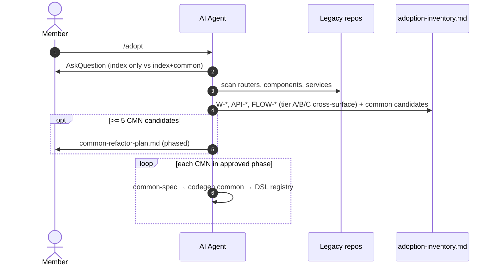

# Workflow — Legacy & brownfield

**Phạm vi (SSOT):** khảo cổ code cũ, `/legacy` + `/spec`, `/adopt`, common catalog — **không** copy-paste sang codebase mới.

**Drill prep cùng custom-base + `/spec`:** [spec-ssot-prep.md](./spec-ssot-prep.md) — brownfield = nhánh **C** (`/adopt`) + (nếu stack lệch) nhánh **B** [custom-base](./custom-base.md) trước leaf bundle.

**Không viết ở đây:** layout legacy-dynamics → [artifacts/docs.md](../artifacts/docs.md) · skill `/legacy` → [references/skills/legacy.md](../references/skills/legacy.md).

**Lane:** macro [Design](./index.md) · grill: [grill-and-human-review.md](./grill-and-human-review.md).

---

## Nguyên tắc

1. **Legacy chưa được yêu cầu sửa** → giữ nguyên 1:1, không refactor rủi ro regression.
2. **Codebase mới** → **cấm** copy-paste class/file lẻ; tái sử dụng **Common catalog** (`CMN-*`, `UI-CMN-*`, …).
3. Nguồn path: `PROJECT-MAPS` / `.flowgrid/config.json` lúc `flowgrid init` — không đoán đường dẫn repo (xem [cli-and-commands](../references/cli-and-commands.md) mục repo split).

---

## Audit legacy 2 tầng

| Tầng | Kích hoạt | Scope |
|------|-----------|--------|
| **Tier 1** | `/legacy /spec` (W-* / API) | Validation thiếu, `@csrf`/auth middleware, sanitization **trong** một màn/API — không audit cross-flow ở tầng này |
| **Tier 2** | `/legacy /user-flow` (FLOW) | Handoff step N→N+1, orphan step/API, confirm/idempotency/rollback |

---

## `/adopt` — index + common catalog



Pipeline CMN: `common-spec` → codegen common → đăng ký registry — whole-page duplicate **warning**, không tạo CMN cho cả page.

---

## Luồng vào spec mới từ code cũ

```text
/adopt (+ audit legacy)  →  adoption-inventory.md
  →  Phase 0 (/module, /db-erd …) khi scope mới
  →  /legacy /spec  →  bundle + evidence (inferredFromCode | qa)
  →  audit spec (CONFIRM_UX / CONFIRM_DB wizard)
  →  grill  →  prototype  →  (tiếp macro Design như greenfield)
```

Nếu FE **custom base:** hoàn tất [custom-base](./custom-base.md) **trước** `/legacy /spec` để DSL/registry khớp code thật — xem [spec-ssot-prep.md](./spec-ssot-prep.md).

Handoff diagram Design: [design.md#design-cycle](./design.md#design-cycle).

### `/adopt` — chế độ quét

- **Index + Common (khuyến nghị):** scan router/component/service → `adoption-inventory.md` + common candidates (CMN-*); ≥5 candidate → `common-refactor-plan.md` theo phase.
- **Index only:** W-*, API-*, FLOW-* (section 4: tier A cross-surface + B/C khi có).
- Whole-page duplicate: **warning** — không tạo CMN cho cả page.

Skill chi tiết: [legacy](../references/skills/legacy.md) · [adopt](../references/skills/adopt.md).
