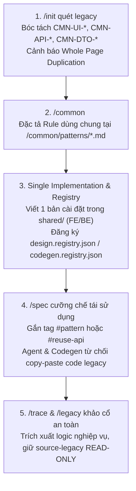
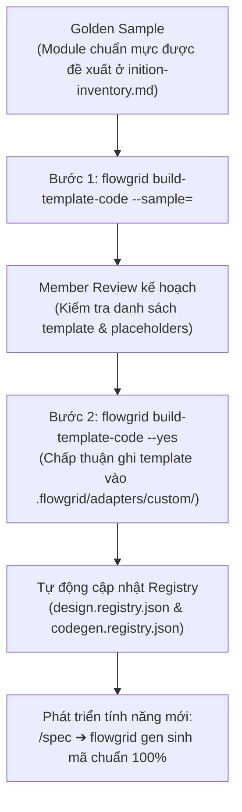

# Phase 0 — Setup & Khởi tạo dự án

Tài liệu này hướng dẫn bước khởi tạo đầu tiên (Phase 0) với lệnh `flowgrid setup` và phân bổ luồng làm việc theo **3 ngữ cảnh thực tế của dự án**:
1. **Greenfield:** Làm sản phẩm mới hoàn toàn.
2. **Maintain:** Tiếp tục phát triển và bảo trì codebase hiện có.
3. **Rebase / Modernization:** Đập đi làm lại từ hệ thống legacy cũ.

---

## Sơ đồ điều hướng Phase 0

```mermaid
flowchart TD
  START(["Bắt đầu: flowgrid setup [workspace]"]) --> CHOICE{"Ngữ cảnh dự án?"}

  %% Nhánh 1: Greenfield
  CHOICE -->|1. Greenfield<br/>(Làm mới tinh)| GF_DOCS["Phát triển overview, architecture<br/>Liệt kê surfaces"]
  GF_DOCS --> GF_REPO["Tạo các repo code mới<br/>vào source-code/"]
  GF_REPO --> GF_INIT["Chạy /init<br/>(Lập bản đồ repo & surfaces)"]
  GF_INIT --> NEXT_PHASE

  %% Nhánh 2: Maintain
  CHOICE -->|2. Maintain<br/>(Phát triển dự án cũ)| MT_REPO["Đưa repo code hiện tại<br/>vào source-code/"]
  MT_REPO --> MT_INIT["Chạy /init<br/>(Quét & nhận diện cấu hình)"]
  MT_INIT --> MT_NEXT["Sang Phase Design:<br/>Dùng kèm /trace khảo cổ chi tiết"]
  MT_NEXT --> NEXT_PHASE

  %% Nhánh 3: Rebase
  CHOICE -->|3. Rebase<br/>(Đập đi làm lại)| RB_LEGACY["Đưa code cũ vào source-legacy/<br/>(STRICTLY READ-ONLY)"]
  RB_LEGACY --> RB_EXTRACT["Chạy /extract-legacy<br/>(Bóc tách modules & surfaces cũ)"]
  RB_EXTRACT --> RB_NEW["Khởi tạo repo code mới<br/>đưa vào source-code/"]
  RB_NEW --> RB_INIT["Chạy /init<br/>(Cấu hình dự án mới)"]
  RB_INIT --> RB_NEXT["Sang Phase Design:<br/>Dùng kèm /legacy trích xuất tính năng"]
  RB_NEXT --> NEXT_PHASE

  NEXT_PHASE(["Chuyển sang chu kỳ tính năng:<br/>Design ➔ Codegen ➔ Test ➔ Wire"])
```

---

## Chi tiết từng kịch bản

### 1. Kịch bản Greenfield (Dự án mới hoàn toàn)

Áp dụng khi bắt đầu một sản phẩm mới từ con số 0.

- **Bước 1: Khởi tạo khung workspace**
  ```bash
  flowgrid setup my-project
  ```
  CLI tự động sinh khung cấu trúc SSOT chuẩn (`architecture/`, `overview/`, `surfaces/`, `registries/`, `source-code/`, `source-legacy/`).
- **Bước 2: Xây dựng tài liệu định hướng cấp cao**
  - Viết tài liệu tại `overview/index.md` (Tầm nhìn, Persona, Mục tiêu phát hành).
  - Khai báo kiến trúc tại `architecture/` (Arc42, Ràng buộc kỹ thuật, ERD cơ sở dữ liệu).
  - Định nghĩa danh mục bề mặt ứng dụng tại `surfaces/` (Liệt kê các surfaces: Web Admin, Mobile App, Portal,...).
- **Bước 3: Khởi tạo repo mã nguồn**
  - Tạo hoặc clone các repository mã nguồn mới vào thư mục `source-code/` (khuyến nghị dưới dạng Git Submodule).
- **Bước 4: Nhận diện cấu hình**
  - Mở Agent AI và chạy skill **`/init`** để quét workspace, tạo file cấu hình liên kết `platform-repos.local.json` và map toàn bộ surfaces.
- **Tiếp theo:** Thành viên chuyển sang tham khảo các phase tiếp theo trong workflow: [Design](./design.md) ➔ [Backend](./backend.md) ➔ [Test](./test.md) ➔ [Wire](./wire.md).

---

### 2. Kịch bản Maintain (Bảo trì & Phát triển tiếp dự án cũ)

Áp dụng khi đưa một hệ thống đang chạy vào quy chuẩn FlowGrid để tiếp tục mở rộng tính năng mới hoặc nâng cấp mà không viết lại từ đầu.

- **Bước 1: Khởi tạo khung workspace**
  ```bash
  flowgrid setup my-project
  ```
- **Bước 2: Tích hợp mã nguồn hiện có**
  - Clone hoặc đưa toàn bộ repository mã nguồn hiện tại vào thư mục `source-code/`.
- **Bước 3: Cấu hình và nhận diện**
  - Chạy skill **`/init`** trên Agent AI để quét codebase, nhận diện công nghệ, tự động lập repo maps và phân bổ surfaces theo cấu trúc thực tế của code.
- **Bước 4: Sang phase Design & Khảo cổ**
  - Khi bắt tay vào làm tính năng mới hoặc sửa đổi tính năng cũ trong phase [Design](./design.md), **bắt buộc sử dụng kèm skill `/trace`**:
    - Agent sẽ quét trực tiếp mã nguồn trong `source-code/` để đối chiếu logic, trích xuất ngược Data Model, API contract và luồng nghiệp vụ hiện hữu sang file spec chuẩn.
    - Giúp viết spec chuẩn xác mà không sợ làm đứt gãy các logic ngầm của hệ thống cũ.

---

### 3. Kịch bản Rebase / Modernization (Đập đi làm lại từ hệ thống cũ)

Áp dụng khi nâng cấp toàn diện (ví dụ chuyển từ Monolith cũ sang Microservices, hoặc từ PHP/WebForms sang Nuxt/Next/NestJS), giữ nguyên nghiệp vụ nhưng đổi mới công nghệ.

- **Bước 1: Khởi tạo khung workspace**
  ```bash
  flowgrid setup my-project
  ```
- **Bước 2: Cách ly mã nguồn legacy**
  - Đưa toàn bộ repository code cũ vào thư mục `source-legacy/`.
  - **Quy tắc bất biến:** `source-legacy/` là **STRICTLY READ-ONLY**. Tuyệt đối không sửa đổi và không copy-paste code thô từ thư mục này sang code mới.
- **Bước 3: Khảo cổ tổng quan với `/extract-legacy`**
  - Mở Agent AI và chạy skill **`/extract-legacy`**:
    - Agent quét sâu cấu trúc code cũ để bóc tách sơ đồ module, danh sách màn hình, danh mục API và các rule dùng chung (`CMN-*`).
    - Kết xuất danh mục chức năng vào `surfaces/` và `architecture/`.
- **Bước 4: Khởi tạo codebase mới**
  - Tạo repository cho hệ thống công nghệ mới và đặt vào `source-code/`.
  - Chạy skill **`/init`** để kết nối hệ thống mới với tài liệu SSOT vừa bóc tách.
- **Bước 5: Sang phase Design & Phục hồi tính năng**
  - Khi bắt đầu làm từng màn hình/tính năng ở phase [Design](./design.md), **sử dụng kèm skill `/legacy`**:
    - Agent đọc mã nguồn cũ tương ứng từ `source-legacy/`, trích xuất 100% logic nghiệp vụ lõi, DTO, validation rule và trạng thái giao diện vào bản spec mới.
    - Đảm bảo hệ thống mới kế thừa trọn vẹn nghiệp vụ cũ mà mã nguồn sạch 100%, không bị vướng rác kỹ thuật.

---

## 4. Bộ kỹ năng & Cơ chế Ngăn chặn Duplicate Code (Anti-Copy-Paste Guard)

Một trong những vấn đề lớn nhất khi bảo trì hoặc hiện đại hóa hệ thống legacy là **code bị copy-paste trùng lặp tràn lan** qua nhiều module (cùng một Confirm Modal, bảng phân trang, hay logic xuất Excel bị viết lại ở 4–5 controller/view khác nhau).

FlowGrid thiết lập chuỗi kỹ năng khép kín để triệt tiêu triệt để vấn đề này ngay từ Phase 0:



### Chi tiết các kỹ năng ngăn chặn duplicate:

1. **Skill `/init` (Quét, Phát hiện Duplicate & Định vị Nơi Gen Code)**:
   - Khi chạy ở chế độ Common Discovery, Agent quét toàn bộ controllers, services, routers, và views để tìm các đoạn code/giao diện lặp lại từ 2 nơi trở lên, tự động gán mã định danh:
     - **`CMN-UI-*`**: Các mẫu giao diện trùng lặp (Confirm Modal, Search Filter Toolbar, Action Bar,...).
     - **`CMN-API-*`**: Các logic backend trùng lặp (Paging wrapper, Audit log interceptor, Export CSV/Excel, Transmission logger,...).
     - **`CMN-DTO-*`**: Cấu trúc dữ liệu trùng lặp (BaseAuditable, Soft-delete model, ApiResponse chuẩn,...).
   - **Định vị chính xác nơi gen Common (Target Placement Check):** Trong các hệ thống lớn hoặc multi-repo, Agent không để mơ hồ mà đối chiếu với `projects` trong `.flowgrid/config.json` để chỉ định rõ 3 tọa độ cho từng Common Candidate trong `inition-inventory.md`:
     1. *Owning Surface & Target Repo:* Repo sở hữu đích (ví dụ `admin-fe`, `booking-portal`, hay `core-api`).
     2. *Target Code Path:* Đường dẫn file mã nguồn cụ thể sẽ sinh (ví dụ `source-code/admin-fe/src/components/Common/ConfirmModal.vue` thay vì nói chung chung).
     3. *Target Docs Path (LCA):* Đường dẫn file Markdown User Stories trong Docs Hub (`surfaces/admin/common/patterns/CMN-UI-001.md`).
   - **Cảnh báo nhân bản cả trang (`Whole Page Duplication Warnings`)**: Nếu phát hiện 2 file màn hình giống nhau đến 90–95% (như `CreateUser.vue` và `EditUser.vue`), Agent **không** tạo `CMN-*` mà khuyến nghị gộp thành một Form Spec đa hình duy nhất (`mode: create | edit`).

2. **Skill `/common <CMN-ID>` (Đặc tả User Stories & Sinh code dùng chung)**:
   - **Chỉ dùng file Markdown `.md` mô tả User Stories & Rules:** Các thành phần common đều được code sẵn trong base (`shared/`), **TUYỆT ĐỐI KHÔNG TẠO FILE YAML CHO COMMON VÀ KHÔNG PHÂN TÁCH IR**. Tạo file YAML cho common là thừa thãi và sai chuẩn.
   - **Quy trình Plan ➔ Tự động thực thi khi Approve / Proceed:**
     - Agent đề xuất Action Plan ngắn gọn (mô tả User Stories dự kiến và file code cần tạo).
     - Member xem qua, điều chỉnh nếu cần rồi bấm **Approve** hoặc **Proceed**.
     - Agent tự động thực thi lần lượt các phase mà không hỏi vòng vo:
       1. Sinh file `.md` User Stories & Behavior tại `<LCA>/common/patterns/<CMN-ID>.md`.
       2. Sinh mã nguồn cài đặt (Single Implementation) vào thư mục `shared/` (`shared/components/` cho FE hoặc `shared/services/` cho BE).
       3. Tự động đăng ký vào `design.registry.json` hoặc `codegen.registry.json`.

3. **Nguyên tắc an toàn tuyệt đối: Chỉ tạo mới cho tương lai — KHÔNG sửa code legacy**:
   - Mục đích tạo Common: Đoạn code này được phát hiện đang bị copy-paste duplicate ở 3–4 nơi trong code cũ. Ta tạo sẵn 1 bản chuẩn hoá duy nhất trong `shared/` để **các tính năng phát triển tiếp theo sử dụng**, triệt tiêu nguy cơ copy duplicate lần thứ 3, thứ 4.
   - **Tuyệt đối KHÔNG tự ý sửa đổi hay refactor code trong `source-legacy/`**: Thư mục legacy luôn là **READ-ONLY**. Không thay thế code cũ đang chạy để tránh 100% nguy cơ regression hoặc làm degrade hệ thống cũ.

4. **Skill `/spec` & Codegen (Cưỡng chế Anti-Copy-Paste Guard)**:
   - Khi bất kỳ thành viên nào phát triển màn hình hoặc API mới qua `/spec`, bundle bắt buộc gắn tag `#pattern: <CMN-ID>` hoặc `#reuse-api: <CMN-ID>`.
   - Agent AI và Codegen engine **tuyệt đối từ chối việc copy-paste code thô từ legacy** vào module mới; bắt buộc `import` và tái sử dụng component/service chung đã được đăng ký trong `shared/`.

5. **Bộ đôi `/trace` & `/legacy` (Kế thừa nghiệp vụ sạch sẽ)**:
   - `/trace` (dự án Maintain): Quét code hiện hữu để đối chiếu data model và logic ngầm mà không làm gãy luồng.
   - `/legacy` (dự án Rebase): Chỉ đọc Read-Only từ `source-legacy/`, trích xuất 100% nghiệp vụ lõi sang bản spec mới, triệt tiêu toàn bộ rác kỹ thuật cũ.

---

## 5. Huấn luyện Template từ Golden Sample (`build-template-code`)

Sau khi chuẩn hóa các thành phần dùng chung, thách thức tiếp theo là **làm sao để Agent AI và engine Codegen sinh mã mới đúng 100% theo kiến trúc, thư viện UI và coding convention riêng của dự án** (không bị lệch chuẩn theo template mặc định).

FlowGrid giải quyết bài toán này bằng công cụ `build-template-code` (kèm skill `/build-templates`) để học tự động từ một **Golden Sample** (module mẫu chuẩn).

### 5.1. Golden Sample là gì?
Ở cuối tài liệu `inition-inventory.md`, Agent AI sẽ phân tích toàn bộ codebase và đề xuất **Golden Sample** — module hoặc surface có kiến trúc phân tầng sạch đẹp, chuẩn mực và rõ layer nhất trong dự án (ví dụ phân tách rõ Controller ➔ Service ➔ Repository ➔ DTO hoặc View ➔ Component, có đầy đủ CRUD và validation mẫu mực).

### 5.2. Quy trình huấn luyện Template (Tri-Sync)



### 5.3. Hướng dẫn thực thi từng bước:

#### Bước 1: Phân tích module mẫu và xuất kế hoạch (`--sample`)
Chỉ định đường dẫn tới thư mục module mẫu (chấp nhận đường dẫn tương đối hoặc tuyệt đối):

```bash
flowgrid build-template-code --sample=./source-code/src/modules/orders
```

*Cơ chế an toàn:* Bước này **hoàn toàn chưa ghi đè hay thay đổi bất kỳ file template nào**. CLI chỉ quét và tạo ra file kế hoạch `.flowgrid/template-plan.json` chứa:
- Danh sách các file template dự kiến sinh.
- Các vị trí placeholder được nhận diện (`{{entity}}`, `{{fields}}`, `{{actions}}`).
- Các component UI và endpoints API được bóc tách.

#### Bước 2: Build luôn template khi User Approve (`--yes`)
- **Fast-track Build khi User xác nhận đề xuất:**
  - Khi user / member đã xem đề xuất Golden Sample (từ `inition-inventory.md` hoặc sau khi chạy `--sample`) và bấm **Approve** hoặc **Proceed**:
  - Agent chạy ngay lệnh `flowgrid build-template-code --yes` để **BUILD LUÔN TEMPLATE**.
  - **Tuyệt đối không chạy thảo luận/discuss dài dòng qua lại.** Người thực hiện công đoạn này là dân kỹ thuật (tech lead / dev) đọc hiểu được code; khi họ đã bấm approve là họ đã nắm rõ kết quả và muốn hoàn tất ngay. Thêm nữa, việc sinh template vào `.flowgrid/` hoàn toàn chưa sửa đổi code cũ legacy nên tuyệt đối an toàn, không có rủi ro degrade.

```bash
flowgrid build-template-code --yes
```

CLI sẽ ghi các file template tương ứng vào thư mục `.flowgrid/adapters/custom/` của repo tương ứng:

| Công nghệ | Đuôi template | File Registry đồng bộ |
| :--- | :--- | :--- |
| **Nuxt, Next, NestJS** | `.hbs` (Handlebars) | `design.registry.json` (FE) · `codegen.registry.json` (BE) |
| **Laravel / PHP** | `.stub` | `codegen.registry.json` |
| **FastAPI / Python** | `.j2` (Jinja2) | `codegen.registry.json` |
| **.NET / C#** | `.scriban` | `codegen.registry.json` |

*Ghi đè khi cần thiết:* Nếu cần cập nhật lại toàn bộ template đã tồn tại, thêm cờ `--force`:
```bash
flowgrid build-template-code --yes --force
```

#### Bước 3: Phát triển tính năng mới với Custom Template
Kể từ thời điểm này, toàn bộ quy trình phát triển chức năng mới diễn ra tự động và chuẩn xác:
1. Viết spec với `/spec` (kế thừa các mã `CMN-*`).
2. Phản biện nghiệp vụ và giao diện với `/grill-bqa`, `/prototype`.
3. Khi chạy lệnh sinh code (`flowgrid gen`), hệ thống sẽ tự động sử dụng bộ custom template vừa được huấn luyện để sinh mã đúng 100% quy chuẩn dự án mà không cần dev phải sửa tay.

---

## 6. Xem tài liệu SSOT trực tiếp trên Local (`pnpm docs:dev`)

Đến đây, quá trình cài đặt và thiết lập Phase 0 đã hoàn tất! Bạn có thể khởi chạy server tài liệu để xem giao diện web trực quan của toàn bộ hệ thống SSOT:

```bash
pnpm docs:dev
# hoặc: flowgrid dev
```

Lệnh này khởi chạy VitePress dev server tại `http://localhost:5173` giúp bạn và toàn bộ team:
- Đọc chi tiết các tài liệu kiến trúc Arc42, cấu trúc surfaces, data model, ERD và API contract dưới dạng web động.
- Tự động cập nhật tức thì (Hot Reload) mỗi khi Agent AI hoặc team chỉnh sửa các file Markdown/YAML trên disk.
- Là nơi đối chiếu trực quan duy nhất giữa BA, Dev và QA trong suốt vòng đời dự án.

