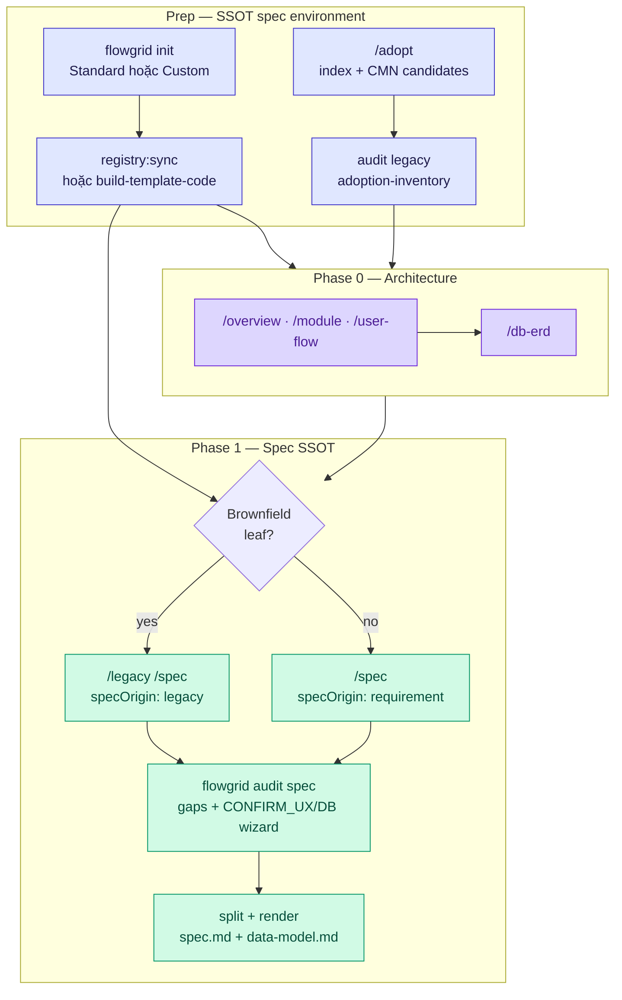

# Workflow — Chuẩn bị SSOT spec (prep drill)

**Phạm vi:** mọi đường vào **`/spec`** / **`/legacy /spec`** — chuẩn bị **registry + chỉ mục + quy tắc tái sử dụng** trước khi author `*.bundle.yaml`. Cùng mục tiêu: document SSOT đọc được (BA) + IR/codegen (Dev).

**Không thay:** Phase 0 kiến trúc ([index § Phase 0](./index.md#phase-0-data-model)) · cycle grill ([design.md](./design.md#design-cycle)).

**Liên quan:** [legacy-brownfield.md](./legacy-brownfield.md) · [custom-base.md](./custom-base.md) · [architecture-data.md](./architecture-data.md).

---

## Ba nhánh prep (chọn theo dự án)

| Nhánh | Khi | Drill | Artifact tối thiểu |
|-------|-----|-------|---------------------|
| **A — Standard base** | Greenfield, Nuxt/Next + adapter mặc định | `flowgrid init` → FE `registry:sync` | `registries/design.registry.json` (checkout FE) |
| **B — Custom base** | UI/stack lệch template mặc định | [custom-base.md](./custom-base.md): Golden Sample → `build-template-code` | Registry + templates + lexicon/graph |
| **C — Brownfield index** | Có repo legacy cần map W-* | `/adopt` (+ Common mode khuyến nghị) → `audit legacy` | `adoption-inventory.md` (+ `common-plan.md` nếu ≥5 CMN) |

**Brownfield + custom stack:** làm **C → B** (hoặc B đã xong từ đầu dự án) rồi mới `/legacy /spec` từng leaf.

**Greenfield thuần:** **A** (hoặc **B** nếu maintain) — **không** bắt buộc `/adopt`.

---

## Drill tổng (trước bundle leaf)

---

## Trên session `/spec` (member + agent)

| Bước | Việc |
|------|------|
| 1 | **Prep đã xong?** Custom → registry có tag thật; brownfield → `adoption-inventory.md` có `W-*` / path legacy |
| 2 | Đọc **Section 5 — Common Catalog Candidates** trong inventory (nếu có) — inherit `CMN-*`, không copy-paste file legacy |
| 3 | Phase 0: ERD LCA đọc trước khi ghi `design.sections[].db` ([architecture-data](./architecture-data.md)) |
| 4 | Author bundle → `audit spec` → patch `gaps[]`; **`confirms[]`** (`CONFIRM_UX_*`, `CONFIRM_DB_*`) → AskQuestion ([grill-and-human-review](./grill-and-human-review.md)) |
| 5 | `split` + `render` → `flowgrid build` / `dev` — **cùng site** `spec.md` + `data-model.md` (sidebar 2 mục) · list columns trên spec |

Modifier **`/legacy /spec`:** bắt buộc inventory + `legacy.evidence` / `inferredFromCode` · chạy `audit legacy` khi cập nhật index.

---

## Anti-patterns (cả ba nhánh)

| Cấm | Làm đúng |
|-----|----------|
| Copy class/file legacy sang spec/code mới | Map `CMN-*` + DSL/registry; whole-page duplicate → một bundle polymorphic (`mode: create \| edit`) |
| `#needs-component` ảo khi component đã có trên base | Prep registry (A/B) trước `/spec` |
| Author spec không audit | `audit spec` mỗi vòng grill; DB drift → `/api-update` sau chốt wizard |
| Bỏ `/adopt` rồi đoán path legacy | `/adopt` một lần ở root; trace qua ID |

---

## Checklist lead (trước mở hàng loạt `/spec`)

- [ ] **A hoặc B:** FE registry sync / `build-template-code` pass; agent map được `#ui:` / `#shell:` từ registry thật.
- [ ] **C (nếu brownfield):** `adoption-inventory.md` + `audit legacy` không blocker; handoff prompt có `W-*` → `/legacy /spec`.
- [ ] Phase 0: module + `db-erd` LCA cho entity mới.
- [ ] Member brief: một session = một command; prep xong mới mở leaf grill.

Skill: [spec](../references/skills/spec.md) · [adopt](../references/skills/adopt.md) · [legacy](../references/skills/legacy.md).
