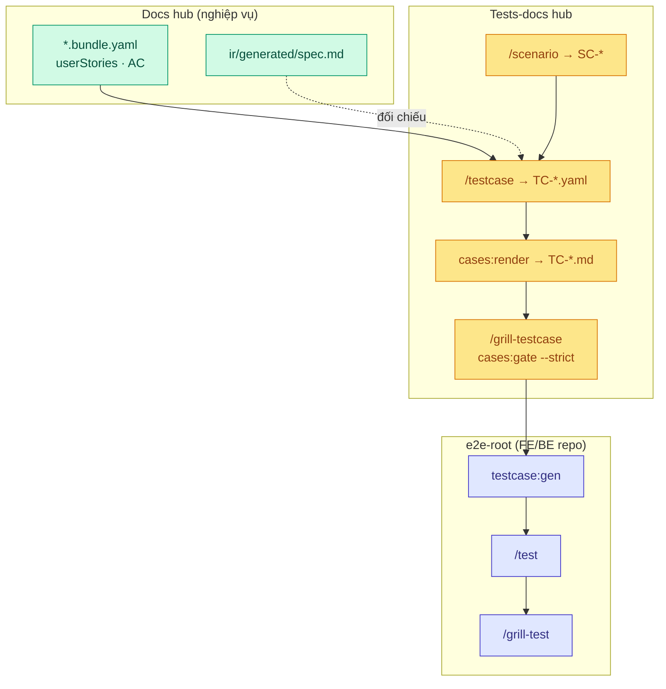
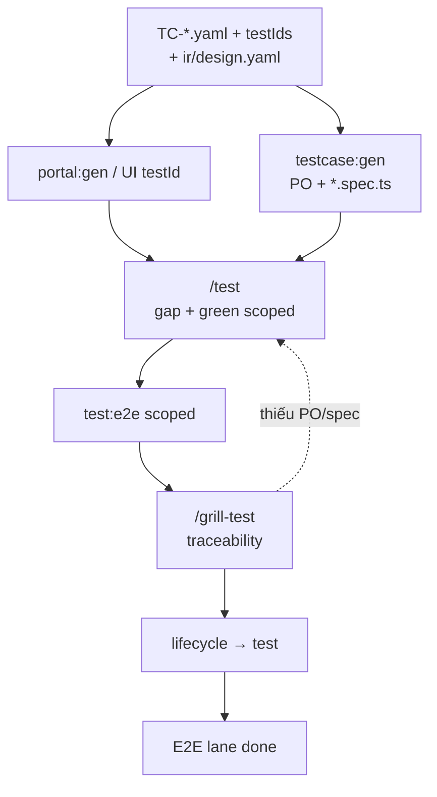
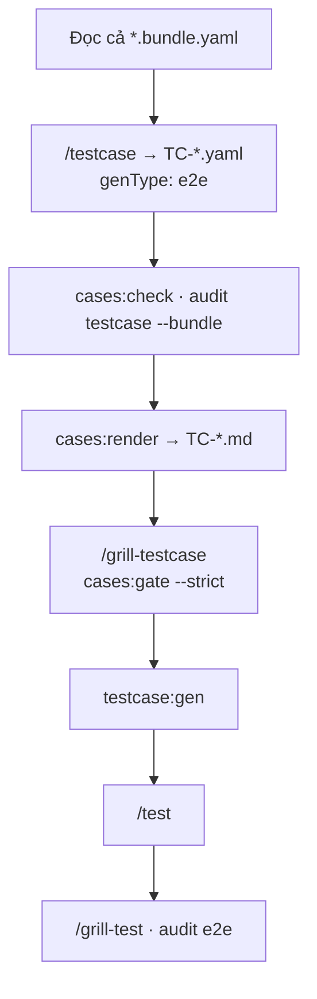
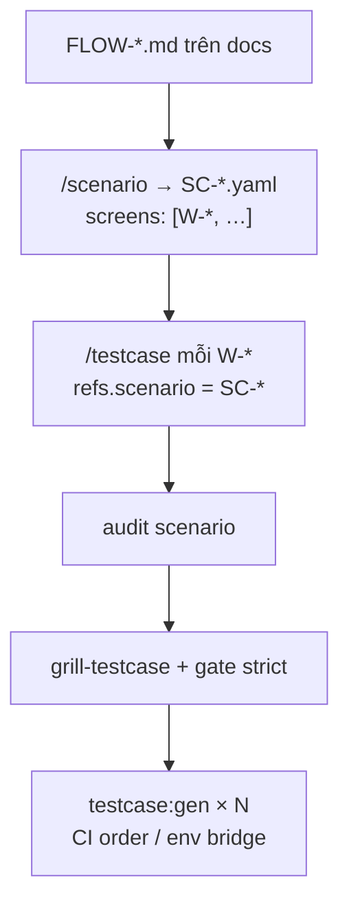
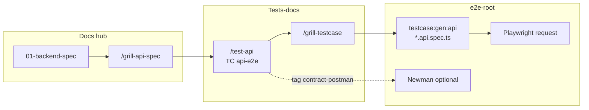

# Workflow — Test (tests-docs & E2E)

**Phạm vi (SSOT):** lane **Code + test** — **tests-docs hub** (`TC-*`, `SC-*`), grill plan, gate, render user case cho QA/Dev, automation trên **e2e-root**.

**Không viết ở đây:** schema TC chi tiết, env, lệnh đầy đủ → [artifacts/tests-docs.md](../artifacts/tests-docs.md) · Playwright layout → [artifacts/code.md](../artifacts/code.md#e2e-root).

**Thuộc macro:** [index.md#full-cycle](./index.md#full-cycle) · phase **2b Tests** · Gate: [gates.md](./gates.md#close-one-function) (bước 3–4, 7–8).

---

## Test cycle (Phase 2b) {#test-cycle}



---

## Ba tầng — không nhầm {#three-layers}

| Tầng | Root | SSOT | VitePress |
|------|------|------|-----------|
| **Docs** | `FLOWGRID_DOCS_ROOT` | `*.bundle.yaml`, `ir/*` | Port **5173** — `spec.md`, `data-model.md`, `api.md` |
| **Tests-docs** | `FLOWGRID_TESTS_DOC` | `cases/**/TC-*.yaml`, `scenarios/**/SC-*` | Port **5174** — `TC-*.md` sau `cases:render` |
| **Automation** | `e2e-root` | `*.spec.ts`, Page Objects | Không phải plan SSOT |

**Coverage toàn project:** mỗi function leaf docs có `TC-*` mirror path; cross-flow có `SC-*` + `audit scenario`; gate `--strict` + `FLOWGRID_DOCS_ROOT` buộc **traceability** về bundle.

Hướng dẫn author: [harness/tests/templates/tpl-testcase-plan.md](../../harness/tests/templates/tpl-testcase-plan.md) (init → tests hub).

---

## SSOT đọc/ghi {#ssot-reading}

| Vai trò | Đọc (review / walkthrough) | Ghi |
|---------|----------------------------|-----|
| BA / PO | Docs VitePress `spec.md` (AC, scenarios) | Không author `TC` — gap → `/update-spec` |
| QA | Tests VitePress `TC-*.md` (bước, ma trận, trace) | `/testcase`, `/scenario` trên YAML |
| Dev FE | `TC-*.md` + `ir/design.yaml` (`testIds`) | `/test`, không sửa plan YAML tùy tiện |
| Lead release | `cases:gate --strict` JSON | Không bypass trace/matrix |

**Grill testcase** đọc **toàn bộ** `*.bundle.yaml` — không tách `ir/spec` + `ir/design` khi thiết kế coverage.

**Excel UAT:** deliverable xuất **sau** YAML/MD chốt — [tests-docs § Excel](../artifacts/tests-docs.md#vận-hành-team-vs-deliverable-excel).

---

## E2E lane (automation) {#test-e2e-lane}

Unit Vitest/PHPUnit — lane riêng trên repo FE/BE; không gộp vào diagram dưới.



### Ba lớp assertion (một spec E2E)

| Lớp | Mục đích |
|-----|----------|
| Functional (steps TC) | Flow, mock/real API, `data-testid` |
| Semantic (`#e2e:*`) | Layout, overflow, console |
| Axe (WCAG) | Violations nghiêm trọng |

Chi tiết: [code.md § E2E](../artifacts/code.md#e2e-root).

### `/grill-testcase` vs `/grill-test`

| Skill | Root | Việc |
| --- | --- | --- |
| **`/grill-testcase`** | **tests-docs** | Plan YAML: `cases:gate --strict`, `audit testcase --bundle`, matrix facet, gap spec → docs |
| **`/grill-test`** | **e2e-root** | TC ↔ PO ↔ `*.spec.ts`, semantic `#e2e:*` — sau `/test` green |

### Pre-wire vs post-wire

Cùng `TC-*.yaml`: `lifecycle` ≠ wire → mocks; `wire` → API thật. Handoff [wire.md § pre/post](./wire.md#pre-wire-post-wire).

**API hook:** xem [§ Grill API hook](#grill-api-hook) · chi tiết [tests-docs § API hook](../artifacts/tests-docs.md#api-hook-tc).

---

## Grill kỹ — ba mode {#grill-modes}

Ba lộ trình **tách session** — không gộp `/grill-testcase` (hub) với `/grill-test` (e2e-root) trong một lệnh chat.

| Mode | SSOT plan | Grill hub | Grill automation |
|------|-----------|-----------|------------------|
| **Một màn** `W-*` | `cases/…/TC-*.yaml` (`e2e`) | `/grill-testcase` + gate | `/grill-test` sau `/test` |
| **Flow dài** `SC-*` | `scenarios/…/SC-*` + N× `TC` | `audit scenario` + gate cả cụm | E2E theo từng TC / thứ tự CI |
| **API hook** | `TC` `api-e2e` | `/test-api` + `/grill-testcase` | `testcase:gen:api` (+ Newman tùy chọn) |

Extract agent: `harness/tests/extracts/grill-screen-tc.md`, `grill-scenario-flow.md`, `grill-api-hook.md`.

### 1 — Một màn chức năng (`W-*`) {#grill-single-screen}

Mục tiêu: coverage **đủ facet** trên **one** function leaf, trace về bundle, rồi mới codegen UI E2E.



| # | Kiểm tra grill (plan) | Lệnh / skill |
|---|------------------------|--------------|
| 1 | Bundle có story/AC — không bịa test | STOP → `/update-spec` |
| 2 | `traceability` khớp `W-*`, scenarios, `AC-*`, `btn_*` | `audit testcase --bundle` |
| 3 | Union `testMatrix` facet trên màn (không chỉ happy) | `cases:gate --strict` |
| 4 | QA đọc user case trên VitePress tests hub | `cases:render` |
| 5 | `testIds.required` khớp design sau split | grill-dev / spot DOM |
| 6 | Spec chạy xanh scoped | `/test` |
| 7 | TC ↔ PO ↔ `*.spec.ts` | `/grill-test`, `audit e2e` |

Có thể **nhiều file** `TC-*.yaml` cùng folder (smoke + regression) — gate gộp facet theo `refs.screen`.

### 2 — Scenario flow dài (`SC-*`) {#grill-scenario-flow}

Mục tiêu: luồng **xuyên màn** bám `FLOW-*.md` trên docs — không flatten `scenarios/auth/…`.



| # | Kiểm tra grill | Ghi chú |
|---|----------------|---------|
| 1 | `FLOW-*.md` tồn tại trước SC | Thin FLOW → docs `/user-flow` |
| 2 | `SC.screens[]` = mọi `W-*` chạm trong journey | Khớp prose FLOW |
| 3 | Mỗi `W-*` có `TC-*.yaml` **hoặc** defer `QA-*` | `SC_SCREEN_NO_TC` |
| 4 | Mỗi TC vẫn pass trace/matrix **per screen** | `audit testcase --bundle` từng leaf |
| 5 | Walkthrough: SC + từng `TC-*.md` render | VitePress 5174 |
| 6 | Automation | Spec riêng/màn; không một file TC 50 bước |

**UI + API trong cùng journey:** hai plan — `genType: e2e` (tạo data) + `genType: api-e2e` (hook) — cùng `refs.scenario`; CI truyền `orderId` / token qua env giữa job (xem API hook).

### 3 — API hook (Playwright `request` · Newman tùy chọn) {#grill-api-hook}

Mục tiêu: kiểm HTTP **partner / webhook / public API** — SSOT contract trên docs `01`, plan trên tests-docs.



| Bước | Việc | Skill / lệnh |
|------|------|----------------|
| 1 | Contract `01` + grill API | [backend.md](./backend.md) |
| 2 | Author `TC` — `apiSteps[]`, `testMatrix` (401/403/404/422…) | `/test-api` · `TC.example-api.yaml` |
| 3 | Grill plan như UI TC | `audit testcase`, `cases:gate --strict` |
| 4 | Gen Playwright | `flowgrid testcase:gen:api` → `tests/api-e2e/**` |
| 5 | Chạy CI | `FLOWGRID_API_TEST_BASE_URL`; secret qua env |
| 6 | (Tùy) Collection đối tác | Newman trong `integrations/postman/`; tag `contract-postman` — **không** thay YAML SSOT |

| Công cụ | Vai trò |
|---------|---------|
| **Playwright `request`** (FlowGrid gen) | Lane chuẩn — trace `TC` ↔ spec, `audit e2e` |
| **Newman** | Replay collection partner / HMAC phức tạp — job CI riêng, link tag trên TC |
| **BE unit** (Supertest/pytest) | Chữ ký webhook, idempotency, DLQ — bổ sung, không thay plan hub |

Portal tạo đơn + partner gọi export: SC gồm **TC UI** + **TC api-e2e** — grill `audit scenario` phải thấy cả hai.

---

## Điều kiện trước lane {#preconditions}

- Docs leaf có bundle đủ `userStories` / `acceptanceCriteria` (hoặc team chấp nhận defer có `QA-*`).
- `flowgrid check` / split ổn trên bundle trước grill testcase hàng loạt.
- `FLOWGRID_DOCS_ROOT` + `FLOWGRID_TESTS_DOC` cấu hình (`flowgrid doctor`).
- Path `cases/…` **mirror** `surfaces/…` — không path phẳng `cases/admin/auth/W-*` ad-hoc.

---

## Bước trong lane {#steps}

| Thứ tự | Việc | Vai trò | Skill / gate |
|--------|------|---------|----------------|
| 0 | (Tùy) Cross-flow inventory | QA / BA | `/scenario` khi có `FLOW-*.md` |
| 1 | Testcase YAML v2 | QA | `/testcase`, `cases:check` |
| 2 | Render user case | QA / any | `flowgrid cases:render` → mở VitePress tests hub |
| 3 | Grill plan | QA + member | `/grill-testcase`, `audit testcase --bundle` |
| 4 | Gate tests-docs | QA / release | `cases:gate --strict` + `FLOWGRID_DOCS_ROOT` |
| 5 | Gen Playwright | Dev / QA | `testcase:gen` (`genType: e2e`) |
| 5b | API hook plan | QA / Dev | `/test-api`, `genType: api-e2e` |
| 6 | Implement & green | Dev | `/test`, `test:e2e` scoped |
| 7 | Grill automation | Dev + QA | `/grill-test` |
| 8 | Audit plan ↔ chạy | QA | `flowgrid audit e2e` (policy) |

Mốc đóng leaf: [gates.md § Đóng một function](./gates.md#close-one-function) bước 3–4, 7–8.

### Nội dung `TC-*.yaml` (tóm tắt)

- `schemaVersion: 2`, `testMatrix` đủ facet, `steps`, `traceability`, `testIds.required`.
- `story` / `description` giàu nghiệp vụ — `title` ngắn; dùng `meaning`/`purpose` từ bundle khi viết bước.
- Mẫu: `harness/tests/templates/TC.example.yaml`.

### Vòng grill (ai làm gì)

| Bước | Ai | Việc |
|------|-----|------|
| Spec / testIds | BA / Dev | `ui.testIds`, `#e2e:*` khi cần |
| `portal:gen` | script | `data-testid` trên UI |
| `testcase:gen` | script | PO + `.spec.ts` |
| `/test` | Dev + AI | Fixture gap, scoped green |
| `/grill-test` | Dev + AI | Matrix TC ↔ PO ↔ spec |

---

## Sign-off test plan (tùy team) {#test-signoff}

Trước `testcase:gen` hàng loạt hoặc trước release IT:

| # | Mục | Kiểm tra |
|---|-----|----------|
| 1 | **Gate** | `cases:gate --strict` pass với `FLOWGRID_DOCS_ROOT` |
| 2 | **Trace** | Mỗi TC có `traceability` khớp bundle screen/scenario/AC/actions |
| 3 | **Matrix** | Union facet trên màn đủ (audit / gate) — không chỉ happy path |
| 4 | **Readable** | `TC-*.md` trên VitePress — QA walkthrough không cần mở YAML |
| 5 | **Docs parity** | Spot AC trên `spec.md` ↔ `acceptanceRefs` |
| 6 | **Defer** | Gap chỉ qua `QA-*` / `coverage_deferred` có chủ đích |

```text
Test plan sign-off: <screen W-*> | reviewer | date | cases:gate strict OK
```

---

## Handoff {#handoff}

- **Design lùi:** gap nghiệp vụ → docs `/update-spec` (paste prompt từ `/grill-testcase`).
- **Wire:** post-wire E2E scoped — [wire.md](./wire.md).
- **Backend:** API-only flows — [backend.md](./backend.md) + `api-e2e` TC.

---

## Liên kết nhanh

| Chủ đề | Trang |
|--------|--------|
| Schema, mirror, API hook | [artifacts/tests-docs.md](../artifacts/tests-docs.md) |
| Skill `/testcase` | [references/skills/testcase.md](../references/skills/testcase.md) |
| `testcase:gen` / `cases:*` CLI | [references/skills/testcase-gen.md](../references/skills/testcase-gen.md) |
| CLI extract (agent) | [testcase-gen-cli.md](../../harness/tests/extracts/testcase-gen-cli.md) |
| Design sign-off (test entry) | [design-leaf-signoff.md](./design-leaf-signoff.md) |
| Grill một màn / SC / API hook | [§ Grill kỹ](./test.md#grill-modes) |
| `/test-api` | [references/skills/test-api.md](../references/skills/test-api.md) |
