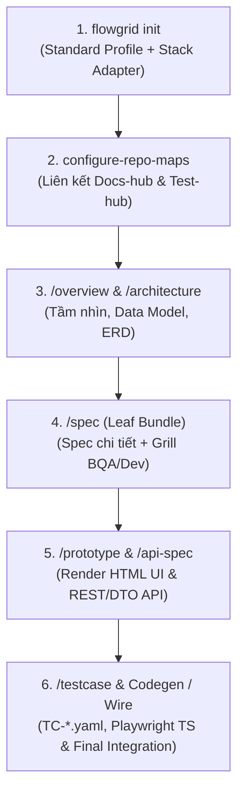
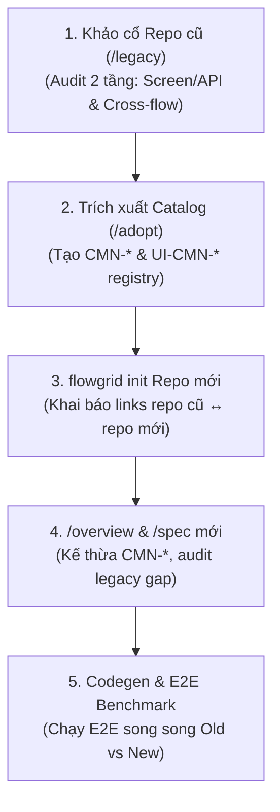
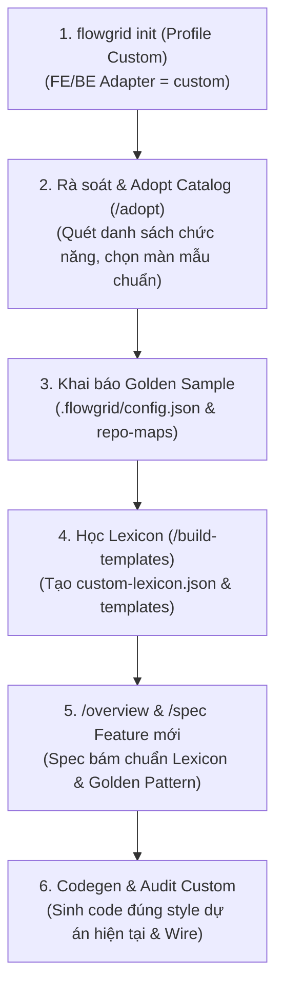

# Hướng dẫn Workflow Chi tiết theo 3 Ngữ cảnh Triển khai (Use Cases)

Tài liệu này hướng dẫn chi tiết từng bước (step-by-step) từ lúc khởi tạo `flowgrid init`, chọn cấu hình, trỏ liên kết multi-repo (`configure-repo-maps`), đến các bước triển khai chi tiết (`overview`, `architecture`, `legacy`, `adopt`, `spec detail`, `testcase`, `wire`) cho **3 ngữ cảnh triển khai thực tế** của FlowGrid được nêu trong README & Overview:

1. **Case 1: Greenfield** — Dự án mới hoàn toàn, áp dụng Stack Adapter chuẩn (`standard`).
2. **Case 2: Modernization / Re-platform (Brownfield)** — Khảo cổ code cũ (`/legacy`), trích xuất Common Catalog (`/adopt`), xây hệ thống mới.
3. **Case 3: Maintain / Custom Base** — Dự án sẵn có / UI library tùy biến (`custom`), huấn luyện Agent qua Golden Sample.

---

## 🚀 Case 1: Greenfield (Dự án mới hoàn toàn, Stack chuẩn Adapter)

**Bối cảnh:** Xây dựng sản phẩm phần mềm mới từ đầu. Đã chốt công nghệ thuộc các khung adapter chuẩn được FlowGrid hỗ trợ (`nuxt4`, `nextjs`, `nestjs`, `fastapi`).



### Các bước thực hiện chi tiết:

#### Bước 1: Khởi tạo với `flowgrid init`
Mở terminal tại root repository và chạy:
```bash
flowgrid init
```
*Chọn các tham số wizard:*
- **Select Agents/Skills:** Chọn Agent IDE team sử dụng (vd: `antigravity`, `cursor`, `gemini`).
- **Select project type:** Chọn `Frontend`, `Backend`, hoặc `Fullstack` (nếu dựng repo Docs-hub riêng thì chọn `Document`).
- **Base Architecture Profile:** Chọn **`standard`** (kích hoạt tính năng tự động chạy `registry:sync` quét components/API).
- **Frontend / Backend technology (Adapter):** Chọn adapter tương ứng (`nuxt4`, `nextjs`, `nestjs`, `fastapi`).
- **Docs-hub location:**
  - *Multi-repo (khuyên dùng):* Chọn `Other location` → trỏ path sang repo `base_docs` (`FLOWGRID_DOCS_ROOT`).
  - *Single-repo:* Chọn `This repository` → scaffold thư mục `docs/` tại chỗ.
- **Tests-docs hub location:**
  - *Multi-repo:* Chọn `Other location` → trỏ path sang repo `base-test-docs` (`FLOWGRID_TESTS_DOC`).
  - *Single-repo:* Chọn `This repository` → scaffold thư mục `tests/`.
- **Automation e2e-root:** Giữ mặc định (`tests/e2e` cho FE, `tests/api-e2e` cho BE).
- **Confirm:** Chọn `Yes` để CLI tạo `.flowgrid/config.json` và đồng bộ registry ban đầu.

#### Bước 2: Liên kết Multi-repo Maps (`configure-repo-maps`)
Khi mô hình triển khai tách thành nhiều repo (Docs-hub + Tests-hub + Code FE/BE):
```bash
# Cấu hình đường dẫn liên kết
flowgrid configure-repo-maps

# Hoặc thiết lập biến môi trường
export FLOWGRID_DOCS_ROOT=/absolute/path/to/docs-hub
export FLOWGRID_TESTS_DOC=/absolute/path/to/tests-docs

# Kiểm tra kết nối
flowgrid doctor
```

#### Bước 3: Dựng Overview & Tổng quan Kiến trúc (`/overview`, `/architecture`)
Mở session Agent AI trên Docs-hub:
- **`/overview`**: Xây dựng bức tranh tổng quan hệ thống tại `overview/index.md` (Vision, Actors, Roles, Release Scope).
- **`/architecture`**: Khai báo kiến trúc kỹ thuật (`architecture/01-introduction.md`) và sơ đồ dữ liệu ERD (`architecture/02-data-model.md`).

#### Bước 4: Dựng Spec Chi tiết theo Màn hình / Feature (`/spec`)
Dùng slash command `/spec` cho từng chức năng (Leaf Bundle):
- Agent tự đọc `design.registry.json` từ FE repo để thiết kế UI layout.
- Sinh cấu trúc Leaf tại `surfaces/<surface>/CMP-*/<NN...>/`:
  - `<slug>.bundle.yaml` (SSOT chính)
  - `ir/design.yaml`, `ir/spec.yaml`, `ir/generated/spec.md`
  - `data-model.md`, `api.md`
- Chạy `/grill-bqa` và `/grill-dev` để phản biện logic nghiệp vụ, UI rules & edge-cases.

#### Bước 5: Sinh Prototype & API Contract (`/prototype`, `/api-spec`)
- **`/prototype`** (lệnh `portal:gen`): Sinh prototype HTML/Vue/React chạy trực tiếp trên browser để BA & PO UAT giao diện trước khi code.
- **`/api-spec`**: Chạy trên repo BE để định nghĩa chi tiết DTO, REST Endpoints và Open API Spec (`api/<seq>/01-backend-spec.yaml`).

#### Bước 6: Viết Testcase, E2E Automation & Wire (`/testcase`, `/wire`)
- **`/testcase`**: Chạy trên Tests-docs hub để sinh catalog `TC-*.yaml` và kịch bản E2E scenarios.
- **`testcase:gen` / `api:gen`**: Sinh code kiểm thử Playwright TS (`tests/e2e/*.spec.ts`) và Controller/Service stubs cho Backend.
- **`/wire`**: Tiến hành đấu nối FE ↔ API thật, chạy audit regression và hoàn tất UAT đóng màn.

---

## 🔄 Case 2: Modernization / Re-platform (Code cũ làm nguồn, /adopt & /legacy)

**Bối cảnh:** Nâng cấp hệ thống legacy sẵn có (PHP monolith, .NET cũ, WebForms,...) sang hệ thống mới dạng Microservices / Modern SPA. **Nguyên tắc cốt lõi:** Khảo cổ & kế thừa 100% rule nghiệp vụ cũ, trích xuất Common Catalog (`CMN-*`), cấm copy-paste code rác cũ sang codebase mới.



### Các bước thực hiện chi tiết:

#### Bước 1: Khảo cổ & Audit Code Cũ (`/legacy`)
Mở session Agent AI trên repository code cũ (Brownfield codebase):
- Chạy kỹ năng **`/legacy`** để khảo cổ 2 tầng:
  - *Tầng 1 (Local Audit):* Quét từng file màn hình, SQL query, thủ tục Stored Procedure, UI controls cũ.
  - *Tầng 2 (Cross-flow Audit):* Phân tích luồng liên thông giữa các màn hình, quy tắc validation ẩn và phân quyền.
- Sinh tài liệu khảo cổ lưu vào `legacy/` (bản đồ tính năng hiện tại, danh sách API cũ).

#### Bước 2: Trích xuất Common Catalog (`/adopt`)
Chạy kỹ năng **`/adopt`** trên codebase cũ để phát hiện các đoạn code / UI / DTO lặp lại:
- Gom nhóm thành các linh kiện tái sử dụng chuẩn hóa:
  - **`CMN-*`**: Business logic / DTO / Service xử lý chung.
  - **`UI-CMN-*`**: Reusable UI Components (Filter Bar, DataGrid, Modal, Export button).
- Xuất dữ liệu catalog vào registry dùng chung của hệ thống mới (`registries/common.registry.json`).

#### Bước 3: Khởi tạo Repo Hệ thống Mới (`flowgrid init`)
Tạo repo cho hệ thống mới và khởi tạo FlowGrid:
```bash
flowgrid init
```
- **Select project type:** `Document` (Docs-hub mới) và `Frontend`/`Backend` (Codebase mới).
- **Base Architecture Profile:** Chọn `standard` (nếu stack mới chuẩn) hoặc `custom`.
- **Repo Maps Configuration:** Khai báo liên kết giữa repo mới và repo cũ qua `platform-repos.local.json`:
  ```json
  {
    "legacyRepoRoot": "/path/to/legacy-code-repo"
  }
  ```

#### Bước 4: Tái cấu trúc Overview & Dựng Spec Mới (`/spec`)
- **`/overview`**: Cập nhật mục tiêu re-platform, phân định rõ phạm vi giữ nguyên 1:1 vs phạm vi làm mới.
- **`/spec`**: Viết spec cho tính năng mới:
  - Gọi trực tiếp các `CMN-*` và `UI-CMN-*` đã trích xuất ở Bước 2.
  - Tuyệt đối **không copy-paste** class/file lẻ từ repo cũ.
  - Chạy lệnh `flowgrid audit legacy` để đảm bảo 100% rule nghiệp vụ cũ đã được bao phủ trong spec mới.

#### Bước 5: Codegen, Migration Data & E2E Validation (`/api-spec`, `/testcase`, `/wire`)
- Sinh API contract mới và schema DB tương thích với dữ liệu cần migrate.
- Chạy **`/testcase`** để tạo bộ kịch bản kiểm thử E2E benchmark (chạy song song trên hệ thống cũ và hệ thống mới để so sánh kết quả output).
- Chạy **`/wire`** tiến hành nghiệm thu hội tụ và chuyển đổi dữ liệu sản xuất.

---

## 🛠️ Case 3: Maintain / Custom Base (Base dự án tùy biến & Golden Sample)

**Bối cảnh:** Bảo trì dự án sẵn có hoặc phát triển trên một kiến trúc / UI Library nội bộ tùy biến không nằm trong khung adapter mặc định của FlowGrid (vd: Angular tùy chỉnh, WPF/C#, Go gRPC, Microservices riêng).



### Các bước thực hiện chi tiết:

#### Bước 1: Khởi tạo với Custom Profile (`flowgrid init`)
Tại repository dự án tùy biến hiện tại, chạy:
```bash
flowgrid init
```
*Chọn các tham số wizard:*
- **Select project type:** Chọn `Frontend`, `Backend`, hoặc `Fullstack`.
- **Base Architecture Profile:** Chọn **`custom`** (báo cho FlowGrid biết đây là dự án có cấu trúc tùy biến).
- **Frontend / Backend technology:** Chọn `custom`.
- **Docs-hub & Tests-docs location:** Chọn `This repository` hoặc `Other location` tùy mô hình lưu trữ tài liệu.

#### Bước 2: Rà soát Chức năng hiện có & Trích xuất Catalog (`/adopt`)
Trước khi thiết lập mẫu code, cần rà soát toàn bộ codebase hiện tại:
- Chạy kỹ năng **`/adopt`** trên codebase để quét và lập danh sách toàn bộ các màn hình/chức năng đang hoạt động trong dự án.
- Phát hiện các linh kiện UI (`UI-CMN-*`) và logic nghiệp vụ dùng chung (`CMN-*`).
- Qua kết quả rà soát của `/adopt`, chọn ra 1-2 màn hình/module được viết chuẩn nhất (đầy đủ UI layout, state management, API calling pattern, convention sạch) để chọn làm **Golden Sample**.

#### Bước 3: Khai báo Golden Sample & Config Repo Maps
Khai báo 1-2 màn hình/module mẫu chuẩn vừa chọn ở Bước 2 vào file `.flowgrid/config.json`:
```json
{
  "baseProfile": "custom",
  "goldenSample": {
    "frontend": "src/modules/golden-feature-ui",
    "backend": "src/Services/GoldenFeatureApi"
  }
}
```
Hoặc chạy `flowgrid configure-repo-maps` để thiết lập đường dẫn Golden Sample.

#### Bước 4: Học Lexicon & Pattern Code (`/build-templates`)
Chạy kỹ năng **`/build-templates`** (hoặc lệnh CLI `flowgrid build-template-code`):
- CLI và Agent AI tiến hành phân tích sâu cấu trúc của Golden Sample đã chỉ định.
- Tự động học từ vựng (lexicon), cách đặt tên biến, quy tắc phân chia layer, cấu trúc component và template code của dự án.
- Xuất kết quả học vào `.flowgrid/registries/custom-lexicon.json` và bộ template tại `.flowgrid/templates/`.

#### Bước 5: Dựng Overview, Spec cho Tính năng mới (`/overview`, `/spec`)
- **`/overview`**: Định nghĩa module/feature mới cần bổ sung vào hệ thống hiện tại.
- **`/spec`**: Viết spec chi tiết cho tính năng mới. Agent AI sẽ đối chiếu trực tiếp với `custom-lexicon.json` để đưa ra các thiết kế UI và API contract khớp 100% với convention và style hiện tại của dự án.

#### Bước 6: Codegen, Audit Custom & Wire (`flowgrid audit`, `/wire`)
- **Codegen:** Sinh code hoặc prototype tuân thủ đúng pattern đã học từ Golden Sample (không sinh theo khung adapter mặc định).
- **Audit:** Chạy `flowgrid audit custom` kiểm tra code mới sinh có vi phạm cấu trúc Golden Sample hay không.
- **Wire & Test:** Chạy `/testcase` và `/wire` để tích hợp tính năng mới vào codebase đang chạy an toàn.

---

## 📊 Bảng So sánh 3 Ngữ cảnh Triển khai

| Tiêu chí | Case 1: Greenfield | Case 2: Modernization (Brownfield) | Case 3: Maintain (Custom Base) |
| --- | --- | --- | --- |
| **Mục tiêu** | Dựng dự án mới từ đầu | Nâng cấp code cũ sang hệ mới | Bảo trì / phát triển trên base có sẵn |
| **Base Profile (`init`)** | `standard` | `standard` hoặc `custom` | `custom` |
| **Kỹ năng trọng tâm** | `/overview`, `/spec`, `/prototype` | `/legacy`, `/adopt`, `/spec` | `/adopt`, `/build-templates`, `/spec` |
| **Nguồn dữ liệu mẫu** | Framework Adapter mặc định | Code legacy cũ & Common Catalog | Golden Sample (chọn sau khi `/adopt`) |
| **Kiểm tra chất lượng** | `flowgrid audit *` tiêu chuẩn | `flowgrid audit legacy` | `flowgrid audit custom` |
