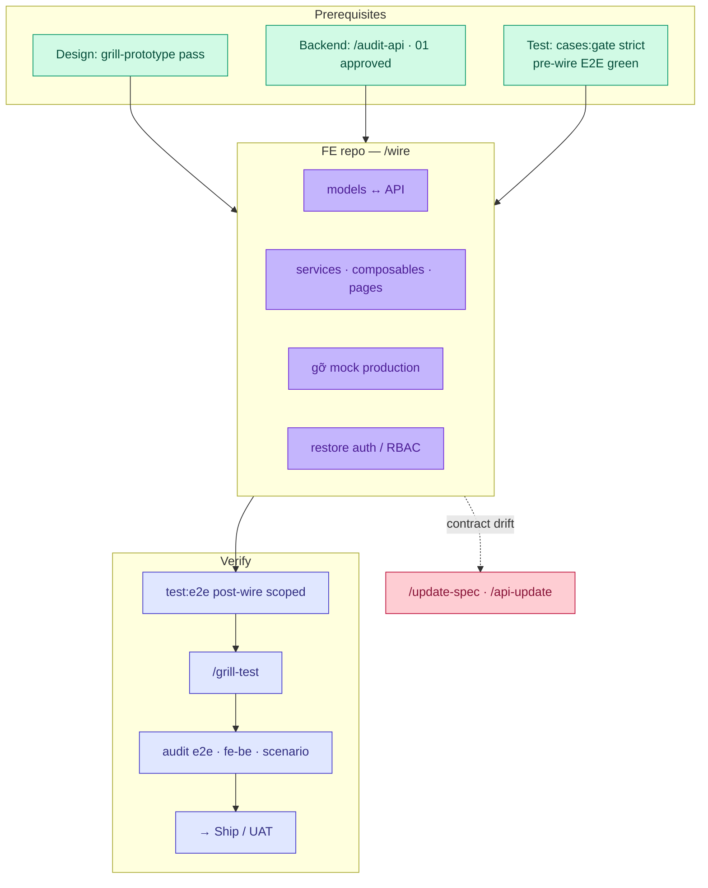
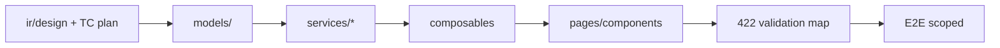

# Workflow — Wire (hội tụ FE ↔ BE)

**Phạm vi (SSOT):** macro **Wire** (phase **3**) — thay mock/stub production bằng API thật, restore auth/RBAC, E2E post-wire, audit hội tụ trước Ship.

**Không viết ở đây:** chi tiết 4 tầng Portal trong repo FE → [artifacts/code.md](../artifacts/code.md) · skill slash → [references/skills/wire.md](../references/skills/wire.md).

**Thuộc macro:** [index.md#full-cycle](./index.md#full-cycle) · Prerequisite lanes: [design.md](./design.md) · [backend.md](./backend.md) · [test.md](./test.md).

---

## Wire cycle (Phase 3) {#wire-cycle}



---

## Ba tầng hội tụ {#three-convergence}

| Luồng | Pre-wire | Wire làm gì | Post-wire verify |
|-------|----------|-------------|------------------|
| **Portal UI** | Prototype mock, `#wire-only` trên design/HANDOFF | `/wire` — services thật, gỡ mock | `test:e2e` scoped · `/grill-test` |
| **Contract** | `01` + grill API; FE `apiRef` trên design | Align models/DTO; CORS/env | `audit fe-be` trên bundle leaf |
| **Cross-flow `SC-*`** | TC pre-wire mocks | Wire từng màn trong journey | `audit scenario` + E2E ordered/CI env |

**BE-only / partner:** không có `/wire` FE — verify bằng `testcase:gen:api`, Newman (tùy), BE integration tests; docs vẫn `01` + tests-docs `api-e2e` TC ([test.md § API hook](./test.md#grill-api-hook)).

---

## SSOT đọc khi wire {#ssot-reading}

| Vai trò | Đọc | Không dùng làm SSOT sửa |
|---------|-----|-------------------------|
| Dev FE | `ir/design.yaml`, HANDOFF, `#wire-only` / `#update:*` | Generated `ir/generated/*.md` |
| Dev FE | `01` / OpenAPI preview khi map DTO | Sửa `01` từ FE repo — qua `/api-update` |
| QA | `TC-*.md` post-wire scenarios | Sửa plan YAML trong session wire |
| Lead | [gates § bước 9](./gates.md#close-one-function) | Skip audit vì “đã chạy tay” |

**Env:** `FLOWGRID_DOCS_ROOT`, `FLOWGRID_TESTS_DOC`, e2e-root — `flowgrid doctor`.

Extract agent (FE harness): [wire-phase.md](../../harness/fe/extracts/wire-phase.md) · [wire-audit-loop.md](../../harness/fe/extracts/wire-audit-loop.md) · skill `/grill-wire` ([grill-wire.md](../references/skills/grill-wire.md)).

Tests hub khi wire báo plan gap: [wire-test-handoff.md](../../harness/tests/extracts/wire-test-handoff.md). Docs hub: [wire-spec-feedback.md](../../harness/docs/extracts/wire-spec-feedback.md).

---

## Điều kiện vào lane {#preconditions}

| Mốc | Tối thiểu |
|-----|-----------|
| Design | `/grill-prototype` không còn gap SSOT (copy, state, mock boundary) — [design.md](./design.md) |
| Backend | API deployable/staging; `/audit-api` hoặc open issues có owner; `approval` trên `01` theo policy |
| Test plan | `cases:gate --strict` cho `W-*` scope (khi team bật gate) |
| Test automation | Pre-wire E2E scoped **green** hoặc gap documented — [test.md](./test.md#test-e2e-lane) |
| Tags | `#wire-only` / `#manual-composable` liệt kê rõ trong HANDOFF — [dsl.md § wire defer](../artifacts/dsl.md#vòng-đời-wire-defer) |

**Chưa đủ:** quay lại prototype/test/backend — **không** wire nửa chừng rồi “fix spec sau”.

---

## Pre-wire vs post-wire (testcase) {#pre-wire-post-wire}

Cùng `TC-*.yaml` trên tests-docs — đổi **runtime**, không bắt buộc đổi plan:

| | Pre-wire | Post-wire |
|--|----------|-----------|
| API | Mock / `setup.mocks` trong Playwright | Base URL thật, session auth thật |
| Auth | Bypass middleware (grill-prototype) | Restore guest/RBAC theo bundle |
| Lifecycle route | `prototype` / `test` | Promote `wire` — [code.md § Page lifecycle](../artifacts/code.md#page-lifecycle) |
| Audit | `audit e2e` (optional pre) | **`audit e2e` bắt buộc** scoped `--screen W-*` |

Chi tiết grill test: [test.md § Grill kỹ](./test.md#grill-modes).

---

## Bước trong lane {#steps}

| # | Việc | Vai trò | Skill / gate |
|---|------|---------|----------------|
| 1 | Align types/models ↔ `01` / OpenAPI | Dev FE | `/model` (nếu chưa) |
| 2 | Service → composable → page (4 tầng) | Dev FE | `/wire` |
| 3 | Gỡ mock production; giữ mock chỉ test/fallback explicit | Dev FE | HANDOFF grill-prototype |
| 4 | Restore auth / RBAC / route meta | Dev FE | Không ship bypass wire |
| 5 | E2E post-wire scoped | Dev + QA | `test:e2e`, `/test` nếu gap |
| 6 | Grill automation | Dev + QA | `/grill-test` |
| 7 | Audit hội tụ | Dev + QA | `/grill-wire` hoặc lệnh `audit e2e`, `audit fe-be`, `audit scenario` (nếu SC) |
| 8 | UAT / stakeholder | PM | Acceptance đã grill; behaviour mới → `/update-spec` **trước** đóng |

### Thứ tự Portal (gợi ý)



---

## Grill / gate wire {#wire-gates}

Chạy từ **FE repo** (e2e-root) sau code wire:

```bash
flowgrid audit e2e --e2e-root <path> --tests-docs "$FLOWGRID_TESTS_DOC" --screen <W-*>
flowgrid audit fe-be <path/to.bundle.yaml>    # portal leaf
flowgrid audit scenario <SC.yaml> --tests-docs "$FLOWGRID_TESTS_DOC"   # nếu SC
```

| Gap audit | Hành động |
|-----------|-----------|
| `missingInPlaywright` / PO | `/test` |
| Plan vs bundle | `/grill-testcase` hoặc `/update-spec` |
| `apiRef` ↔ `01` | `/api-update` + re-grill API |
| Defer có chủ đích | `qa` + tag policy team |

---

## Sign-off wire (tùy team) {#wire-signoff}

Trước merge release scope hoặc UAT sign-off:

| # | Mục | Kiểm tra |
|---|-----|----------|
| 1 | **No prod mock** | Không còn mock production path cho scope `W-*` |
| 2 | **Tags cleared** | `#wire-only` / `#update:*` scope wire đã xử lý hoặc defer QA |
| 3 | **Auth** | Middleware/RBAC khớp bundle `screenAccess` |
| 4 | **E2E** | Post-wire scoped green |
| 5 | **audit e2e** | Không `critical` gap (warnings có owner) |
| 6 | **fe-be** | Portal màn có BE: `audit fe-be` không blocker |
| 7 | **Lifecycle** | Route stage `wire` trên registry (nếu dùng) |

```text
Wire sign-off: <W-*> | reviewer | date | audit e2e OK
```

---

## Rẽ nhánh / gap loop {#gap-loop}

| Khi | Hành động |
|-----|-----------|
| Contract BE sai | `/api-update` → BE redeploy → re-wire |
| UX/spec sai | `/update-spec` → split → re-test pre-wire nếu cần |
| E2E thiếu coverage | `/test` → `/grill-test` — không skip `audit e2e` |
| SC thiếu màn | Thêm `TC` hoặc `QA-*` — `audit scenario` |

**Một session = một command** — `/wire` không gộp full regression product + `/api` BE codegen.

---

## Handoff {#handoff}

- **Ship / release macro:** human UAT bước 10 — [gates.md § đóng leaf](./gates.md#close-one-function) · [human sign-off](./grill-and-human-review.md#human-signoff) · [index.md](./index.md#full-cycle)
- **Test còn gap:** [test.md](./test.md)
- **Chưa grill API:** [backend.md](./backend.md) — không wire FE lên contract chưa approved

---

## Liên kết nhanh

| Chủ đề | Trang |
|--------|--------|
| Đóng leaf bước 9 | [gates.md § Đóng một function](./gates.md#close-one-function) |
| `#wire-only` DSL | [artifacts/dsl.md](../artifacts/dsl.md) |
| Skill `/wire` | [references/skills/wire.md](../references/skills/wire.md) |
| Page lifecycle | [artifacts/code.md#page-lifecycle](../artifacts/code.md#page-lifecycle) |
